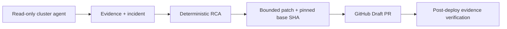

# Opsia

Opsia는 Kubernetes 장애 증거를 보존하고 제한된 변경안을 GitOps Draft PR로 제안한 뒤 배포 결과를 다시 검증하는 운영 제어면입니다.

## 해결하는 문제

장애 대응에서 관측 시점의 상태, 원인 판단, 실제 변경, 배포 후 결과가 서로 다른 도구와 대화에 흩어지면 재현과 리뷰가 어렵습니다. Opsia는 이 네 단계를 하나의 상관관계 ID와 불변 근거로 연결합니다.

## Golden Path

1. 읽기 전용 cluster agent가 Pod와 Event 증거를 제한된 범위로 수집합니다.
2. 규칙 엔진이 증거 내용과 ImagePullBackOff 후보를 결정론적으로 대조합니다.
3. 허용된 scalar 변경만 현재 GitOps manifest와 base SHA에 고정합니다.
4. GitHub에 자동 병합되지 않는 Draft PR을 생성합니다.
5. 병합·배포 이벤트 뒤 같은 대상을 다시 관측하고 회복 또는 검증 실패를 기록합니다.

완결된 대표 흐름은 `ImagePullBackOff → wrong_image_tag → image_tag_fix Draft PR → 재수집 검증`입니다.

## 안전 모델

- agent RBAC은 읽기 전용이며 `pods/exec`, `nodes/proxy`, `patch` 권한이 없습니다.
- 제어면은 클러스터 명령을 직접 실행하지 않습니다.
- 수정안은 정확한 repository, manifest path, base SHA, source digest에 고정됩니다.
- Secret 보정이나 외부 registry 장애처럼 자동 결정할 수 없는 원인은 운영자 검토로 종료합니다.
- PR은 Draft로 생성되며 자동 merge, 자동 rollback, 범용 CD orchestration을 제공하지 않습니다.

## 5분 빠른 확인

요구 사항은 Python 3.13, [uv](https://docs.astral.sh/uv/), Node.js 22, Helm입니다.

```bash
uv sync --all-groups
cd frontend && npm ci && cd ..
make demo
make gate
```

`make demo`는 외부 클러스터나 GitHub를 변경하지 않고 Golden Path의 계약 테스트를 실행합니다. 실제 설치 manifest는 `make manifest-check`로 검증합니다.

## 테스트

```bash
make test                         # Ruff, compileall, backend pytest
make gate-frontend                # lint, typecheck, frontend tests, production build
make manifest-check               # Helm lint/template, RBAC·manifest 검사
make product-brand-boundary-check # 과거 제품명과 개인 배포 경계 검사
```

## 아키텍처



기본 runtime은 15개 제어면 서비스와 1개 read-only cluster agent로 구성됩니다. 브라우저 표면은 사건 목록과 사건 상세의 3개 route만 제공합니다. 자세한 구성은 [Project Map](docs/PROJECT-MAP.md), 이벤트 흐름은 [Golden Path](docs/GOLDEN-PATH.md), 삭제·격리 판단은 [Cleanup Matrix](docs/CLEANUP-MATRIX.md)를 참고하세요.

## 현재 한계

- GitHub만 Draft PR provider로 지원합니다.
- 대표 완료 시나리오는 ImagePullBackOff이며 다른 Kubernetes 원인 규칙은 동일한 증거 품질을 보장하지 않습니다.
- 로컬 검증은 계약·빌드·manifest 수준입니다. 실제 cluster와 GitHub App을 잇는 end-to-end 검증은 배포 환경에서 별도로 수행해야 합니다.
- 과거 command와 dashboard DB 스키마 일부는 migration 호환을 위해 비실행 상태로 남아 있습니다.
