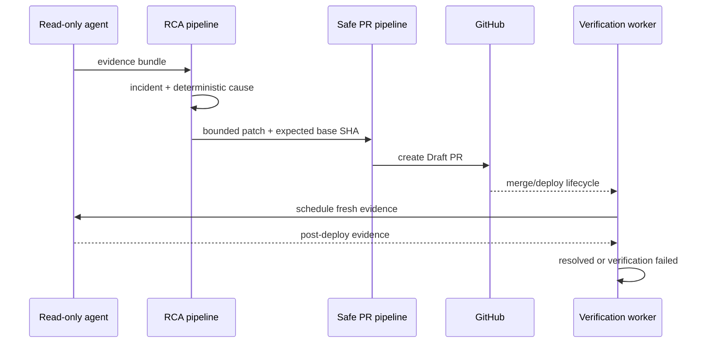

# Golden Path

Opsia는 Kubernetes 장애 증거를 보존하고 제한된 변경안을 GitOps Draft PR로 제안한 뒤 배포 결과를 다시 검증하는 운영 제어면입니다.

## ImagePullBackOff 완결 흐름

| 단계 | 입력 | 결정 또는 산출물 | 실패 시 |
|---|---|---|---|
| 1. 증거 수집 | read-only agent의 Pod, container state, Event | correlation ID가 붙은 불변 evidence bundle | 불완전 증거로 기록 |
| 2. 사건 탐지 | `ImagePullBackOff`, `ErrImagePull` | 대상 cluster/namespace/workload가 고정된 incident | 대상이 모호하면 중단 |
| 3. 결정론적 RCA | Event message와 catalog signal | `wrong_image_tag`, `missing_image_pull_secret`, `registry_unavailable` 등의 근거별 후보 | signal이 부족하면 `insufficient_evidence` |
| 4. 수정안 제한 | GitOps manifest, source digest, 현재 base SHA | 허용된 image scalar의 forward/inverse patch | 경로·SHA·단일 대상이 불명확하면 중단 |
| 5. Draft PR | GitHub repository와 base branch | base SHA가 고정된 Draft PR | base가 전진하면 stale 처리 후 재계산 |
| 6. 재검증 | merge/deploy 이벤트와 새 evidence window | ImagePullBackOff 소멸, Pod Ready 회복, 대상 동일성 기록 | deadline 내 회복하지 않으면 verification failed |

`wrong_image_tag`만 자동 제안 가능한 대표 경로입니다. Secret 생성, registry mirror 전환, 클러스터 명령은 정책으로 추론하지 않고 운영자 검토 항목으로 남깁니다.

## 불변 조건

- 증거는 수집 당시 cluster, namespace, resource identity와 함께 저장합니다.
- RCA는 LLM 출력이 아니라 versioned YAML rule과 정확한 signal match로 결정합니다.
- patch는 repository, branch, manifest path, base SHA, source SHA-256을 모두 가져야 합니다.
- PR 생성 전에 원본 scalar가 예상값과 같은지 다시 확인합니다.
- merge는 제품 권한 밖입니다. Opsia는 Draft PR을 만들고 lifecycle event만 관측합니다.
- 검증은 변경 전 evidence와 변경 후 evidence를 같은 대상 identity로 비교합니다.

## 주요 이벤트



## 검증

```bash
make demo
uv run pytest -q tests/test_recovery_gitops_authority.py
uv run pytest -q tests/test_safe_pr_structured_base_advance.py
uv run pytest -q tests/test_recovery_verification.py
```
