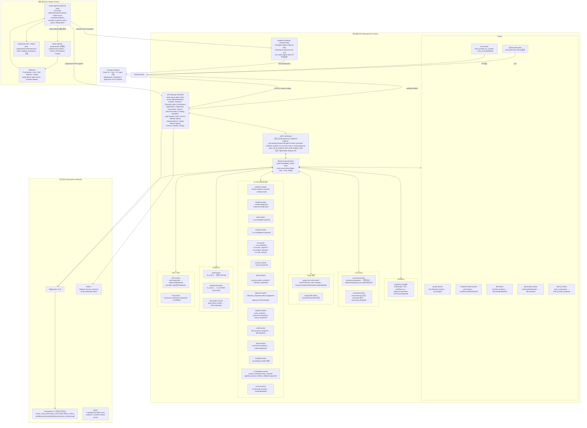
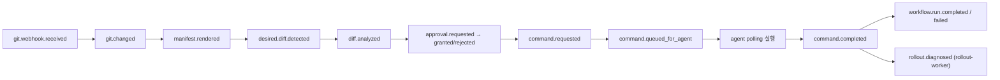

# 시스템 아키텍처 다이어그램 (최신화)

기준: `src/services`, `src/packages`, `deploy` 실제 코드 (2026-07-06 분석)

## 전체 아키텍처

## GitOps / 명령 이벤트 흐름

## RCA / 자율 복구 이벤트 흐름

```mermaid
flowchart LR
    A["cluster.evidence.received"] --> B["evidence.built"] --> C["evidence.bundle.built<br/>(+ incident.detected)"]
    C --> D["rca.candidates.planned"] --> E["rca.candidates.evaluated"] --> F["rca.completed"]
    F --> G["recovery.planned"] --> H["recovery.action_selected<br/>또는 selection_requested"]
    H --> I["command.requested<br/>또는 safe_pr.requested"]
    I --> J["safe_pr.patch_prepared"] --> K["diff.explained"] --> L["safe_pr.ready_for_creation"] --> M["safe_pr.created / failed"]
```

## 첨부 다이어그램 대비 변경/누락 사항

| 구분 | 첨부 다이어그램 | 현재 코드 기준 |
| --- | --- | --- |
| 신규 | 없음 | **realtime-gateway**: agent live stream을 browser로 fan-out하는 WS 게이트웨이 (`/live/agent`, `/live/browser`) |
| 신규 | 없음 | **github-poll-worker**: webhook 불가 환경용 GitHub 폴링 (AsyncService) |
| 신규 | 없음 | **command-janitor**: 만료된 agent command 정리 → `command.completed` 발행 |
| 신규 | 없음 | **dead-letter-monitor**: `dead_letter.created` → `alert.requested` 운영 알림 연결 |
| 신규 | 없음 | **target-drift-worker**: `cluster.drift.detected` 전담 처리 |
| 신규 | 없음 | **ai-chat-worker**: AI conversation API (`/ai/conversations`) → `ai.message.*` |
| 신규 | 없음 | **backlog-worker**, **rca-feedback-worker**: RCA 개선 backlog·차단/폴백 피드백 루프 |
| 제거 | Git Cache Worker (repo mirror) | 별도 서비스 없음 — git-pull-worker 단일 파일로 통합 |
| 제거 | Rollout Observer / PR Status Watcher / Rollback PR Worker | 서비스 목록에 없음 — rollout-worker·scm-worker로 흡수 |
| 이름 변경 | Alert + Notification Worker (Slack/Email/Webhook) | **alert-worker** (provider: log/webhook) + **mail-worker** (이메일 인증)로 분리. Slack provider는 현재 코드에 없음 |
| 이름 변경 | Evidence Builder/Incident Detector/RCA Analyzer/Recovery Planner/Safe PR Agent/Diff Explanation/Rollout Diagnosis/Approval Assistant Worker | evidence / incident / plan / analyze / rca / recovery / select / approval / dispatch / ai-diff / rollout / safe-pr worker로 세분화·개명 |
| 변경 | PostgreSQL 3개 분리 (Event Runtime / GitOps State / Read·Audit) | **단일 PostgreSQL 17 + PgBouncer** 경유. 테이블 수준 분리 (events, outbox, event_processing, event_dead_letters, 도메인 테이블) |
| 변경 | Object / Secret Stores | **MinIO**는 management artifact bucket(`deploy/management/storage.yaml`)과 target Loki object store(`deploy/target/minio.yaml`, `deploy/target/loki.yaml`)로 배포된다. Secret은 **SecretVault** port (env / aws-secrets-manager / kubernetes-secret provider, `src/packages/security/vault.py`) + SOPS/age 암호화 (`secrets/*.enc.yaml`) |
| 변경 | Workflow Console Target "planned UI" | **console-frontend 구현 완료**: React 18 + Vite, nginx 컨테이너 (`deploy/management/console.yaml`) |
| 변경 | Telemetry "take Prometheus/Loki/OTel now; real adapters planned" | Prometheus·Loki·OTel Collector·**Tempo** 배포 존재 (`deploy/target/`), agent evidence provider adapter 구현됨 |
| 변경 | Gateway 경로 | `/clusters/*` inventory·policy API, `/applications`, `/approvals`, `/ai/conversations`, `/catalog`, `/providers`, identity admin(`/orgs`,`/groups`,`/users`,`/access`), `/readyz` 추가 |
| 변경 | Agent "command receiver" | command **poll/start/result/heartbeat** + evidence **job scheduler** + inventory snapshot + debug query + node-collector 배포 관리로 확장 |
| 유지 | NATS JetStream, DLQ/replay, outbox, event_processing | 동일 — 단일 스트림 `SERVICE_EVENTS`, 보존 7일/512MiB, dedupe window 24h 상세 추가 |
