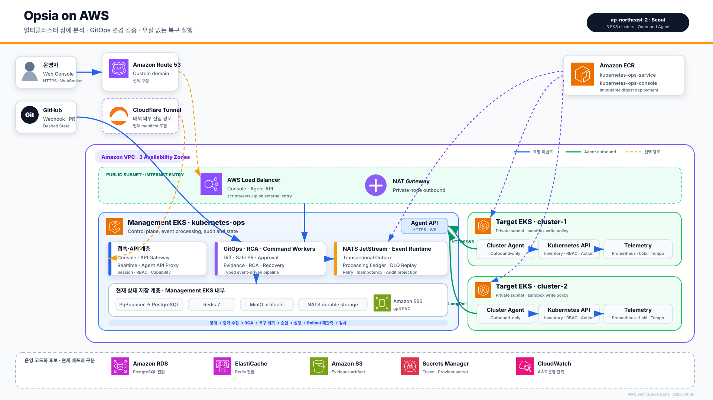

# Opsia AWS 포스터 아키텍처

## 다이어그램의 기준

- 현재 배포 이름: `kubernetes-ops`, `cluster-1`, `cluster-2`
- AWS Region: `ap-northeast-2`
- 이미지 저장소: `kubernetes-ops-service`, `kubernetes-ops-console`
- 기반 인프라: 공용 VPC, EKS 3개, Managed Node Group, ECR, EBS, 외부 진입 경로
- 관리 클러스터: Console, API/Realtime Gateway, GitOps·RCA·Command workers, NATS JetStream, PgBouncer, PostgreSQL, Redis, MinIO
- 대상 클러스터: Outbound-only Cluster Agent, Kubernetes API, Prometheus, Loki, Tempo
- 신뢰성 경로: Transactional Outbox → NATS JetStream → Processing Ledger → DLQ Replay

## 현재 구현과 고도화 후보 구분

다이어그램의 VPC 내부 실선 영역은 저장소의 Terraform과 Kubernetes manifest에서 확인한 현재 구조다. 하단 점선 영역의 Amazon RDS, ElastiCache, S3, Secrets Manager, CloudWatch는 `deploy/eks/README.md`에 정의된 운영 고도화 후보이며 현재 배포된 것으로 표현하지 않는다.

## 편집 및 출력

- 편집 원본: `opsia-aws-poster.drawio`
- 포스터 원본: `opsia-aws-poster.svg` (`1920 × 1080`)
- PNG 출력: `opsia-aws-poster.png` (`3840 × 2160`)
- AWS 공식 아이콘: `assets/aws/`
- diagrams.net에서 `.drawio` 파일을 열면 텍스트, 박스, 연결선을 개별 편집할 수 있다.

## AWS 도구 선택

- **AWS Infrastructure Composer**: CloudFormation/SAM 리소스를 시각적으로 설계하고 템플릿으로 내보낼 때 적합하다. 이 저장소는 Terraform과 EKS 내부 workload가 핵심이므로 전체 아키텍처 표현에는 제한이 있다.
- **Workload Discovery on AWS**: 실제 AWS 계정 리소스를 자동 탐색해 관계도를 만들지만 2026년 8월 14일 종료 예정이고, 자체 운영 비용이 있어 이번 포스터 제작에는 사용하지 않는다.
- **AWS Architecture Icons + diagrams.net**: 현재 구조와 EKS 내부 서비스를 함께 표현하고 포스터로 내보내기에 가장 적합하다.

## 근거 파일

- `infra/vpc.tf`
- `infra/eks.tf`
- `infra/ecr.tf`
- `scripts/aws-up.sh`
- `deploy/management/`
- `deploy/target/`
- `docs/architecture-diagram.md`
- `deploy/eks/README.md`

AWS 아이콘은 AWS Architecture Center가 배포한 `Icon-package_04302026`을 사용했다.
