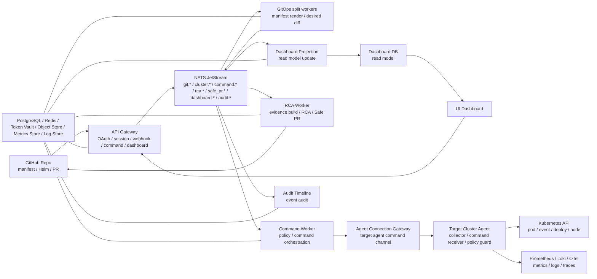

# 코치님 공유용 한 장 계획서

## 프로젝트 한 줄 설명

Kubernetes 클러스터의 이벤트, 로그, 메트릭을 수집해 장애 근거를 만들고, RCA와 복구안을 제안한 뒤 사람이 승인하면 안전하게 명령 실행 또는 GitHub PR로 연결하는 운영 자동화 서비스입니다.

## 기획 요약

| 항목 | 내용 |
| --- | --- |
| 대상 사용자 | Kubernetes 기반 서비스를 운영하는 개발자, SRE, 플랫폼 엔지니어 |
| 문제 | 장애 발생 시 로그, 메트릭, 이벤트, 배포 이력을 사람이 따로 확인해야 해서 원인 파악과 복구안 작성이 늦어짐 |
| 해결 | 클러스터 증거를 자동 수집하고, RCA와 복구 후보를 만들고, 승인된 조치만 실행 또는 PR로 제안 |
| 핵심 가치 | 장애 분석 시간 단축, 복구 조치의 근거 보존, 운영 명령의 승인/감사 기록 유지 |
| MVP 사용자 흐름 | 장애 징후 수집 -> 증거 묶음 생성 -> RCA 생성 -> 복구안 또는 PR 제안 -> 사람 승인 -> sandbox 명령 실행 -> dashboard/audit 확인 |
| 1차 데모 입력 | GitHub webhook, target agent evidence, command API 중 하나 이상 |
| 1차 데모 출력 | dashboard 상태, RCA 결과, Safe PR dry-run, command queue/result, audit log |

## MVP 범위

| 포함 | 제외 또는 후순위 |
| --- | --- |
| Management API Gateway | 완성형 UI |
| NATS JetStream 기반 event flow | production namespace write |
| Target Cluster Agent outbound 연결 | 다중 클러스터 고도화 |
| 실제 provider 계약 기반 E2E smoke | 고성능 대용량 튜닝 |
| OAuth/session 기본 흐름 | 복잡한 조직 권한 모델 |
| RCA baseline과 Safe PR 제안/생성 흐름 | 완전 자동 복구 |
| DLQ/replay 기본 운영 | AI 답변 품질 평가 자동화 |

## 성공 기준

| 기준 | 확인 방법 |
| --- | --- |
| 전체 흐름 연결 | `make up && make smoke`로 webhook/evidence부터 dashboard까지 확인 |
| 장애 격리 | worker pod 삭제 후 재기동, event retry 또는 DLQ 확인 |
| 승인 경계 | command 실행 전 session/policy/sandbox guard 확인 |
| 근거 보존 | evidence, RCA, PR, command result, audit log가 같은 correlation_id로 조회됨 |
| 데모 가능성 | 수요일 보고 전 10분 이내 재현 가능한 runbook 확보 |

## MVP 목표

| 기간 | 목표 | 데모 기준 |
| --- | --- | --- |
| 1주차, 2026-06-27 ~ 2026-07-01 | 전체 End-to-End 흐름 연결 | Git webhook 또는 agent evidence 입력부터 RCA, Safe PR, command queue까지 끊기지 않게 동작 |
| 2주차, 2026-07-04 ~ 2026-07-10 | 실제 provider와 AI 기본 모듈 | GitHub PR, Prometheus/Loki/Tempo/Kubernetes provider, AI chat, 복구안 추천, 승인 guard 기본 구현 |
| 3주차 | MVP 완성 | 장애 주입부터 근거 조회, RCA, 복구안 승인, command 실행, PR 제안까지 통합 데모 |
| 4~5주차 | 고도화와 발표 안정화 | multi-cluster, agent policy, AI eval, backpressure 중 선택 고도화 |

## 아키텍처 요약

## 핵심 설계 판단

| 판단 | 현재 방향 |
| --- | --- |
| 구조 | 처음부터 마이크로서비스 실행 단위로 분리하고, 서비스 간 직접 호출 대신 NATS JetStream event로 연결 |
| Target 연결 | Target cluster가 management로 outbound 연결하고 command를 polling 또는 stream으로 받아감 |
| 안전 수준 | Google SRE 관점의 L2-ready 구조. 2주차에 AI 복구안과 사람 승인 guard를 넣어 L2 MVP로 전환 |
| 쓰기 권한 | production write 금지, sandbox namespace부터 제한 실행 |
| 저장소 | MVP는 PostgreSQL/Redis/Object Store 등을 관리 클러스터에 두되, 스키마와 소유권은 서비스별로 분리 |
| 실패 처리 | worker retry, event_processing ledger, DLQ, replay API로 복구 가능하게 설계 |

## 서비스 역할

| 서비스 | 역할 |
| --- | --- |
| API Gateway | 모든 외부 요청의 입구이며 OAuth/session, webhook, command, DLQ API를 담당 |
| GitOps split workers | Git 변경을 manifest render, desired diff, command.requested event로 변환 |
| Command Worker | command policy를 검사하고 sandbox command만 target agent queue로 보냄 |
| RCA Worker | cluster evidence를 묶어 RCA를 만들고 Safe PR 또는 복구 제안 event를 생성 |
| Dashboard Projection Service | RCA/command/Safe PR event를 `RcaTimeline` read model로 투영하고 `/dashboard/rca/*` API가 읽음 |
| Audit Timeline Service | 누가 어떤 event와 명령을 만들었는지 감사 로그로 보존 |
| Target Cluster Agent | 대상 클러스터 안에서 Kubernetes API와 telemetry를 읽고, 승인된 command만 실행 |
| Node Collector | DaemonSet으로 노드/runtime 지표와 로그 샘플을 제공하는 선택형 수집기 |

## Command / Control 상세 역할

| 박스 | 한 줄 역할 | 왜 분리하는가 |
| --- | --- | --- |
| Command Orchestrator | command.requested를 받아 정책, 상태, 실행 계획을 결정 | 명령을 바로 실행하지 않고 승인/정책/상태 전이를 한 곳에서 관리하기 위해 |
| Command Dispatcher | 실행 가능한 command를 target agent로 보낼 수 있는 형태로 변환 | 전송 방식이 polling, WebSocket, gRPC로 바뀌어도 command 판단 로직을 보호하기 위해 |
| Agent Connection Gateway | target agent와 management 사이의 연결 채널 | target cluster가 외부에서 직접 뚫리지 않고 outbound 연결만 유지하게 하기 위해 |

현재 코드에서는 `Command Orchestrator`와 `Command Dispatcher`가 `src/services/command/command-worker` 안에서 최소 구현으로 묶여 있고, `Agent Connection Gateway`는 `src/services/gateway/api-gateway`의 agent endpoint와 `src/services/target/cluster-agent`의 polling client로 구현되어 있습니다. 트래픽이나 책임이 커지면 별도 서비스로 분리합니다.

## 코치님께 확인받고 싶은 것

- 1주차에 전체 E2E를 실제 provider 계약 기준으로 먼저 연결하는 우선순위가 맞는지
- 2주차에 AI chat, recovery planner, approval guard를 넣어 L2 MVP로 가는 범위가 적절한지
- Target Agent가 outbound 방식으로 붙고 sandbox write만 허용하는 보안 방향이 실무적으로 안전한지
- NATS JetStream 기반 event-driven 구조가 MVP 규모에서 과하지 않은지
- Safe PR과 command 실행 중 어느 쪽을 데모 핵심으로 잡는 것이 더 설득력 있는지
