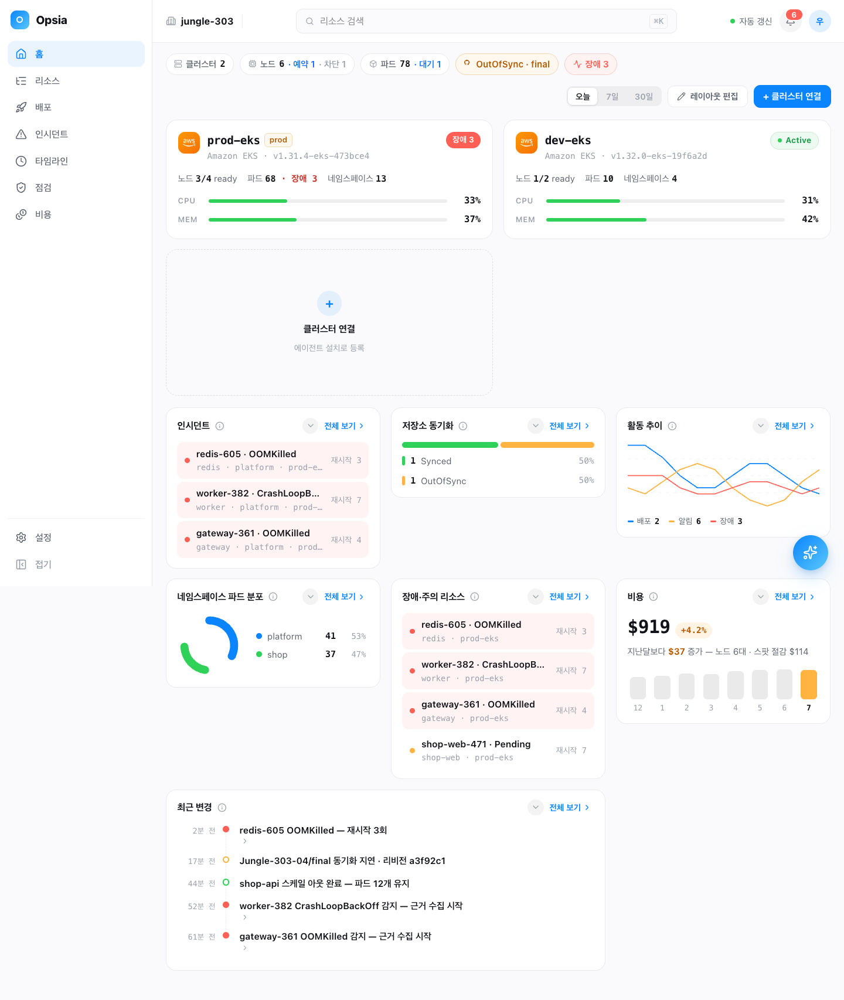
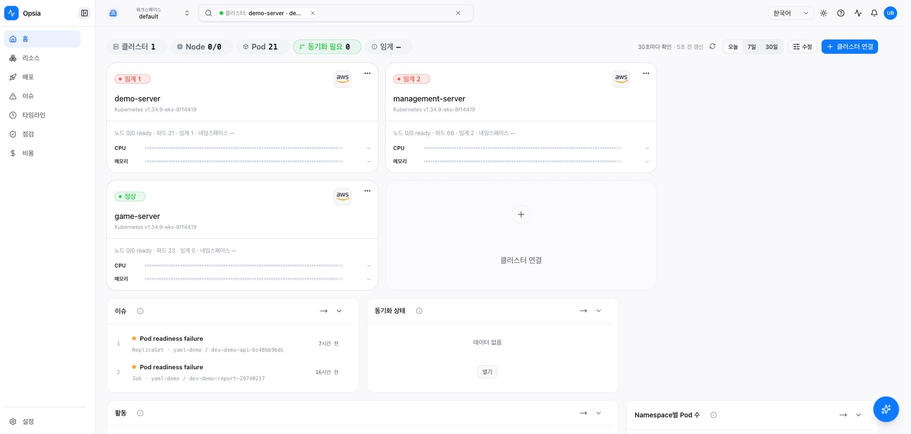
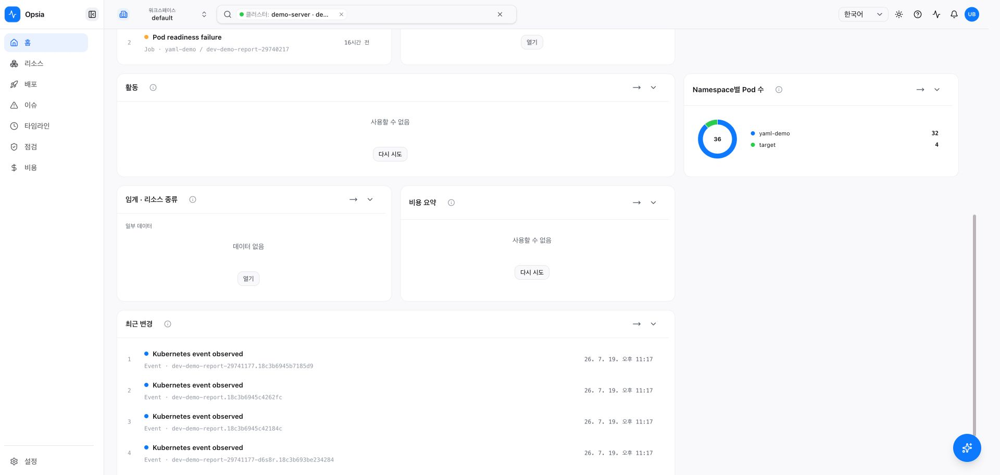
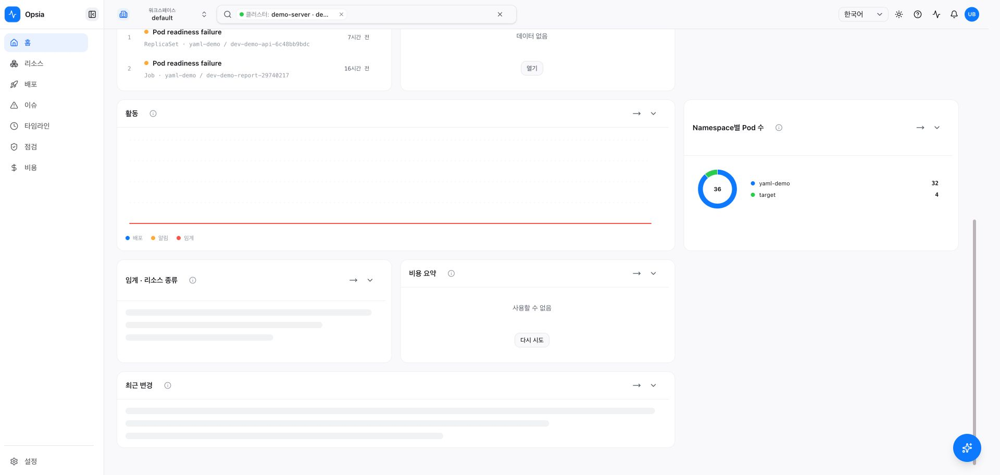
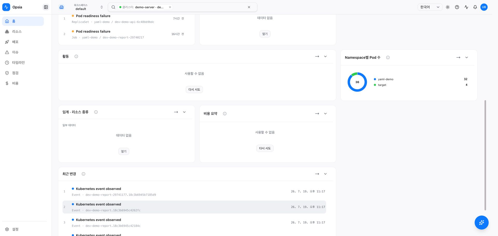

# Home surface visual comparison — demo v3 ↔ live `333c65734`

- Reference: read-only `demo-freeze-v3`, `/devpreview-unified.html`, 1440 px
- Live product: `https://k8s.woonyong.org/home?clusters=demo-server`, 1920 px viewport; the top bitmap is 1909 px after scrollbar exclusion
- Live digest: `333c657345271e5d924fbb9e01983f9142335098`
- Pipeline: Dev Gate `29689900163`, Dev Deploy `29690120559`, both success

| demo-freeze-v3 reference | deployed product |
| --- | --- |
|  |  |
| reference includes the complete vertical board |  |

## Surface verdict

| Element | v3 rule | Same-SHA live observation | Result |
| --- | --- | --- | --- |
| Fleet summary | one-row chips, period segment, actions on the right | structure present | visual structure pass |
| Cluster cards | two-column maximum, health/provider/version/usage, connection action | structure present, CPU/MEM honestly unavailable | visual structure pass |
| Card facts | summary, cards and APIs must tell one fact | card node/pod/health values differ from `/api/fleet/summary` | **fail** |
| Widget board | W2–W8 visible with shared chart/card grammar | all seven widgets present | structure pass |
| Activity | stable across scheduled refreshes | chart renders initially, then becomes unavailable after 30 seconds | **fail** |
| Empty states | executable next action, no dead legacy route | captured actions resolve to canonical routes | pass for captured paths |
| Theme/motion | common tokens and motion grammar | light surface visually coherent; static screenshots cannot finish motion parity | partial |
| Responsive | no wrap/overflow break at 1280–1920 | deployed 1920 horizontal overflow 0 | partial; deployed 1280/1440 still required |

## Deterministic activity regression

| Initial load | After one 30-second refresh |
| --- | --- |
|  |  |

The backend endpoint is healthy in the same deployment: a 2026 one-hour request returns HTTP 200 and 12 five-minute buckets. The transition above is caused by frontend refresh-window construction, not by the deployed bigint fix.

## Completion judgment

This pack proves that the Home UI reached live and that W2–W8 are present. It also proves two blockers. It is **not** a G4 Home completion pack because:

1. card/fleet numbers disagree;
2. activity breaks on the first scheduled refresh;
3. reference and live captures are not yet the same viewport;
4. deployed 1280 and 1440 resize checks remain outstanding.

No G4 completion line may be added until the two product defects are fixed and the same-viewport demo/live comparison is repeated on the new deployed digest.
