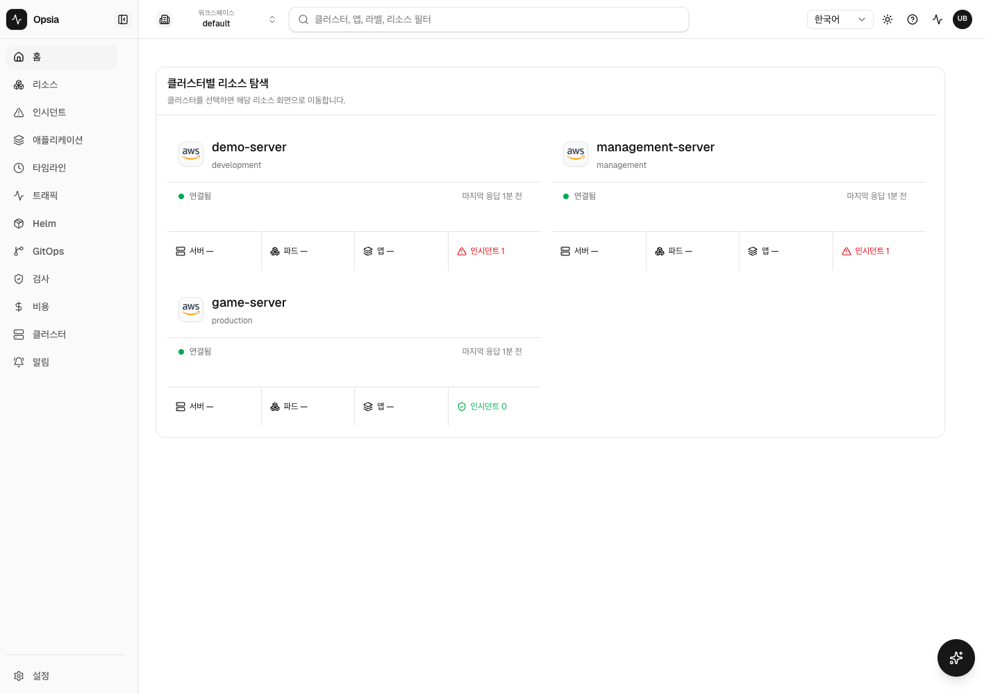

# 라이브 발표 경로 스모크 — 2026-07-19 17:50 KST

- 라이브: `https://k8s.woonyong.org`
- 확인된 source SHA: `fba57b25ef837cc3fa329511ebdd7782b5e25425`
- 번들: `index-D0whfJ2c.js`
- API health: `{"status":"ok","service":"api-gateway"}`
- 브라우저: headless Google Chrome, 1440×1000, ko
- JS page error: 0
- console error: 0

## 경로 결과

| 요청 경로 | HTTP | 최종 경로 | H1 |
| --- | ---: | --- | --- |
| `/` | 200 | `/` | 홈 |
| `/resources` | 200 | `/resources` | 리소스 |
| `/alerts` | 200 | `/alerts` | 알림 |
| `/applications` | 200 | `/applications` | 애플리케이션 |
| `/timeline` | 200 | `/timeline` | 타임라인 |
| `/traffic` | 200 | `/traffic` | 트래픽 |
| `/helm` | 200 | `/helm` | Helm |
| `/gitops` | 200 | `/gitops` | GitOps |
| `/inspect` | 200 | `/home` | 홈 |
| `/cost` | 200 | `/cost` | 비용 |
| `/clusters` | 200 | `/clusters` | 클러스터 |
| `/settings` | 200 | `/settings` | 설정 |

빠른 연속 탐색에서 발생한 `net::ERR_ABORTED`는 다음 경로로 이동하며 이전 화면의
폴링 요청을 브라우저가 취소한 결과라 실패 건수에서 제외했다.

## 판정

G0 라이브 기준 경로·health 스모크는 통과했다. 이 증거는 G4 후보 SHA의 증거가 아니다.
G4 최종 스모크는 새 Dev Deploy가 완주한 뒤 같은 source SHA·service/console digest로 다시
수행해야 한다.
