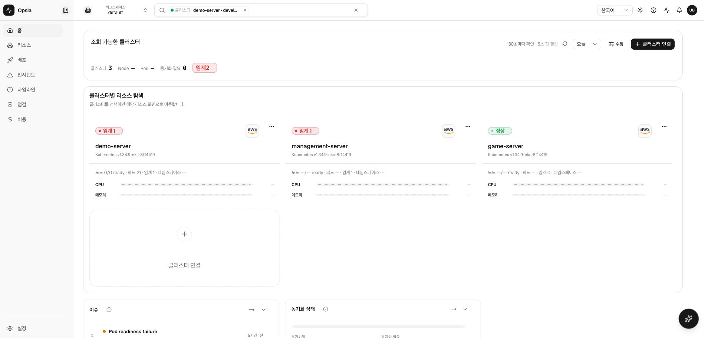

# 라이브 발표 경로 스모크 — 2026-07-19 21:58 KST

- 라이브: `https://k8s.woonyong.org`
- 확인된 source SHA: `fdd75a4f265eb5c7fd4dd769b475677c1f6830c8`
- 번들: `index-C7RrC8Hw.js`
- API health: `{"status":"ok","service":"api-gateway"}`
- API readiness: `{"status":"ready"}`
- 브라우저: 로그인 상태의 실제 Google Chrome, 한국어
- JS console error: 0
- 8개 canonical 경로 가로 overflow: 0

## 경로 결과

| 요청 경로 | 최종 경로 | H1 | 로그인 회귀 | 가로 overflow |
| --- | --- | --- | --- | ---: |
| `/home` | `/home?clusters=demo-server` | 홈 | 없음 | 0 |
| `/resources` | `/resources?clusters=demo-server` | 리소스 | 없음 | 0 |
| `/deploy` | `/deploy?clusters=demo-server` | 배포 | 없음 | 0 |
| `/issues` | `/issues?clusters=demo-server` | 인시던트 | 없음 | 0 |
| `/timeline` | `/timeline?clusters=demo-server` | 타임라인 | 없음 | 0 |
| `/checks` | `/checks?clusters=demo-server` | 점검 | 없음 | 0 |
| `/cost` | `/cost?clusters=demo-server` | 비용 | 없음 | 0 |
| `/settings` | `/settings?clusters=demo-server` | 설정 | 없음 | 0 |

## 판정

2시간 주기 E 라이브 발표 경로 스모크의 누락 회차를 보충했고 canonical 8개 경로,
공개 health/readiness, 브라우저 console 경계가 통과했다. 현재 라이브는 여전히
`fdd75a4f2`이므로 이 자료는 홈 후보나 G4 완료 증거가 아니다. 홈 후보 배포 뒤 같은
source SHA와 번들에서 카드 수치·W2~W8·클릭 경로를 다시 수집한다.
