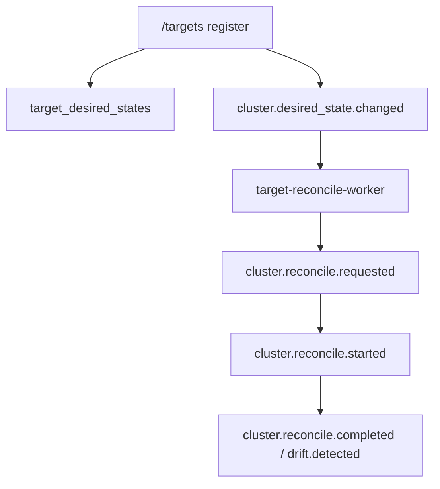
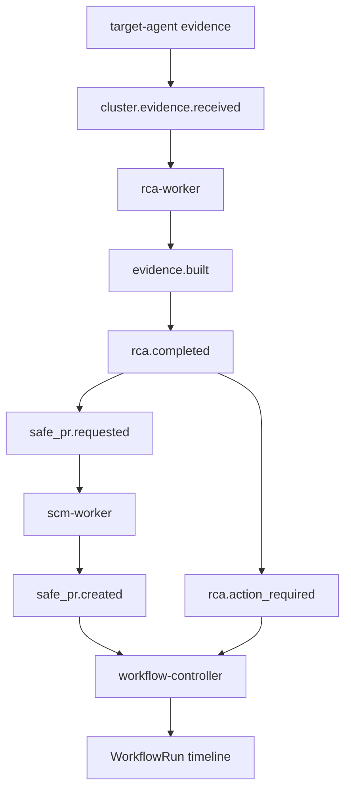
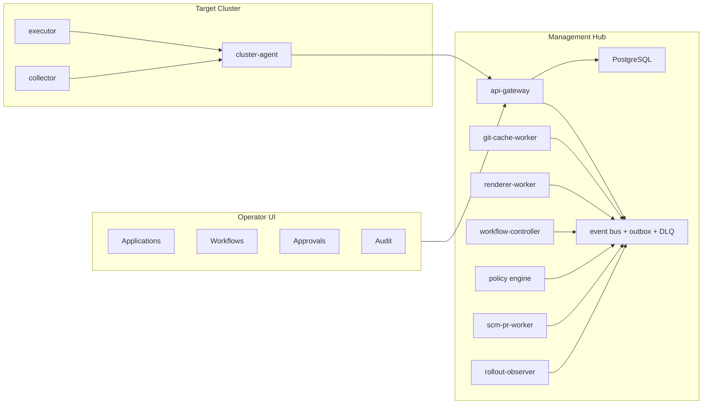
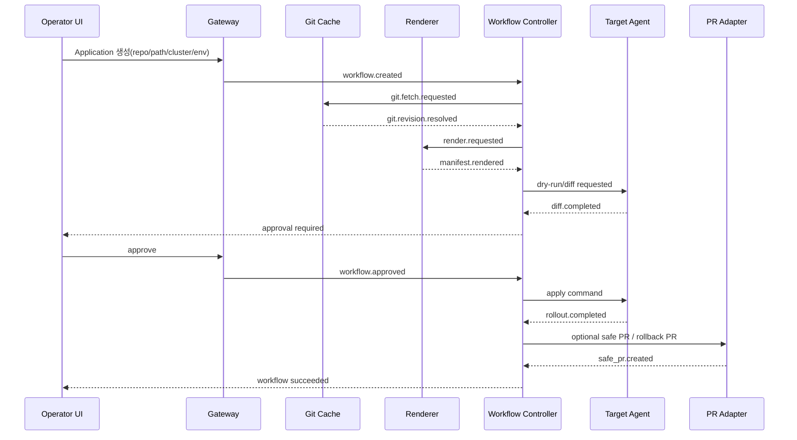

# GitOps Fleet Control Plane 제품/아키텍처 전환안

이 문서는 현재 `dev` 브랜치의 이벤트 기반 Kubernetes 운영 자동화 MVP를
`lightweight GitOps fleet control plane` 제품으로 발전시키기 위한 기준이다.

목표는 Plural Console을 그대로 복제하는 것이 아니다. Plural에서 강한 부분인
"운영 워크플로우를 UI로 쉽게 관리하는 경험"은 가져오되, 더 가볍고 더 뾰족한
GitOps 중심 제품으로 경쟁한다.

## 한 문장 정의

여러 Kubernetes 클러스터를 하나의 UI에서 연결하고, Git을 source of truth로 삼아
렌더링, diff, 승인, 배포, health check, rollback, audit을 끝까지 관리하는
가벼운 GitOps fleet control plane.

## 용어 정리

### Kubernetes fleet-management control plane

`fleet`은 여러 Kubernetes 클러스터 묶음이다.

```text
dev-cluster
staging-cluster
prod-seoul-cluster
prod-us-cluster
customer-a-cluster
customer-b-cluster
```

`fleet-management control plane`은 이 클러스터들을 하나씩 `kubectl`로 관리하지 않고,
중앙 서버에서 상태를 보고, 배포하고, 승인하고, 장애를 추적하게 해주는 제어면이다.

자동화는 선택지다. 핵심은 중앙에서 여러 클러스터의 상태와 변경 흐름을 관리한다는
점이다.

```text
수동형
  상태만 보여주고 사람이 kubectl 실행

승인형
  시스템이 변경안을 만들고 사람이 승인하면 적용

자동형
  정책에 맞으면 시스템이 바로 적용

GitOps형
  Git에 원하는 상태를 저장하고 시스템이 클러스터를 Git 상태에 맞춤
```

우리 제품은 `GitOps형 + 승인형 + 안전 자동화`를 기본값으로 둔다.

### Git cache

GitHub/GitLab repository를 매번 새로 clone하지 않고, control plane이 commit 기준으로
빠르게 읽을 수 있게 보관하는 캐시다.

필요한 이유:

- 여러 클러스터가 같은 repo를 참조해도 clone/fetch를 반복하지 않는다.
- render와 diff가 항상 특정 commit SHA에 묶인다.
- 배포 증거에 "무슨 commit을 적용했는가"를 남길 수 있다.
- GitHub 장애나 rate limit 영향을 줄인다.

### Helm cache

Helm chart repository와 chart package를 캐시하는 계층이다. Helm chart를 매번 외부에서
받으면 느리고 불안정하다. Git cache와 마찬가지로 chart version, values, render 결과를
추적 가능하게 만든다.

### Pipeline / workflow

배포가 지나가는 단계의 묶음이다.

```text
Git 변경 감지
-> Helm/Kustomize render
-> diff 계산
-> policy 검사
-> staging 적용
-> health check
-> 승인 대기
-> production 적용
-> 알림
```

Plural에서 배워야 할 핵심은 이 workflow를 UI에서 쉽게 보고 조작할 수 있다는 점이다.
우리도 workflow를 백엔드 이벤트 로그에만 숨기지 않고, UI의 1급 개념으로 올려야 한다.

### PR automation

시스템이 GitHub/GitLab PR을 자동으로 만들어주는 기능이다.

예:

```text
장애 발견
  checkout-api v2 readiness probe 실패

시스템 판단
  이전 stable image로 rollback 필요

자동 PR 생성
  image: checkout-api:v2
  -> image: checkout-api:v1

사람이 리뷰/merge
  GitOps reconcile이 적용
```

핵심은 운영 변경을 클러스터에 몰래 적용하지 않고 Git 변경으로 남긴다는 것이다.

### AI

AI는 챗봇 장식이 아니라 운영 workflow 안에 들어가는 진단/제안 계층이다.

좋은 AI 역할:

- Kubernetes event, log, metric, trace 요약
- 장애 원인 후보 제시
- 관련 manifest 위치 찾기
- 수정 PR 초안 만들기
- 위험한 변경인지 설명
- rollback plan 작성

금지할 AI 역할:

- 근거 없이 prod 변경
- 임의 `kubectl` 명령 추천
- 단순 채팅창만 붙이고 workflow와 연결하지 않기

### Notification

Slack, Email, Discord, Webhook 같은 알림이다.

알림 대상:

- drift 감지
- safe PR 생성
- 승인 필요
- 배포 실패
- rollback 완료
- agent disconnected

### IaC

Infrastructure as Code다. Terraform, OpenTofu, Pulumi 같은 도구로 cloud resource를
관리하는 영역이다.

초기 경쟁 축에서는 IaC를 제품 중심에 두지 않는다. 먼저 Kubernetes GitOps와 fleet
workflow를 압도적으로 잘 만든다.

## 제품 포지셔닝

우리는 단순 Kubernetes dashboard가 아니다.

```text
Plural
  all-in-one Kubernetes fleet platform

Argo CD / Flux
  GitOps CD engine / toolkit

Rancher
  대형 multi-cluster management portal

우리 제품
  lightweight GitOps fleet control plane
  여러 클러스터를 위한 안전한 GitOps 운영 콘솔
```

이 제품은 Argo/Flux의 보조 도구가 아니라, 자체 GitOps 엔진과 운영 UI를 가진다.
다만 "모든 DevOps 작업"을 한 제품에 넣지 않는다. Plural보다 가볍고, GitOps 운영
workflow는 더 직접적이고 쉬워야 한다.

## 반드시 가져와야 하는 Plural의 장점

Plural이 좋아 보이는 이유는 기능 목록이 많아서가 아니라, 운영자가 UI에서 workflow를
관리할 수 있기 때문이다.

따라서 우리도 아래 UI 경험은 반드시 가져와야 한다.

```text
Application 생성
-> repository/path/branch 선택
-> cluster/environment binding
-> Helm values 또는 Kustomize path 설정
-> render 결과 확인
-> diff 확인
-> staging 먼저 배포
-> production 승인 대기
-> rollout/health 확인
-> 실패하면 rollback 또는 safe PR 생성
-> audit timeline 확인
```

UI의 첫 화면은 "상태를 보는 dashboard"가 아니라 "운영 workflow console"이어야 한다.

## 현재 dev 브랜치 기준 아키텍처

현재 구조는 이미 경쟁 제품의 뼈대를 일부 갖고 있다.

### 현재 강점

- `src/services/*/app.py` 기준의 분리 실행 단위.
- NATS JetStream 기반 event spine.
- outbox, retry, DLQ, event processing ledger.
- `@app.on(...)` 기반 worker chaining.
- `dashboard-worker`, `audit-worker`의 전체 이벤트 projection.
- per-cluster agent token과 outbound long-poll command 경계.
- target desired state와 reconcile record의 초기 모델.
- GitHub webhook, split GitOps worker, manifest artifact 저장 모델.
- dashboard React/Vite UI skeleton.

### 현재 주요 흐름

```mermaid
flowchart TD
  GH["GitHub webhook"] --> GW["api-gateway"]
  GW --> E1["git.webhook.received"]
  E1 --> GP["git-pull-worker"]
  GP --> E2["git.changed"]
  E2 --> MR["manifest-render-worker"]
  MR --> E3["manifest.rendered"]
  E3 --> DF["diff-worker"]
  DF --> E4["desired.diff.detected"]
  E4 --> DA["diff-analyze-worker"]
  DA --> SP["safe_pr.requested"]
  DA --> AL["alert.requested"]
  AL --> CMD["command.requested"]
  CMD --> AGQ["agent command queue"]
  AGQ --> TA["target cluster-agent"]
  E1 -.관찰.-> WC["workflow-controller"]
  E2 -.관찰.-> WC
  E3 -.관찰.-> WC
  E4 -.관찰.-> WC
  DA -.diff.analyzed.-> WC
  CMD -.queued/completed.-> WC
  WC --> WF["workflow_runs / workflow_run_steps / approvals"]
```

### 2026-07-01 dev 적용 상태

이번 리팩토링으로 "이벤트가 흐름을 표현함"에서 "제품 객체가 이벤트 흐름을 감쌈"으로
가기 위한 최소 구조가 들어갔다.

```text
Application
  사용자가 보는 앱/서비스 단위

DeploymentBinding
  Application을 cluster/namespace/environment에 연결

WorkflowRun
  app + binding + commit + environment 배포 실행 1건

WorkflowRunStep
  git/render/diff/policy/approval/safe_pr/apply/health 단계별 상태

Approval
  write-by-approval 정책의 승인 요청/승인/거절 상태
```

추가된 실행 단위:

```text
src/services/gitops/workflow-controller/app.py
```

역할:

- `git.webhook.received`, `git.changed`, `manifest.rendered`, `manifest.invalid`,
  `desired.diff.detected`, `diff.analyzed`를 관찰해 WorkflowRun과 Step을 갱신한다.
- 안전한 sandbox diff는 `approval.granted`를 자동 승인 이벤트로 남긴다.
- 위험한 diff는 `approval.requested`를 만들고 run을 `waiting_for_approval`로 둔다.
- `command.queued_for_agent`에서 `command_id`를 WorkflowRun에 연결한다.
- `command.completed`에서 run을 `succeeded` 또는 `failed`로 닫는다.

기존 worker chain은 제거하지 않았다. `workflow-controller`는 실행을 직접 대신하지 않고,
현재 chain 위에 상태 관리 layer로 얹혀 있다.

Target desired-state 흐름:



### 현재 한계

현재 구조는 "GitOps 제품"이라기보다 "GitOps/RCA/command demo workflow"에 가깝다.

| 영역 | 현재 상태 | 제품화 한계 |
| --- | --- | --- |
| Git cache | webhook/poll 중심, local git 접근 일부 | commit 기준 artifact cache 부족 |
| Helm/Kustomize | simple YAML/Deployment 중심 | real renderer 아님 |
| diff | image 중심 placeholder | multi-resource diff, server-side dry-run 부족 |
| workflow | Application/WorkflowRun/Step/Approval + workflow-controller 초기 구조 추가 | Gateway query API와 풍부한 UI, 재시도/수동승인 API 필요 |
| PR adapter | stub URL 기반 | 실제 GitHub App PR 생성 필요 |
| target apply | command queue/agent 구조 있음 | server-side apply, rollout watch, field manager 부족 |
| UI | 운영 데모 콘솔 | application/workflow/approval 중심 UX 필요 |
| auth/RBAC | session/resource access 기초 | OIDC, project role, cluster role 강화 필요 |
| secret | credential_ref 개념 | secret vault와 token lifecycle 필요 |
| migration | SQLAlchemy create 중심 | Alembic 같은 migration version 필요 |
| observability | logs + 일부 visual stream | Prometheus metrics, tracing, workflow SLO 필요 |

## 첨부 아키텍처 이미지 기준 추가 모듈

첨부된 현재 아키텍처 이미지는 크게 네 영역이다.

```text
관리 영역
  api-gateway
  NATS JetStream
  GitOps/RCA/command/projection/audit workers

계기반 영역
  dashboard realtime gateway
  dashboard query API
  dashboard DB
  UI

타깃 클러스터 영역
  target cluster agent
  Kubernetes API
  Prometheus/Loki/OTel collector
  ServiceAccount/RBAC

저장 영역
  PostgreSQL
  metrics store
  token vault/secret
```

이 그림 위에 추가되는 핵심 모듈은 아래와 같다.

```text
관리 영역에 추가
  workflow-controller
    기존 GitOps/command/approval 이벤트를 관찰한다.
    applications, workflow_runs, workflow_run_steps, approvals를 갱신한다.
    workflow.* / approval.* 이벤트를 발행한다.

  git-cache-worker
    repo_ref + branch + commit_sha 기준 clone/fetch cache를 관리한다.
    manifest-render-worker가 local file이나 단순 webhook body가 아니라 cache에서 source를 읽게 한다.

  renderer adapter
    raw YAML, Helm, Kustomize renderer를 같은 RenderedManifest/Artifact 계약으로 수렴시킨다.

  policy/approval API
    approval.requested를 사람이 승인/거절하는 HTTP 경계를 제공한다.
    승인되면 approval.granted와 승인된 command/safe_pr 흐름을 연결한다.

  rollout-observer
    command.completed만 믿지 않고 target-agent의 rollout/health 보고를 관찰한다.
    rollout_waiting, succeeded, failed를 WorkflowRun에 반영한다.

저장 영역에 추가
  applications
  workflow_runs
  workflow_run_steps
  approvals
  git cache metadata
  render artifact digest
  PR/rollout result metadata

계기반 영역에 추가
  Application list
  Workflow run timeline
  Approval queue
  Diff viewer
  Rollout/health view
  Audit timeline
```

대시보드 구현은 별도 브랜치에서 진행하더라도, 백엔드는 위 객체들을 이미 1급
상태로 만들어야 한다. UI는 이벤트 subject를 직접 보여주는 것이 아니라
`checkout-api prod 배포`, `commit abc123`, `approval 대기`, `image v1 -> v2`처럼
WorkflowRun projection을 읽어야 한다.

## AI / RCA 흐름

현재 이미지에는 AI 흐름이 RCA 서비스 한 칸으로만 보인다. 목표 제품에서는 AI가
별도 채팅 부속물이 아니라 WorkflowRun의 진단/조치 단계에 들어간다.



AI가 해야 하는 일:

- Kubernetes event, log, metric, trace를 evidence bundle로 요약한다.
- 증거에서 장애 원인 후보와 confidence를 만든다.
- 관련 application, binding, workflow_run을 찾아 연결한다.
- 안전하면 rollback/fix PR 초안을 `safe_pr.requested`로 넘긴다.
- 위험하면 `approval.requested` 또는 `rca.action_required`로 사람에게 넘긴다.

AI가 하면 안 되는 일:

- 승인 없이 production apply를 직접 실행한다.
- event body에 kubeconfig, token, secret을 포함한다.
- 근거 없는 `kubectl` 명령을 command-worker로 바로 보낸다.

즉 AI 흐름의 제품 표현은 "채팅 답변"이 아니라 WorkflowRun의 한 단계다.

## 목표 아키텍처

목표 구조는 현재 event spine을 유지하되, 제품의 중심을 `GitOps Application`과
`Workflow Run`으로 이동한다.



### 바뀌는 중심 모델

현재 중심:

```text
event subject chain
git webhook body
manifest rendered body
command request
target desired component
```

목표 중심:

```text
Application
Repository
Environment
ClusterBinding
RenderArtifact
Diff
Workflow
WorkflowRun
Approval
Rollout
SafePR
AuditTimeline
```

이벤트는 계속 중요하지만, 사용자가 직접 보는 제품 개념은 `Application`과 `Workflow`다.

## 현재 dev 대비 아키텍처 변경점

### 1. GitOps 도메인이 보조 흐름에서 제품 코어로 승격된다

현재:

- `/github/webhook`이 들어오면 이벤트 chain이 돈다.
- `GitRepository`, `GitWatchTarget`, `DeploymentBinding`, `ManifestArtifact` 모델은 있다.
- `Application`, `WorkflowRun`, `WorkflowRunStep`, `Approval` 초기 모델과
  `workflow-controller`가 추가됐다.
- 아직 Gateway query API와 사용자 UI에서 application/workflow 단위로 조작하지는 않는다.

목표:

- `Application` 또는 `DeploymentBinding`이 UI의 중심 객체가 된다.
- 사용자는 UI에서 repo/path/branch, cluster, namespace, environment를 연결한다.
- Git 변경은 application workflow run을 만든다.
- workflow run은 render, diff, policy, approval, apply, health check 상태를 가진다.

변경 방향:

```text
domains/gitops
  현재: webhook/event 중심
  목표: repository, application, binding, artifact, diff의 source of truth

초기 구현됨
  application model
  workflow run model
  workflow run step model
  approval model

다음 필요
  rollout model
  workflow query/approval API
```

### 2. manifest-render-worker는 real renderer 계층으로 바뀐다

현재:

- JSON 또는 간단 YAML을 읽어 `RenderedManifest` 하나를 만든다.
- Deployment 전용 shape에 가깝다.

목표:

- `helm template`
- `kustomize build`
- raw YAML multi-document
- server-side dry-run
- render artifact digest
- render error report

목표 흐름:

```text
git.changed
-> git cache에서 commit checkout
-> renderer job 생성
-> Helm/Kustomize/raw YAML render
-> artifact 저장
-> manifest.rendered
-> diff job 생성
```

### 3. diff-worker는 단순 image 비교에서 cluster-aware diff로 바뀐다

현재:

- `PREVIOUS_IMAGE` placeholder와 rendered image를 비교한다.

목표:

- target agent가 보고한 actual snapshot 또는 server-side dry-run 결과와 비교한다.
- resource 단위 create/update/delete를 계산한다.
- 위험도는 문자열이 아니라 정책 결과가 된다.

예:

```text
Deployment checkout-api
  replicas: 2 -> 4
  image: v1 -> v2

Service checkout-api
  no change

Ingress checkout-api
  host changed
  risk: external traffic impact
```

### 4. target-agent는 "증거/명령 수신자"에서 "GitOps executor"로 확장된다

현재:

- management hub에 outbound 연결한다.
- command queue를 polling한다.
- telemetry/evidence를 보낸다.
- node collector를 관리할 수 있다.

목표:

- server-side apply executor
- dry-run/diff executor
- rollout watcher
- actual state reporter
- field manager 기반 ownership tracking
- apply result와 health result 보고

중요 원칙:

```text
management plane
  desired state 저장
  policy/approval 결정
  workflow 상태 관리

target-agent
  자기 cluster에서만 actual 조회
  승인된 작업만 실행
  결과와 증거를 hub로 보고
```

### 5. workflow-controller가 상태 관리 layer로 추가됐다

현재:

- 기존 worker chain은 그대로 유지된다.
- `workflow-controller`가 GitOps/approval/command 이벤트를 관찰해
  `workflow_runs`, `workflow_run_steps`, `approvals`를 갱신한다.
- 아직 사용자가 UI에서 "이 배포가 어느 단계인지"를 조작하는 query/action API는 부족하다.

목표:

```text
WorkflowRun states
  created
  rendering
  render_failed
  diffing
  policy_checking
  waiting_for_approval
  applying
  rollout_waiting
  succeeded
  failed
  rollback_requested
  safe_pr_created
```

workflow-controller는 이벤트를 받아 `workflow_runs`를 갱신하고
`workflow.*`, `approval.*` projection event를 발행한다. apply 실행 자체는
기존 `command-worker`와 target-agent 경계를 계속 사용한다.

### 6. PR automation은 stub에서 실제 GitHub App adapter로 바뀐다

현재:

- `scm-worker`가 `SCM_PR_URL_PREFIX`로 stub URL을 만든다.

목표:

- GitHub App installation token 발급.
- branch 생성.
- patch commit.
- PR 생성.
- PR URL, branch, commit SHA, review status 저장.
- merge 후 GitOps reconcile trigger.

PR은 우리 제품의 안전성 메시지다. 따라서 첫 public release 전에는 실제 adapter가
필수다.

### 7. UI는 데모 대시보드에서 workflow console로 바뀐다

현재:

- `dashboard/`는 GitOps, Kubernetes, 이벤트/장애 탭과 live demo 조작을 제공한다.
- 실제 운영 workflow builder, approval queue, application list는 부족하다.

목표 화면:

```text
좌측 네비게이션
  Applications
  Clusters
  GitOps Workflows
  Approvals
  Pull Requests
  Incidents
  Audit

Application 상세
  repository/path/branch
  environment bindings
  cluster별 sync/health/drift
  latest workflow run
  current diff
  rollout status
  rollback action

Workflow run 상세
  render result
  diff
  policy decision
  approval history
  apply logs
  health checks
  generated PR
  audit timeline
```

Plural에서 가져와야 할 것은 "예쁜 dashboard"가 아니라 이 운영 workflow를 한 화면에서
이해하고 조작하는 경험이다.

### 8. auth/RBAC는 workflow action 중심으로 강화된다

현재:

- 내부 email/password session.
- resource access grant.
- cluster agent token.

목표:

- OIDC login.
- workspace/project role.
- cluster/app/environment action 권한.
- approval 권한과 deploy 권한 분리.
- break-glass action 별도 audit.

권한 예:

```text
viewer
  상태와 audit 읽기

developer
  dev/staging workflow 실행
  PR 생성 요청

approver
  production approve

admin
  cluster 연결, secret 등록, policy 변경
```

### 9. secret vault가 필요하다

현재:

- `credential_ref` 개념은 있으나 실제 vault는 제품화 전 단계다.

목표:

- GitHub App key, webhook secret, OIDC secret, notification webhook, cloud token을 직접
  event payload에 넣지 않는다.
- secret은 vault record로 저장하고, workflow는 `credential_ref`만 참조한다.
- token rotation, revoke, audit가 필요하다.

초기 구현은 DB 암호화 또는 SOPS/KMS 기반 vault여도 된다. 중요한 것은 secret 원문이
이벤트, 로그, UI response에 나오지 않는 것이다.

### 10. 운영 배포는 Helm chart 중심으로 바뀐다

현재:

- `deploy/management/*.yaml`, `deploy/target/*.yaml` 중심.
- kind/local 실행에 적합하다.

목표:

- hub Helm chart.
- target agent Helm chart.
- migration Job.
- NetworkPolicy.
- resource requests/limits.
- HPA/KEDA.
- Prometheus metrics.
- OpenTelemetry tracing.

설치 경험 목표:

```bash
helm install releasegraph ./charts/hub

helm install releasegraph-agent ./charts/agent \
  --set hub.url=https://hub.example.com \
  --set agent.token=...
```

## 유지해야 할 현재 설계

아래는 버리지 않는다.

- event-driven service chain.
- outbox + event_processing ledger + DLQ.
- audit-worker의 전체 이벤트 기록.
- projection-worker의 read model 갱신.
- target cluster outbound-only agent.
- 서비스별 entrypoint 분리.
- `packages/contracts` 기반 event body와 port 계약.
- production write 기본 차단, 승인/정책 후 apply.

이 구조는 Plural보다 작고 설명하기 쉬운 강점이다.

## 새로 필요한 서비스 후보

| 서비스 | 책임 | 현재 대체/유사 |
| --- | --- | --- |
| `git-cache-worker` | repo mirror/fetch, commit checkout, provenance | `github-poll-worker`, `git-pull-worker` |
| `renderer-worker` | Helm/Kustomize/raw YAML render, artifact 저장 | `manifest-render-worker` |
| `diff-worker` 확장 | cluster-aware diff, dry-run 결과 비교 | 현재 `diff-worker` |
| `workflow-controller` | workflow run state machine | 2026-07-01 초기 구현 완료 |
| `approval-worker` | approval timeout, required approver, gate event | alert/command 사이에 일부 |
| `rollout-observer` | apply 후 rollout/health watch | target-agent 일부 |
| `notification-worker` | Slack/Email/Webhook routing | `alert-worker` 확장 |
| `scm-worker` 확장 | 실제 GitHub/GitLab PR adapter | 현재 stub |

서비스 수를 무작정 늘리지 않는다. 먼저 현재 worker를 확장하고, 책임이 커질 때 분리한다.

## 새로 필요한 데이터 모델 후보

현재 이미 있는 모델:

- `git_repositories`
- `git_watch_targets`
- `deployment_bindings`
- `manifest_artifacts`
- `target_desired_states`
- `target_reconcile_records`
- `agent_commands`
- `pull_requests`
- `dashboard_cards`
- `audit_logs`

추가/확장 후보:

| 모델 | 목적 |
| --- | --- |
| `applications` | UI의 1급 GitOps app/service. 2026-07-01 초기 구현 완료 |
| `workflow_runs` | app + binding + commit + environment 실행 1건. 2026-07-01 초기 구현 완료 |
| `workflow_run_steps` | render/diff/policy/approval/apply/health 단계 상태. 2026-07-01 초기 구현 완료 |
| `approvals` | write-by-approval 요청/승인/거절 상태. 2026-07-01 초기 구현 완료 |
| `environments` | dev/staging/prod 같은 배포 단계 |
| `workflow_definitions` | render/diff/approval/apply 단계 정의 |
| `render_artifacts` | multi-resource manifest bundle, digest, source provenance |
| `diff_artifacts` | resource별 diff, risk, policy result |
| `rollout_records` | apply result, rollout condition, health check |
| `secret_refs` | credential/vault metadata |
| `notification_routes` | Slack/Email/Webhook 라우팅 |

## 새 목표 흐름



## 단계별 전환 계획

### Phase 1. 제품 개념 정리와 UI 정보구조

- `Application`, `WorkflowRun`, `WorkflowRunStep`, `Approval` 용어와 초기 DB/event 계약은
  2026-07-01 dev에 반영했다.
- `Environment`와 workflow definition 용어는 다음 설계에서 확정한다.
- dashboard를 `운영 콘솔` 정보구조로 재정렬.
- 현재 GitOps/Control/Kubernetes/Event 탭을 Applications/Workflows/Approvals/Audit로
  재구성할 설계 작성.

성공 기준:

- 사용자가 UI에서 "어떤 app이 어떤 cluster에 어떤 commit으로 배포 중인지"를 볼 수 있다.

### Phase 2. real Git cache

- repository 등록 API 정리.
- bare mirror/fetch cache.
- commit SHA, branch, path, credential_ref provenance 저장.
- webhook과 poller가 같은 `git.revision.resolved` 흐름으로 합류.

성공 기준:

- 같은 repo를 여러 workflow가 사용해도 checkout/cache가 재사용된다.

### Phase 3. real Helm/Kustomize renderer

- `helm template`, `kustomize build`, raw YAML render 지원.
- render를 sandboxed Job 또는 제한된 subprocess adapter 뒤에 둔다.
- rendered bundle과 digest 저장.

성공 기준:

- 단일 Deployment placeholder 없이 multi-document manifest를 artifact로 저장한다.

### Phase 4. workflow run state machine

- `workflow_runs`, `workflow_run_steps`, `approvals` 초기 테이블과 `workflow-controller`는
  2026-07-01 dev에 반영했다.
- render/diff/policy/approval/apply/health 상태를 명시적으로 기록한다.
- event chain은 유지하되 UI는 workflow run을 조회한다.
- 다음 구현은 approval API, retry API, rollout observer, workflow query API다.

성공 기준:

- 배포 하나의 현재 단계, 실패 이유, 재시도 가능 단계가 UI에 보인다.

### Phase 5. target-agent GitOps executor

- dry-run/diff.
- server-side apply.
- rollout wait.
- actual state snapshot.
- apply result 보고.

성공 기준:

- management plane이 kubeconfig를 직접 들고 apply하지 않고, target-agent가 자기
  클러스터에서 승인된 작업만 실행한다.

### Phase 6. real PR automation

- GitHub App adapter.
- branch/commit/PR 생성.
- PR status와 merge event 수집.
- rollback PR 생성.

성공 기준:

- 장애 또는 policy 결과에서 실제 PR이 생성되고 audit timeline에 남는다.

### Phase 7. OIDC/RBAC/secret vault/notification

- OIDC login.
- project/cluster/app role.
- approval permission.
- vault-backed credential_ref.
- Slack/Email/Webhook notification route.

성공 기준:

- production workflow는 승인 권한 없이 apply될 수 없다.
- secret 원문은 event/log/UI response에 나타나지 않는다.

### Phase 8. 운영 배포 성숙화

- Alembic migration.
- hub/agent Helm chart.
- Prometheus metrics.
- OpenTelemetry tracing.
- KEDA.
- backup/restore 기준.

성공 기준:

- kind demo가 아니라 dev/staging cluster에 반복 설치/업그레이드할 수 있다.

## 경쟁 기준

Plural보다 이겨야 하는 항목:

- 설치와 이해가 더 쉽다.
- GitOps workflow UI가 더 직관적이다.
- multi-cluster 상태가 더 빠르게 한눈에 보인다.
- 변경 전 diff, 승인, audit이 더 선명하다.
- 장애에서 rollback PR까지의 흐름이 더 짧다.

Plural과 경쟁하지 않을 항목:

- 모든 IaC 실행 플랫폼.
- 모든 notification/workbench/chat 기능.
- 대형 enterprise portal 전체 복제.
- cloud cluster provisioning 전체.

## 현재 dev와 목표의 핵심 차이 요약

| 축 | 현재 dev | 목표 |
| --- | --- | --- |
| 제품 정체성 | 이벤트 기반 Kubernetes 운영 자동화 MVP | GitOps fleet control plane |
| 사용자 중심 객체 | 이벤트, dashboard card, command | Application, WorkflowRun, Approval |
| GitOps | webhook 기반 split worker | 자체 Git cache + renderer + workflow engine |
| 렌더링 | simple YAML/Deployment | Helm/Kustomize/raw YAML real renderer |
| diff | placeholder image 비교 | cluster-aware resource diff |
| 적용 | command queue + agent | 승인된 GitOps executor + rollout observer |
| PR | stub adapter | real GitHub/GitLab PR automation |
| UI | 데모 운영 대시보드 | workflow management console |
| 권한 | session/resource access 기초 | OIDC + app/cluster/environment RBAC |
| secret | credential_ref 개념 | vault-backed secret lifecycle |
| 운영 | local/kind manifest | Helm chart + migration + metrics/tracing/KEDA |

## 결론

현재 `dev` 브랜치는 방향이 틀린 것이 아니다. 오히려 event spine, outbox/DLQ, audit,
outbound agent, split worker 구조는 유지해야 할 강점이다.

바뀌어야 하는 것은 중심축이다. 지금은 이벤트 체인을 통해 GitOps처럼 보이는 흐름을
만든다. 목표 제품은 GitOps application과 workflow를 1급 객체로 만들고, 이벤트 체인은
그 workflow를 신뢰성 있게 실행하는 내부 동력으로 내려간다.

즉 다음 전환의 핵심은 이 문장이다.

> 이벤트 기반 MVP에서 GitOps workflow 제품으로 승격한다.
