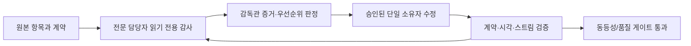

# 동등성 완료 후 감독관 운영 계획

## 완료 순서

1. 고정 원본의 모든 기능·화면·UI 이벤트를 source ledger와 feature ledger에
   빠짐없이 연결한다.
2. 각 항목을 Python 계약, React 소비자, 필요한 실시간 전송, 데스크톱 브리지,
   검증으로 구현해 기준 동등성을 통과시킨다.
3. 기준 동등성이 완료된 뒤에만 감독관 승인 하에 구조 리팩터링과 제품 고유
   확장을 시작한다. 동등성 전의 기능을 "개선" 명목으로 누락·변형하지 않는다.

`reference-feature-port-map.json`의 `deliveryStatus`는 실제 상태다. `planned`나
`in_progress`는 완료로 계산하지 않으며, 최종 게이트는 제품 항목 모두가
`implemented`가 될 때만 통과한다.

## 감독관 루프

- 담당자는 처음에는 수정하지 않는다. 보고에는 재현 절차, 파일·라인 증거,
  영향 계약, 최소 수정안, 필요한 테스트가 반드시 포함된다.
- 감독관은 소스 동등성·권한·보안·성능·중복 영향이 확인된 항목만 승인한다.
- 승인 후에도 한 작업 항목에는 한 명만 쓰기 권한을 가진다. 다른 담당자는
  재검증만 하므로 동시 편집 충돌과 중복 구현을 방지한다.
- 수정은 서버가 소유하는 descriptor·공용 계약·재사용 adapter를 우선한다.
  화면별 action 목록, 경로, 권한 또는 상태의 복사는 허용하지 않는다.

### 작업 단위와 소유권

각 작업 단위는 하나의 feature ledger 행 또는 서로 분리할 수 없는 공용 계약으로
제한한다. 한 단위에는 동시에 한 명의 수정 담당자만 둔다. 품질 담당자는 수정 전에
읽기 전용으로 다음 형식의 보고를 남긴다.

| 필수 항목 | 내용 |
|---|---|
| 기준 | 원본 파일·심볼·상호작용과 feature contract ID |
| 재현 | viewport, 권한, scope, 입력, 키보드/포인터 순서, 기대·실제 결과 |
| 영향 | Python 계약, React 소비자, desktop bridge, stream, 접근성, 성능 영향 |
| 심각도 | P0(데이터 손실·권한·원본 흐름 차단), P1(핵심 흐름 품질), P2(일관성), P3(개선) |
| 최소 수정안 | 중복 없이 소유 계층에 넣을 descriptor·adapter·primitive·테스트 |
| 재검증 | 계약·단위·E2E·시각 검증 명령과 통과 조건 |

감독관은 이 보고를 검토해 수정 범위와 담당자를 명시적으로 승인한다. 수정 담당자는
먼저 실패하는 테스트를 별도 커밋으로 남기고, 구현과 통과 검증을 뒤 커밋으로 남긴다.
재감사 담당자는 수정자가 아니어야 하며, 재현 조건을 바꿔서는 안 된다. 통과하지
않으면 같은 단위를 다시 감사 단계로 되돌린다.

### 단계별 동결 게이트

| 단계 | 진입 조건 | 완료 기준 | 다음 단계에서 금지되는 일 |
|---|---|---|---|
| A. 원본 반입 | 고정 revision과 source ledger | 모든 원본 파일의 해시·분류 | 제품이 원본 런타임을 import/execution |
| B. 동등성 명세 | 파일/화면/API/UI event가 ledger 행 | 각 행에 원본 근거와 제품 계약 | 개선을 이유로 원본 이벤트 삭제·의미 변경 |
| C. 수직 이식 | 행별 backend/frontend/desktop 소유자 | capability→receipt→event→UI가 실제 동작 | 화면별 API path/action/RBAC 복사 |
| D. 품질 수렴 | C의 자동 계약 검증 | 품질·사용성·데이터·motion 재감사 통과 | 테스트 없이 CSS/상태를 임시 보정 |
| E. 제품 확장 | 제품 대상 행이 모두 출하 가능 | workspace/cluster/replay/RCA/AI를 additive로 검증 | 기준 URL·단축키·실행 계약의 파괴적 변경 |

### 상태와 데이터 경계

- 서버는 화면이 실행할 수 있는 동작을 capability descriptor로 발행하고, UI는
  descriptor의 경로·입력 schema·확인 정책·표시 문자열·실시간 채널을 소비한다.
  화면에 action ID, API 경로, 권한 판정, 상태 전이 목록을 직접 열거하지 않는다.
- command는 `CommandRequest`의 scope·resource·입력과 서버가 계산한 영향/diff를
  감사 가능한 `CommandReceipt`로 고정한다. 확인 UI는 그 receipt의 대상, 영향,
  차이, RBAC 결과, 감사 ID를 한 번 명시한 뒤에만 전송한다.
- `OperationEvent`는 workspace와 command별 단조 sequence를 가진 영속 로그다.
  SSE 재접속은 마지막 cursor부터 재생하고, gap·중복·terminal 상태를 공용 reducer가
  처리한다. 고빈도 이벤트는 requestAnimationFrame마다 한 번만 화면 상태에 반영한다.
- scope를 해석하는 곳은 하나여야 한다. 모든 읽기/명령/stream은 동일한
  `ClusterScope`를 받아 workspace, cluster set, namespace set, freshness를 잃지
  않아야 한다. UI가 첫 cluster를 묵시적으로 선택하거나 URL filter를 버려서는 안 된다.

### 감독관 우선순위

1. 권한 우회, 잘못된 대상 실행, 이벤트 손실·중복, 데이터 유출, 원본 핵심 흐름 단절
   (P0)를 먼저 닫는다.
2. 좁은 화면/다크 모드/keyboard/focus/reduced-motion에서 핵심 작업이 불가능해지는
   품질 결함(P1)을 닫는다.
3. 성능은 수치로 확인한다. 인터랙션 중에는 프레임당 상태 commit을 하나로 coalesce
   하고, 네트워크 재시도에는 cursor·backoff·취소·권한 오류 종료가 있어야 한다.
4. 모든 기준 동등성 행이 출하 가능한 뒤에만 새 widget, 권한 모델 확장, workspace/
   cluster 관리, replay, RCA, AI를 추가한다. 확장은 기존 interaction contract를
   교체하는 대신 extension panel과 cross-link로 결합한다.

## 담당 범위와 승인 기준

| 담당 | 읽기 전용 감사 범위 | 승인 후 수정 범위 | 통과 기준 |
|---|---|---|---|
| UI 품질 | viewport, 줄바꿈, overflow, 정렬, focus, dark mode, loading/empty/error, reduced motion | CSS 토큰·공용 primitive·해당 화면 | 주요 viewport에서 clipping/누적 layout shift 없이 Playwright snapshot 통과 |
| 사용성 | 메뉴, 버튼, keyboard, drawer/overlay, 확인·실패·재시도 흐름, 접근성 | 공용 interaction contract와 화면 소비자 | 동일한 동작은 동일한 affordance·Escape·focus 복귀·권한 피드백을 제공 |
| 데이터 설계 | FastAPI, agent, workspace/cluster scope, RBAC, cache, stream/reconnect, 60fps 부담 | Python 계약·repository·adapter·subscription | 모든 버튼이 서버 capability와 receipt/event를 사용, 중복 fetch/fan-out 없음 |
| 다이나믹 애니메이션 | 상태 전환, 연결/재연결, 명령 진행/완료/실패, 알림, 이동 피드백 | 공용 motion token·상태별 primitive | 상태를 숨기지 않고 reduced-motion·키보드·실패 상태를 동일하게 보장 |

## 데이터·실시간 원칙

- 화면은 `ClusterScope`, `ResourceRef`, `CapabilitySet`, `CommandRequest`,
  `CommandReceipt`, `OperationEvent` 공용 계약만 사용한다.
- 실행 UI는 capability catalog가 제공한 method, path, input schema,
  confirmation, realtime 정보를 그대로 소비한다. action ID나 API path를
  화면에 하드코딩하지 않는다.
- 변경 명령은 `CommandReceipt`를 즉시 받고, Redis 기반 SSE `OperationEvent`로
  queued → leased/running → completed/failed를 갱신한다. 재연결과 최종
  snapshot은 서버가 보존한 command 상태로 복구한다.
- 데이터 갱신은 scope·freshness·visibility를 명시하고, 독립 요청은 병렬화하며,
  고빈도 이벤트는 프레임 단위로 coalesce한다. 렌더 경로에서 poll fan-out이나
  무제한 배열 누적을 만들지 않는다.

## 후속 제품 확장

기준 동등성 검증 후 다음을 기존 URL·단축키·실행 흐름을 바꾸지 않는 확장 패널과
교차 링크로 추가한다.

1. workspace/cluster 관리와 역할별 capability
2. 멀티클러스터 evidence, replay, correlation 기반 RCA 타임라인
3. 모든 주요 화면의 AI 조사 보조와 근거 연결
4. 상태 의미를 전달하는 절제된 motion과 데스크톱 전용 안전 브리지

## 최종 출하 게이트

- 모든 source ledger 파일이 해시·분류·목적지·검증을 가진다.
- 모든 feature ledger 행이 제품 경계와 실제 완료 상태를 가지며, 제품 항목은
  Python 계약 테스트와 React 소비/E2E 테스트에 연결된다.
- command, stream, reconnect, 권한 거부, 부분 실패, empty/loading/error,
  keyboard/focus/reduced-motion 및 dark/narrow viewport를 자동 검증한다.
- Python 정적 검사·테스트, frontend typecheck/lint/test/build, Tauri
  macOS/Windows/Linux package·signing 검사가 모두 통과한다.
