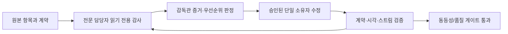

# 동등성 완료 후 감독관 운영 계획

## 완료 순서

1. 고정 원본의 모든 기능·화면·UI 이벤트를 source ledger와 feature ledger에
   빠짐없이 연결한다.
2. 각 항목을 Python 계약, React 소비자, 필요한 실시간 전송, 데스크톱 브리지,
   검증으로 구현해 기준 동등성을 통과시킨다.
3. 기준 동등성이 완료된 뒤에만 감독관 승인 하에 구조 리팩터링과 제품 고유
   확장을 시작한다. 동등성 전의 기능을 "개선" 명목으로 누락·변형하지 않는다.

`reference-feature-port-map.json`의 `deliveryStatus`는 실제 상태다. `planned`나
`in_progress`는 완료로 계산하지 않으며, 최종 게이트는 제품 항목 모두가
`implemented`가 될 때만 통과한다.

## 감독관 루프

- 담당자는 처음에는 수정하지 않는다. 보고에는 재현 절차, 파일·라인 증거,
  영향 계약, 최소 수정안, 필요한 테스트가 반드시 포함된다.
- 감독관은 소스 동등성·권한·보안·성능·중복 영향이 확인된 항목만 승인한다.
- 승인 후에도 한 작업 항목에는 한 명만 쓰기 권한을 가진다. 다른 담당자는
  재검증만 하므로 동시 편집 충돌과 중복 구현을 방지한다.
- 수정은 서버가 소유하는 descriptor·공용 계약·재사용 adapter를 우선한다.
  화면별 action 목록, 경로, 권한 또는 상태의 복사는 허용하지 않는다.

## 담당 범위와 승인 기준

| 담당 | 읽기 전용 감사 범위 | 승인 후 수정 범위 | 통과 기준 |
|---|---|---|---|
| UI 품질 | viewport, 줄바꿈, overflow, 정렬, focus, dark mode, loading/empty/error, reduced motion | CSS 토큰·공용 primitive·해당 화면 | 주요 viewport에서 clipping/누적 layout shift 없이 Playwright snapshot 통과 |
| 사용성 | 메뉴, 버튼, keyboard, drawer/overlay, 확인·실패·재시도 흐름, 접근성 | 공용 interaction contract와 화면 소비자 | 동일한 동작은 동일한 affordance·Escape·focus 복귀·권한 피드백을 제공 |
| 데이터 설계 | FastAPI, agent, workspace/cluster scope, RBAC, cache, stream/reconnect, 60fps 부담 | Python 계약·repository·adapter·subscription | 모든 버튼이 서버 capability와 receipt/event를 사용, 중복 fetch/fan-out 없음 |
| 다이나믹 애니메이션 | 상태 전환, 연결/재연결, 명령 진행/완료/실패, 알림, 이동 피드백 | 공용 motion token·상태별 primitive | 상태를 숨기지 않고 reduced-motion·키보드·실패 상태를 동일하게 보장 |

## 데이터·실시간 원칙

- 화면은 `ClusterScope`, `ResourceRef`, `CapabilitySet`, `CommandRequest`,
  `CommandReceipt`, `OperationEvent` 공용 계약만 사용한다.
- 실행 UI는 capability catalog가 제공한 method, path, input schema,
  confirmation, realtime 정보를 그대로 소비한다. action ID나 API path를
  화면에 하드코딩하지 않는다.
- 변경 명령은 `CommandReceipt`를 즉시 받고, Redis 기반 SSE `OperationEvent`로
  queued → leased/running → completed/failed를 갱신한다. 재연결과 최종
  snapshot은 서버가 보존한 command 상태로 복구한다.
- 데이터 갱신은 scope·freshness·visibility를 명시하고, 독립 요청은 병렬화하며,
  고빈도 이벤트는 프레임 단위로 coalesce한다. 렌더 경로에서 poll fan-out이나
  무제한 배열 누적을 만들지 않는다.

## 후속 제품 확장

기준 동등성 검증 후 다음을 기존 URL·단축키·실행 흐름을 바꾸지 않는 확장 패널과
교차 링크로 추가한다.

1. workspace/cluster 관리와 역할별 capability
2. 멀티클러스터 evidence, replay, correlation 기반 RCA 타임라인
3. 모든 주요 화면의 AI 조사 보조와 근거 연결
4. 상태 의미를 전달하는 절제된 motion과 데스크톱 전용 안전 브리지

## 최종 출하 게이트

- 모든 source ledger 파일이 해시·분류·목적지·검증을 가진다.
- 모든 feature ledger 행이 제품 경계와 실제 완료 상태를 가지며, 제품 항목은
  Python 계약 테스트와 React 소비/E2E 테스트에 연결된다.
- command, stream, reconnect, 권한 거부, 부분 실패, empty/loading/error,
  keyboard/focus/reduced-motion 및 dark/narrow viewport를 자동 검증한다.
- Python 정적 검사·테스트, frontend typecheck/lint/test/build, Tauri
  macOS/Windows/Linux package·signing 검사가 모두 통과한다.
