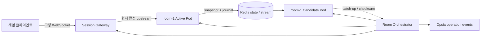
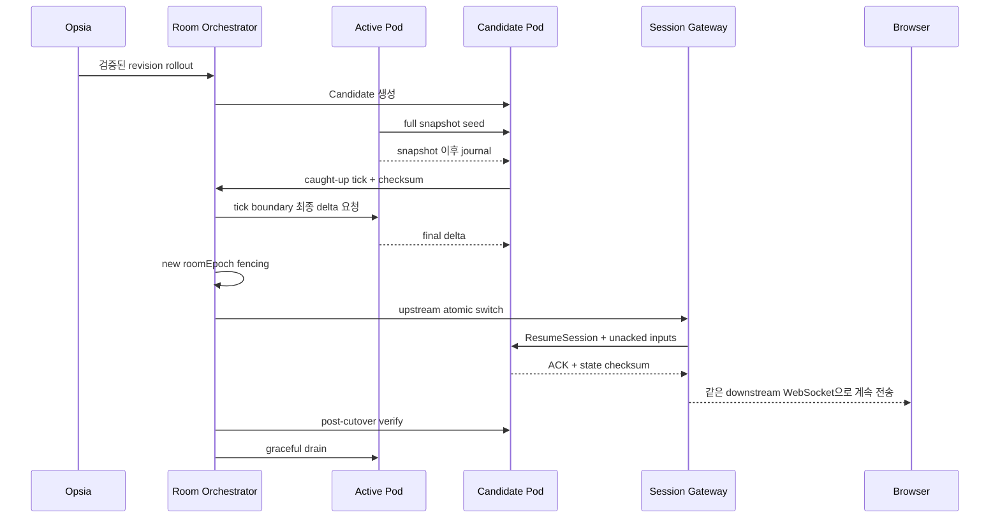

# 게임방 무중단 세션 전환 · 장애 재현 · 운영 이벤트 구현 명세

## 1. 문서 목적

이 문서는 Codex가 `demo-game`과 Opsia를 실제로 수정할 때 사용하는 구현 기준이다. 목표는 다음 세 가지다.

1. 비개발자에게 이해하기 쉬운 **게임방 하나 = 현재 요청을 처리하는 활성 게임 Pod 하나**라는 표현을 유지한다.
2. 계획된 배포 중에는 브라우저와 게임의 연결·상태를 유지한 채 활성 Pod를 교체한다.
3. 위험한 변경은 실제 사용자에게 도달하기 전에 격리된 Canary에서 장애를 재현하고, Opsia가 Git 변경·Kubernetes Event·메트릭·서비스 로그를 한 시간축으로 연결해 차단·분석·복구하는 과정을 증명한다.

이 문서는 현재 구현과 목표 구현을 구분한다. `목표`로 표시한 기능이 구현·검증되기 전에는 발표에서 이미 동작하는 기능처럼 말하지 않는다.

## 2. 현재 구현에서 확인된 사실

### 2.1 현재 게임방 모델

- `sandbox/game` StatefulSet은 `game-0`, `game-1`, `game-2` 세 Pod를 실행한다.
- ordinal과 방이 고정 매핑된다.
  - `game-0` → `room-0` → faction
  - `game-1` → `room-1` → desert
  - `game-2` → `room-2` → snow
- `OPSIA_INFINITE=true`이므로 게임방은 경기가 끝나도 운영용 방으로 계속 유지된다.
- `services/room-orchestrator/src/registry.ts`도 `room-${ordinal}`과 `game-${ordinal}`을 동일한 방으로 기록한다.
- `services/room-profiles.ts`에는 현재 3개 방 프로필만 있다.
- 현재 최대 방 수, Gateway 라우팅 정규식, Bot Runner 대상도 0~2에 맞춰져 있다.

따라서 현재 코드에서 StatefulSet `replicas: 3 → 5`만 변경하면 정상적인 방 2개가 추가되지 않는다. 5개 방 시연을 하려면 방 프로필·라우팅·오케스트레이터·봇 대상·검증을 함께 확장해야 한다.

### 2.2 현재 무중단 한계

- 브라우저 WebSocket은 Nginx Gateway를 통해 특정 `game-N` Pod에 연결된다.
- 이미 연결된 WebSocket의 upstream Pod가 종료되면 Nginx가 그 연결을 다른 Pod로 옮겨 주지 않는다.
- 현재 Redis snapshot은 팀·점수·위치·체력·인벤토리 등 일부 상태를 복구하지만, 모든 시뮬레이션 상태와 입력 확인 번호를 포함하지 않는다.
- StatefulSet은 같은 ordinal의 기존 Pod와 후보 Pod를 동시에 운영해 상태를 맞춘 뒤 원자적으로 교체하기 어렵다.

따라서 현재 구조를 그대로 두고 “모든 플레이어가 한 번도 끊기지 않았다”고 말할 수 없다.

### 2.3 현재 장애 시나리오에 활용할 수 있는 코드 특성

- 게임 프로세스는 기본적으로 1초마다 snapshot 저장을 요청한다.
- 현재 저장 호출은 비동기 완료를 기다리는 단일 실행 보장이 없다. 저장 주기를 지나치게 줄이고 Redis 쓰기가 처리 속도를 따라오지 못하면 저장 작업이 겹치고 메모리·이벤트 루프 지연이 증가할 수 있다.
- 이 특성은 “snapshot 주기 설정 오류 → 비동기 작업 적체 → 메모리 압력 → OOMKilled”라는 실무적으로 설명 가능한 Canary 장애를 구성할 수 있다.
- 단, 발표 수치는 실제 사전 부하 시험에서 얻은 값만 사용한다. 장애를 보이기 위해 가짜 메트릭이나 숨겨진 강제 종료 코드를 넣지 않는다.

## 3. 목표와 보장 범위

### 3.1 반드시 보장할 범위

- 한 논리적 게임방에는 정상 운영 시 활성 게임 Pod가 정확히 하나다.
- 계획된 게임 Pod 교체 중에만 동일 방의 Candidate Pod가 일시적으로 추가된다.
- 브라우저는 게임 Pod가 아니라 고정된 Session Gateway에 WebSocket을 연결한다.
- 계획된 교체 동안 브라우저↔Session Gateway WebSocket은 닫히지 않는다.
- 위치·체력·팀·점수·인벤토리·맵 상태·입력 진행 지점이 Candidate에 이어진다.
- Candidate가 충분히 따라오지 못했거나 checksum이 다르면 기존 Pod를 유지한다.
- Canary에서 장애가 발생하면 실제 게임방으로 승격하지 않는다.
- 모든 단계는 operation event로 기록되어 알림·워크플로·타임라인·Replay에서 같은 순서로 보인다.

### 3.2 이번 발표에서 절대 보장이라고 말하지 않을 범위

- 사용자 인터넷 단절
- 브라우저 종료·새로고침
- Session Gateway 전체 장애
- 리전 전체 장애
- 이미 활성인 게임 Pod의 예고 없는 OOMKilled

예고 없는 활성 Pod 장애까지 브라우저 연결과 상태를 그대로 유지하려면 각 방에 항상 따라오는 Hot Standby가 필요하다. 이는 비용이 증가하므로 2단계 옵션으로 분리한다. 본 발표의 OOMKilled는 실제 사용자가 연결되지 않은 Canary에서 발생시키고, 실제 게임방에는 검증된 버전만 무중단 방식으로 배포한다.

## 4. 목표 아키텍처



### 4.1 Session Gateway

기존 Nginx의 단순 upstream proxy 역할을 애플리케이션 계층 Gateway로 확장한다.

- 브라우저와의 WebSocket을 배포 동안 유지한다.
- `roomId`, `sessionId`에 해당하는 현재 활성 Pod를 registry에서 조회한다.
- 클라이언트 입력에 단조 증가하는 `inputSequence`를 부여한다.
- 게임 서버가 확인한 `lastAckInputSequence`까지 입력을 제거하고, 미확인 입력은 짧은 bounded buffer에 보존한다.
- cutover 시 upstream만 Candidate로 바꾼 뒤 미확인 입력을 순서대로 재전송한다.
- 오래된 `roomEpoch`의 출력은 폐기해 두 Pod가 동시에 화면을 갱신하는 split-brain을 막는다.
- buffer 한도 초과, Candidate 지연, registry 불일치는 조용히 무시하지 않고 명시적 실패 event와 metric을 남긴다.

### 4.2 Room Orchestrator

기존 StatefulSet replica 수 조절 중심 모델을 **방 단위 Deployment 조정 모델**로 변경한다.

- 방마다 `game-room-<ordinal>` Deployment를 하나씩 관리한다.
- 평상시 replica는 1이며, 해당 Pod만 active lease를 가진다.
- rollout 때 Deployment의 `maxSurge: 1`, `maxUnavailable: 0`으로 Candidate를 먼저 만든다.
- Candidate 준비만으로 트래픽을 전환하지 않는다. snapshot 복원·journal catch-up·checksum·세션 attach 검증까지 통과해야 한다.
- 전환 완료 후 기존 Pod를 drain하고 종료한다.
- 한 번에 한 방만 교체하는 기본 wave 정책을 사용한다. 실패하면 다음 방으로 진행하지 않는다.

방 수는 단순 StatefulSet replica가 아니라 Git으로 관리하는 desired room policy를 정본으로 삼는다.

```yaml
apiVersion: demo.opsia.io/v1alpha1
kind: GameFleet
metadata:
  name: live-rooms
  namespace: sandbox
spec:
  desiredRooms: 5
  roomProfiles:
    - room-0
    - room-1
    - room-2
    - room-3
    - room-4
  rollout:
    maxConcurrentRooms: 1
    requireStateChecksum: true
    requireSessionContinuity: true
```

초기 구현에서 CRD가 부담이면 같은 schema를 ConfigMap으로 시작할 수 있지만, API 모델과 검증은 위 계약을 유지한다. 최종 정본은 `GameFleet`이다.

### 4.3 Active lease와 fencing epoch

- 각 방은 `roomEpoch`를 가진다.
- Active Pod만 현재 epoch의 lease를 갱신할 수 있다.
- Candidate는 catch-up 중 출력 권한이 없다.
- cutover transaction에서 Candidate에 새 epoch를 부여하고 Gateway registry를 함께 갱신한다.
- 이전 epoch 출력·snapshot·event는 수신되더라도 적용하지 않는다.
- lease 갱신 실패 시 무조건 다른 Pod를 active로 만들지 않는다. quorum/authority 확인이 실패하면 방을 `handoff-blocked`로 두고 기존 연결을 유지한다.

### 4.4 상태 snapshot과 journal

현재 snapshot을 다음 상태 계약으로 확장한다.

- schema version, game build revision, map seed, RNG state
- room id, room epoch, server tick, snapshot tick
- player id/session id/team/score/position/velocity/direction/health/inventory
- gas phase·시간·위치
- projectile·explosion·loot·obstacle·building 등 진행 중 world object
- 제거된 object id와 생성된 object id
- 쿨다운·예약 timer·지연 effect
- 세션별 마지막 처리 `inputSequence`
- snapshot payload checksum

snapshot 이후 입력과 상태 변화는 room별 Redis Stream journal에 기록한다. Candidate는 snapshot을 읽고, snapshot tick 이후 journal을 replay해 Active의 현재 tick까지 따라온다.

저장 경로는 다음 원칙을 지킨다.

- 방별 single-flight: 동시에 snapshot 저장 하나만 실행
- 최신 요청 coalescing: 저장 중 들어온 요청은 무한 queue가 아니라 최신 한 건으로 합침
- bounded timeout과 retry
- payload 크기 제한과 schema 검증
- 실패해도 게임 tick을 멈추지 않는 별도 비동기 경로
- 연속 실패 시 handoff 비활성화와 명확한 원인 표시

### 4.5 클라이언트·서버 프로토콜

브라우저 연결은 다음 식별자를 유지한다.

```text
roomId
sessionId
inputSequence
clientTick
roomEpoch
serverTick
lastAckInputSequence
stateChecksum
```

Candidate 전환 과정에서 Gateway가 `ResumeSession` 내부 메시지를 보낸다. Candidate는 snapshot에서 복원한 플레이어 상태와 stable `sessionId`를 연결하고, 마지막 ACK 이후 입력만 다시 적용한다. 동일 sequence를 재수신해도 결과가 중복되지 않도록 input 처리는 idempotent해야 한다.

클라이언트는 짧은 cutover 동안 마지막 authoritative frame을 유지하고 보간한다. 페이지 재로드·로비 이동·방 재선택을 요구하지 않는다.

## 5. 계획된 무중단 handoff 순서



실패 처리:

- Candidate readiness 실패 → Candidate 삭제, 기존 Active 유지
- catch-up timeout → 전환하지 않음, 기존 Active 유지
- checksum mismatch → 전환하지 않음, 증거 보존·배포 중단
- Gateway switch 실패 → registry 원복, 기존 Active 유지
- post-cutover 건강 악화 → fencing epoch를 새로 발급해 이전 Active 또는 검증된 replacement로 다시 전환
- 기존 Pod drain timeout → 새 세션은 Candidate 유지, 이전 Pod 강제 종료 여부는 policy로 결정하고 audit 기록

## 6. Canary 장애 유발 시나리오

### 6.1 선택한 장애

Git 설정 변경으로 snapshot 주기를 `1000ms → 사전 benchmark로 정한 위험 주기`로 낮춘다. 현재 fire-and-forget 저장 구조에서는 쓰기 처리량보다 요청 생성이 빨라져 저장 작업이 겹칠 수 있다.

검증용 Canary는 다음 조건을 가진다.

- matchmaking과 public Gateway에서 제외
- 별도 room id·Redis key prefix·active lease 사용
- 실제 게임과 같은 이미지·리소스 limit·환경을 사용
- Bot Runner만 직접 연결
- 장애가 live room으로 전파되지 않음

장애 인과는 다음과 같다.

```text
Git snapshot interval 축소
→ Canary 반영
→ 봇 입력과 snapshot payload 증가
→ snapshot inflight/backlog 증가
→ Redis write latency와 process RSS 증가
→ event loop lag·snapshot timeout
→ container memory limit 도달
→ Kubernetes OOMKilled
→ PromotionBlocked
```

### 6.2 실제성과 재현성

- `50ms`, 봇 수, payload 크기, OOM까지의 시간은 사전 부하 시험으로 결정한다.
- 문서나 UI에 수치를 고정해 꾸미지 않는다. 실행마다 실제 측정값을 사용한다.
- Canary 장애를 빠르게 만들기 위해 live보다 몰래 낮은 memory limit을 쓰지 않는다. 다른 limit을 쓴다면 UI와 증거에 `canary policy limit`으로 명시한다.
- Redis 지연이 필요하면 Canary 전용 fault proxy/isolated Redis에만 주입한다. live Redis에 장애를 넣지 않는다.
- 강제 `process.exit`, 임의 OOM event 삽입, 가짜 로그는 금지한다.

### 6.3 Safe PR 수정 내용

복구 PR은 단순히 주기를 원복하는 데서 끝내지 않는다.

1. snapshot 저장 single-flight
2. 저장 중 추가 요청 coalescing
3. 설정 가능한 최소 주기 검증
4. inflight·backlog·payload·latency metric
5. bounded timeout과 circuit breaker
6. snapshot 실패 시 game loop 영향 격리
7. 단위·부하·회귀 테스트

## 7. 반드시 발행할 운영 이벤트

모든 event는 기존 typed event envelope의 `event_id`, `subject`, `source`, `workspace_id`, `correlation_id`, `causation_id`, `created_at`을 사용한다. 게임 고유 필드는 payload에 둔다.

### 7.1 Release·Canary 이벤트

| Event subject | 발생 조건 | UI 표현 |
|---|---|---|
| `GitRevisionObserved` | 새 commit 감지 | Git 변경 감지 완료 |
| `ManifestRendered` | manifest render·schema 검증 완료 | 렌더 완료 |
| `ReleasePolicyEvaluated` | 대상·권한·위험 정책 평가 | 정책 통과/차단 |
| `CanaryScheduled` | Canary Pod 예약 | Canary 준비 중 |
| `CanaryReady` | readiness·서비스 probe 통과 | 검증 부하 대기 |
| `ValidationLoadStarted` | Bot Runner 부하 시작 | 실제 검증 중 |
| `MetricGateEvaluated` | 메트릭 창 평가 | 통과/실패와 근거 |
| `PromotionBlocked` | OOM·오류율·지연 등 gate 실패 | 승격 차단 |
| `PromotionApproved` | 모든 gate 통과 | live wave 진행 |

### 7.2 Snapshot·장애 이벤트

| Event subject | 필수 payload |
|---|---|
| `SnapshotSaveStarted` | room, pod uid, epoch, tick, payload bytes |
| `SnapshotSaveCompleted` | duration, checksum, resource usage |
| `SnapshotSaveCoalesced` | skipped request count, current inflight duration |
| `SnapshotBacklogDetected` | inflight, pending, oldest age, threshold |
| `MemoryPressureObserved` | working set, limit, ratio, trend |
| `ContainerOOMKilled` | pod uid, container, exit code, restart count, K8s event uid |
| `EvidenceBundleSealed` | evidence ids, time range, completeness, missing reasons |

### 7.3 방 handoff 이벤트

| Event subject | 의미 |
|---|---|
| `RoomCandidateScheduled` | 대상 방 Candidate 생성 시작 |
| `RoomCandidateReady` | readiness 통과 |
| `RoomSnapshotSeeded` | full snapshot 복원 완료 |
| `RoomJournalCaughtUp` | Active tick까지 replay 완료 |
| `RoomChecksumMatched` | 상태 일치 확인 |
| `RoomChecksumMismatched` | 상태 불일치·전환 차단 |
| `RoomEpochFenced` | 새 active epoch 확정 |
| `RoomGatewayCutover` | upstream 원자 전환 |
| `RoomInputReplayCompleted` | 미확인 입력 재적용 완료 |
| `RoomPostVerificationCompleted` | 세션·상태·메트릭 검증 완료 |
| `RoomOldPodDrained` | 기존 Pod 종료 완료 |
| `RoomHandoffFailed` | 실패 단계·원인·원복 결과 |

### 7.4 RCA·복구 이벤트

기존 Opsia의 RCA·SCM·GitOps event를 재사용하고 부족한 상태만 확장한다.

- `IncidentDetected`
- `EvidenceBuilt`, `EvidenceBundleBuilt`
- `RcaCandidatesPlanned`, `RcaCandidatesEvaluated`, `RcaCompleted`
- `RecoveryPlanned`, `RecoveryActionSelected`
- `SafePrPatchPrepared`, `SafePrRequested`, `SafePrCreated`, `SafePrFailed`
- `ApprovalRequested`, `ApprovalGranted`, `ApprovalRejected`
- `WorkflowRunStarted`, `WorkflowStepRecorded`, `WorkflowRunCompleted`, `WorkflowRunFailed`
- `CommandRequested`, `CommandQueuedForAgent`, `CommandDispatched`, `CommandCompleted`, `CommandRejected`

추가로 PR merge, GitOps revision 관측, rollout wave, 사후 검증을 구분하는 event가 없으면 다음 subject를 추가한다.

- `SafePrMerged`
- `GitOpsRevisionObserved`
- `RolloutWaveStarted`, `RolloutWaveCompleted`, `RolloutWaveBlocked`
- `PostVerificationCompleted`

### 7.5 공통 payload 규칙

```json
{
  "operation_id": "op_...",
  "workspace_id": "...",
  "cluster_id": "game-server",
  "namespace": "sandbox",
  "room_id": "room-1",
  "resource_ref": {
    "kind": "Pod",
    "name": "game-room-1-...",
    "uid": "...",
    "resource_version": "..."
  },
  "git_revision": "...",
  "room_epoch": 42,
  "server_tick": 91820,
  "status": "running",
  "reason_code": "snapshot_backlog",
  "evidence_ids": ["ev_..."],
  "observed_at": "2026-07-20T00:00:00Z"
}
```

규칙:

- operation 단위 순번은 단조 증가한다.
- correlation은 전체 배포·복구 흐름, causation은 바로 앞 event를 가리킨다.
- secret, token, 전체 Secret 값, 사용자 개인정보를 넣지 않는다.
- 없는 값은 `unknown`으로 뭉개지 않고 `unavailable_reason`을 기록한다.
- UI 진행 상태는 이벤트를 추측해 만들지 않고 이 원장에서 투영한다.

## 8. 메트릭·로그·Alert 계약

### 8.1 게임·snapshot 메트릭

- `game_snapshot_inflight`
- `game_snapshot_payload_bytes`
- `game_snapshot_write_duration_seconds`
- `game_snapshot_coalesced_total`
- `game_snapshot_failures_total`
- `game_event_loop_lag_seconds`
- `game_room_players`
- `game_room_epoch`
- `game_server_tick`
- `process_resident_memory_bytes`
- `container_memory_working_set_bytes`
- `kube_pod_container_status_restarts_total`
- `kube_pod_container_status_last_terminated_reason`

### 8.2 handoff·Gateway 메트릭

- `game_candidate_tick_lag`
- `game_state_checksum_match`
- `game_handoff_duration_seconds`
- `game_session_gateway_connections`
- `game_session_gateway_upstream_switch_total`
- `game_session_gateway_unacked_inputs`
- `game_session_gateway_replayed_inputs_total`
- `game_session_continuity_failures_total`

### 8.3 구조화 로그 예시

```json
{"event":"snapshot_backlog","roomId":"canary-room","inflight":18,"oldestMs":1840,"rssBytes":987654321}
{"event":"oom_observed","podUid":"...","reason":"OOMKilled","restartCount":1,"gitRevision":"..."}
{"event":"room_handoff","roomId":"room-1","phase":"checksum-matched","oldEpoch":41,"newEpoch":42,"tick":91820}
{"event":"session_cutover","roomId":"room-1","sessionId":"redacted-hash","unackedInputs":2,"durationMs":84}
```

세션 ID는 평문 사용자 식별자가 아니라 audit 가능한 비가역 hash를 사용한다.

### 8.4 Alert

- snapshot backlog 경고/심각
- memory working set 비율과 증가율
- OOMKilled 즉시 경고
- Canary promotion blocked
- Candidate catch-up timeout
- checksum mismatch
- Gateway cutover timeout
- session continuity failure
- rollout wave blocked

Alert는 자동 확장의 원인이 아니다. Alert는 관측·통지이며, 확장과 배포는 각각 HPA/GameFleet 정책과 Release Workflow가 수행한다.

## 9. Opsia UI 표현

### 9.1 Release Workflow DAG

```text
Git 변경
→ Manifest Render
→ Policy
→ Canary
→ 검증 부하
→ Metric Gate
→ 승인
→ Candidate
→ Snapshot Seed
→ Journal Catch-up
→ Checksum
→ Gateway Cutover
→ Input Replay
→ Verify
→ Old Pod Drain
→ 다음 방
→ Post Verify
```

- 대기: 회색
- 현재 진행: 파란 pulse와 흐르는 edge
- 성공: 초록 check
- 경고: 주황
- 실패·차단: 빨강
- 노드는 event가 도착한 순서대로만 상태를 바꾼다.

### 9.2 전역 operation 알림

화면을 이동해도 우측 상단 또는 하단 operation dock에서 현재 상태를 유지한다.

```text
복구 PR 생성 → 검증 → Merge → GitOps Sync → Canary → 방별 교체 → 사후 검증
```

완료 화면은 다음 증거를 제공한다.

- PR URL
- commit SHA와 merge SHA
- sync revision
- 방별 old/new Pod UID
- resourceVersion
- operation/audit ID
- session continuity 결과
- 정상화된 metric 비교

### 9.3 물리 보기와 PiP

- 방 카드에는 논리적 방 이름과 현재 Active Pod를 함께 표시한다.
- rollout 중 Candidate는 Active와 같은 방 안의 보조 상태로 표시하고 새 게임방 수에 포함하지 않는다.
- 브라우저→Session Gateway 선은 handoff 내내 초록으로 유지한다.
- Gateway→Pod 선만 기존 Active에서 Candidate로 움직인다.
- PiP에는 방·플레이어·점수·위치가 유지되고 페이지 reload나 로비 이동이 없었음을 보여준다.

## 10. 저장소별 구현 지도

### 10.1 `Jungle-303-04/demo-game`

기존 수정 대상:

- `services/room-orchestrator/src/main.ts`
- `services/room-orchestrator/src/registry.ts`
- `services/room-orchestrator/src/scaler.ts`
- `services/room-profiles.ts`
- `services/bot-runner/src/botctl.ts`
- `upstream-survev/server/src/game/gameProcess.ts`
- `upstream-survev/server/src/game/client.ts`
- `upstream-survev/server/src/opsia/runtime.ts`
- `deploy/k8s/base/game.yaml`
- `deploy/k8s/base/gateway.yaml`
- `deploy/k8s/base/room-orchestrator.yaml`
- `deploy/k8s/base/bot-runner.yaml`
- `deploy/k8s/base/configmap.yaml`

신규 권장 경계:

- `services/session-gateway/`: downstream 유지, upstream 전환, input ACK/replay
- `services/room-orchestrator/src/handoff.ts`: Candidate lifecycle와 fencing
- `services/room-orchestrator/src/events.ts`: typed game operation events
- `upstream-survev/server/src/opsia/snapshot.ts`: full snapshot, single-flight, coalescing
- `upstream-survev/server/src/opsia/journal.ts`: tick 이후 event journal
- `upstream-survev/server/src/opsia/sessionResume.ts`: stable session attach
- `deploy/k8s/base/session-gateway.yaml`
- `deploy/k8s/base/game-fleet.yaml`
- `tests/e2e/session-handoff.test.ts`
- `tests/e2e/canary-snapshot-oom.test.ts`

### 10.2 Opsia

기존 경계 재사용:

- `src/packages/runtime/operation_events.py`: persist-before-fanout operation stream
- `src/services/projection/release-flow-worker/app.py`: workflow·RCA·SCM event projection
- `src/domains/release_flow/`: policy, readiness, execution, verification, projection
- `src/domains/rca/events.py`: RCA typed events
- `src/domains/scm/events.py`: Safe PR events
- `src/domains/gitops/events.py`: workflow·approval events
- `src/domains/target/events.py`: target evidence events
- `frontend/src/features/operations/`: 실시간 operation 상태
- `frontend/src/features/notifications/`: 전역 진행 알림
- `frontend/src/pages/resources/physicalTopologyRealtimeModel.ts`: 물리 보기 실시간 상태
- `frontend/src/pages/timeline/`: 과거 frame·event 상세
- `frontend/src/pages/issues/`: 인시던트·복구 진행

추가 구현은 위 경계를 확장하고 별도의 중복 event store나 UI 상태 원장을 만들지 않는다.

## 11. 단계별 구현 순서

### P0. 사실 측정과 기준 고정

- 현재 3개 방·Gateway·snapshot·Redis·bot 경로 통합 테스트
- 실제 snapshot payload·duration·memory baseline 측정
- 장애 재현 benchmark와 live 격리 증명
- 현재 데모에서 과장된 문구 제거

### P1. 방 5개 지원

- room-3·room-4 profile 추가
- 정적 `[0-2]` 라우팅 제거, room registry 기반 동적 라우팅
- bot target 동적 discovery
- desired room policy와 GitOps 정본 연결
- 3→5 생성·Ready·게임 접속 E2E

### P2. Session Gateway와 프로토콜

- stable downstream WebSocket
- input sequence/ACK/bounded buffer
- active room registry와 fencing epoch
- direct client→game Pod 경로 차단
- reconnect·backpressure·rate limit 테스트

### P3. Full state handoff

- snapshot schema 확장
- journal과 Candidate catch-up
- checksum과 atomic cutover
- unacked input replay와 old Pod drain
- planned rollout continuity E2E

### P4. Canary 장애와 RCA

- isolated Canary와 bot load
- snapshot backlog fault 재현
- Kubernetes·Prometheus·Loki·Git evidence 연결
- 승격 차단과 Evidence Bundle
- Safe PR 수정·검증

### P5. Opsia 동적 UI

- workflow DAG 실시간 event projection
- 물리 보기 Active/Candidate 표현
- 1분 전 Replay
- 로그 핵심 문장과 RCA 증거 충족률
- 전역 복구 operation 알림
- PiP session continuity 증거

### P6. 선택: 활성 Pod 돌발 장애까지 무중단

- 방별 항상 실행되는 Hot Standby
- 지속 shadow replay와 lag SLO
- Active lease 만료 감지와 자동 fencing
- Gateway 즉시 전환
- 비용·일관성·리전 장애 정책 별도 승인

## 12. 완료 판정 테스트

### 12.1 핵심 불변식

- 평상시 방별 active lease 보유 Pod는 정확히 1개다.
- Candidate는 matchmaking 방 수에 포함되지 않는다.
- 오래된 epoch는 출력·snapshot·event를 확정할 수 없다.
- browser는 게임 Pod 주소를 알거나 직접 연결하지 않는다.
- event stream 재연결 시 cursor 이후 순서가 보존되고 중복 투영되지 않는다.

### 12.2 기능 검증

- Git desired rooms 3→5 변경 후 room-3·room-4가 실제 접속 가능하다.
- Canary OOMKilled가 실제 Kubernetes Event와 container status에서 관측된다.
- Canary 실패 시 live revision과 live player session은 변하지 않는다.
- Replay가 Git change→backlog→memory→OOM→promotion blocked 순서를 재구성한다.
- Safe PR 수정 후 같은 검증 부하에서 backlog·OOM이 재발하지 않는다.
- live rollout에서 방 0→4가 한 방씩 교체된다.
- 각 교체에서 downstream WebSocket이 닫히지 않는다.
- 플레이어 위치·체력·점수·팀·인벤토리와 마지막 ACK가 유지된다.
- Candidate checksum 불일치 시 기존 Active가 유지된다.
- operation 완료에 PR·SHA·sync revision·Pod UID·resourceVersion·audit ID가 남는다.

### 12.3 발표용 브라우저 게이트

- PiP가 전 단계에서 유지된다.
- 방별 handoff 전후 브라우저 reload 횟수 0
- downstream WebSocket close event 0
- input loss·중복 0
- 게임 상태 checksum 일치
- Alert, Incident, Timeline, RCA, Safe PR, Release Workflow가 동일 operation/correlation을 가리킨다.
- 데이터가 없으면 가짜값 대신 수집 대기·권한 부족·미지원·stale 이유가 보인다.

## 13. 발표에서 사용할 정확한 한 문장

> “방 하나는 여전히 하나의 활성 게임 Pod가 처리합니다. 다만 배포 순간에만 후보 Pod가 상태와 입력을 따라잡고, 브라우저가 붙어 있는 Session Gateway가 내부 연결만 바꾼 뒤 기존 Pod를 종료하기 때문에 플레이어는 같은 방에서 게임을 계속할 수 있습니다.”

장애 설명:

> “위험한 버전은 실제 방에 바로 들어가지 않았습니다. 사용자와 분리된 Canary가 같은 부하 검증을 먼저 받았고, snapshot 작업이 쌓여 OOMKilled가 발생하자 배포가 자동으로 차단되었습니다.”

한계 설명:

> “오늘 증명하는 무중단 범위는 계획된 게임 서버 교체입니다. 사용자 네트워크나 Gateway 전체 장애까지 포함하는 완전 무중단은 별도의 다중 Gateway·Hot Standby 단계가 필요합니다.”
