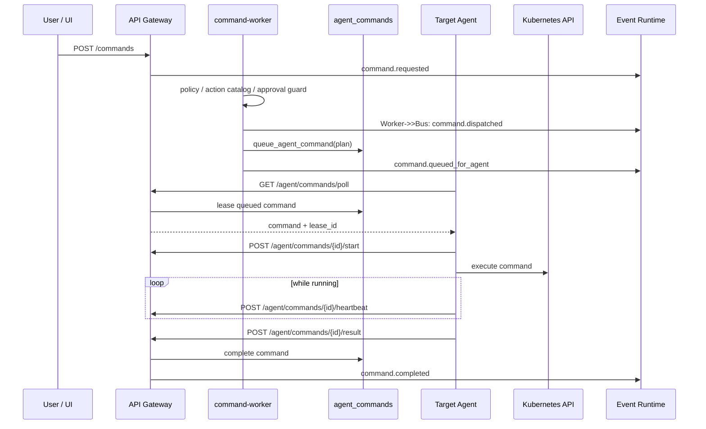
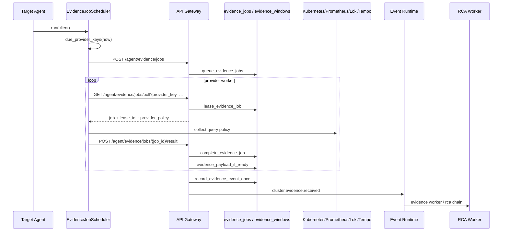

# Target Agent Command / Evidence 구현 가이드

이 문서는 현재 코드에 이미 구현된 인터페이스를 기준으로, 다음 두 흐름을 구현자 관점에서 설명한다.

1. Management Plane에서 명령을 만들고, Target Agent가 명령을 poll해서 실행한 뒤 결과를 다시 보고하는 흐름
2. Target Agent가 evidence job을 스케줄링하고, provider별 worker가 job을 poll해서 수집한 뒤 Management Plane이 aggregate해서 `cluster.evidence.received` 이벤트로 넘기는 흐름

Target Agent는 NATS, JetStream, PostgreSQL을 직접 알면 안 된다. Agent 입장에서 Management Plane은 HTTP API이고, Management Plane 내부에서는 worker, DB queue, outbox, event runtime이 상태 전이를 책임진다.

처음 연습하는 팀원은 먼저 [역할별 실습 가이드](../role-practice-guide.md)의 민정 섹션을 따라간 뒤, 세부 구현이 필요할 때 이 문서를 기준서로 사용한다.

## 코드 기준 파일

| 영역 | 기준 파일 | 역할 |
| --- | --- | --- |
| Gateway route 상수 | `src/packages/contracts/gateway/routes.py` | Agent와 Gateway가 공유하는 HTTP path 단일 출처 |
| Gateway request/response schema | `src/packages/contracts/gateway/requests.py`, `src/packages/contracts/gateway/responses.py` | HTTP body와 응답 shape |
| Command HTTP router | `src/domains/command/router.py` | `/commands`, `/agent/commands/*` |
| Command worker | `src/services/command/command-worker/app.py` | `command.requested` 구독, policy/plan/queue 처리 |
| Command domain logic | `src/domains/command/handler.py` | action allowlist, approval guard, plan 생성 |
| Command action catalog | `src/domains/command/actions.py`, `src/domains/command/builtin_actions.py` | Management 쪽 action 존재 여부와 정책 메타데이터 |
| Command DB queue | `src/domains/command/repository.py` | `agent_commands` enqueue, lease, start, heartbeat, complete |
| Target Agent main loop | `src/services/target/cluster-agent/agent.py` | command poll, execute, heartbeat, result outbox, evidence scheduler 실행 |
| Target Agent command registry | `src/services/target/cluster-agent/commands/` | agent 내부 command handler 등록과 Kubernetes guard |
| Target evidence router | `src/domains/target/router.py` | `/agent/evidence/jobs`, policy, job lease, result aggregate |
| Legacy/direct evidence router | `src/domains/rca/router.py` | `/agent/evidence` 직접 수신 호환 경로 |
| Evidence job model | `src/domains/target/evidence_jobs.py`, `src/domains/target/models.py` | `evidence_key`, `job_id`, aggregate 규칙, DB model |
| Evidence policy | `src/domains/target/evidence_policy.py` | provider 기본 정책과 기본 query 목록 |
| Target evidence scheduler | `src/services/target/cluster-agent/evidence/jobs.py` | due provider 계산, schedule, provider별 worker pool |
| Target evidence collector | `src/services/target/cluster-agent/evidence/collector.py` | provider query 실행과 payload 구성 |
| Telemetry provider registry | `src/services/target/cluster-agent/telemetry_registry.py` | `source -> evidence_key -> query_type` 등록 |
| Telemetry providers | `src/services/target/cluster-agent/providers/` | Kubernetes, Prometheus, Loki, Tempo, Metadata provider |
| Query model | `src/services/target/cluster-agent/queries/` | query definition과 `telemetry.query.run` payload |

## Command 전체 흐름



Command는 push가 아니라 pull이다. Management Plane은 Target Cluster API server를 직접 열지 않는다. `command-worker`가 `agent_commands`에 명령을 적재하고, Target Agent가 outbound HTTP long-poll로 자기 클러스터의 명령만 lease한다.

## Command HTTP 인터페이스

현재 Agent 관련 route는 `src/packages/contracts/gateway/routes.py`가 기준이다.

```python
COMMANDS_PATH = "/commands"
AGENT_DEBUG_QUERY_PATH = "/agent/debug/query"
AGENT_COMMAND_POLL_PATH = "/agent/commands/poll"
AGENT_COMMAND_START_PATH = "/agent/commands/{command_id}/start"
AGENT_COMMAND_HEARTBEAT_PATH = "/agent/commands/{command_id}/heartbeat"
AGENT_COMMAND_RESULT_PATH = "/agent/commands/{command_id}/result"
```

사용자 또는 내부 workflow가 명령을 만들 때는 `POST /commands`를 호출한다. 이 route는 session 사용자를 요구하고, 현재 사용자가 대상 cluster에 deploy access를 갖는지 확인한다.

```python
class CommandRequest(StrictModel):
    cluster_id: str
    action: str
    namespace: str
    reason: str | None = None
    diff: dict[str, Any] | None = None
    approval_ref: str | None = None
    policy_decision_ref: str | None = None
```

중요한 제약:

- `diff`는 필수다. 수동 command라도 Gateway가 임의 대상 resource를 합성하지 않는다.
- `workspace_id`는 request body에서 받지 않는다. session의 workspace가 기준이다.
- `cluster_id`에 대한 deploy 권한이 없으면 `403`이다.
- `CommandRequestedBody`로 변환된 뒤 event runtime으로 들어간다.

Agent가 명령을 가져갈 때는 `GET /agent/commands/poll`을 호출한다. 이 route는 `x-agent-token` 기반 `require_cluster_agent`를 통과해야 한다. body나 query의 `workspace_id`, `cluster_id`는 신뢰하지 않고 token identity의 값을 사용한다.
Gateway는 `COMMAND_NOTIFY_DATABASE_URL`이 설정되어 있으면 Postgres `LISTEN agent_command_queued`로 새 command queue 알림을 듣고, 같은 workspace/cluster로 long-poll 중인 요청을 즉시 깨운다.
그래도 정본은 항상 `agent_commands` lease 쿼리다.
알림 listener가 없거나 끊겨도 poll timeout 뒤 재시도하는 구조라 command 유실이 없어야 한다.

```text
GET /agent/commands/poll?agent_id=<agent-id>&timeout=<seconds>
x-agent-token: <per-cluster-agent-token>
```

응답:

```json
{
  "command": {
    "command_id": "cmd-...",
    "workspace_id": "workspace-1",
    "correlation_id": "...",
    "cluster_id": "replace-with-target-cluster-id",
    "action": "apply_manifest",
    "payload": {
      "command_id": "cmd-...",
      "action": "apply_manifest",
      "namespace": "sandbox",
      "diff": {},
      "lease": {},
      "retry_policy": {},
      "approval_ref": "approval-...",
      "policy_decision_ref": "policy-decision-..."
    },
    "status": "queued",
    "lease_id": "uuid",
    "agent_id": "target-agent",
    "leased_until": "2026-07-05T..."
  }
}
```

명령이 없으면 `{"command": null}`이다. Gateway는 내부적으로 `lease_agent_command()`를 호출하고, `queued`, 만료된 `leased`, 만료된 `running` 상태를 다시 lease 후보로 본다.

Agent는 실행 전에 start를 보고한다.

```json
POST /agent/commands/{command_id}/start
{
  "cluster_id": "replace-with-target-cluster-id",
  "workspace_id": "workspace-1",
  "agent_id": "target-agent",
  "lease_id": "uuid"
}
```

여기서도 `cluster_id`, `workspace_id`는 body가 아니라 token identity가 최종 기준이다. DB update 조건은 `command_id`, trusted workspace/cluster, `lease_id`, `agent_id`, `status=leased`, `leased_until>=now`다. 조건이 맞지 않으면 `404`로 처리된다.

실행이 오래 걸리면 heartbeat를 보낸다.

```json
POST /agent/commands/{command_id}/heartbeat
{
  "cluster_id": "replace-with-target-cluster-id",
  "workspace_id": "workspace-1",
  "agent_id": "target-agent",
  "lease_id": "uuid"
}
```

결과 보고는 다음 shape다.

```python
class CommandResultRequest(StrictModel):
    status: Literal["completed", "failed"]
    cluster_id: str
    workspace_id: str
    agent_id: str
    lease_id: str
    applied: bool = False
    message: str = ""
    retryable: bool = False
    resources: list[dict[str, Any]] = []
    stdout: str = ""
    stderr: str = ""
    cleanup_completed: bool = False
    residual_resources: list[str] = []
```

`cleanup_completed`와 `residual_resources`는 `cluster.agent.uninstall` result에서만 등록 해제 근거로 쓴다. 일반 command는 기본값 그대로 둔다.

결과 예시:

```json
{
  "status": "completed",
  "cluster_id": "replace-with-target-cluster-id",
  "workspace_id": "workspace-1",
  "agent_id": "target-agent-0",
  "lease_id": "uuid",
  "applied": true,
  "message": "Kubernetes action processed in sandbox namespace",
  "retryable": false,
  "resources": [
    {
      "resource": "deployment/checkout-api",
      "status": "completed",
      "applied": true,
      "message": "Kubernetes action processed in sandbox namespace"
    }
  ],
  "stdout": "bounded sanitized summary",
  "stderr": ""
}
```

Gateway는 `complete_agent_command_and_stage_event()`로 `agent_commands`를 완료 상태로 바꾸고, 같은 transaction 안에서 `command.completed`를 event/outbox에 stage한다.

## Agent debug query API

개발 중에 provider query 하나만 Target Agent로 보내 확인해야 할 때는 `POST /agent/debug/query`를 쓴다.

이 API는 일반 배포 command가 아니다. 읽기 권한으로 provider query를 agent command queue에 넣고, Target Agent가 기존 command poll/start/heartbeat/result 흐름으로 실행하게 하는 디버그용 입구다.

요청 schema:

```python
class AgentDebugQueryRequest(StrictModel):
    cluster_id: str
    query: dict[str, Any]
    reason: str | None = None
```

응답 schema:

```python
class AgentDebugQueryResponse(StrictModel):
    accepted: bool
    command_id: str
    correlation_id: str
```

요청 예시:

```json
{
  "cluster_id": "replace-with-target-cluster-id",
  "reason": "RCA 확인용",
  "query": {
    "source": "prometheus",
    "name": "restart_rate",
    "description": "Restart trend for target namespace.",
    "query": "increase(kube_pod_container_status_restarts_total{namespace=\"target\"}[15m])",
    "range_seconds": 900,
    "step_seconds": 30
  }
}
```

Gateway 내부 동작:

```text
POST /agent/debug/query
  -> cluster read access 확인
  -> action=telemetry.query.run plan 생성
  -> db.queue_agent_command(correlation_id, plan, queued)
  -> Target Agent GET /agent/commands/poll
  -> Target Agent가 TelemetryQueryDefinition으로 query 실행
  -> /agent/commands/{command_id}/result
```

확인할 테스트:

```bash
PYTHONPATH=src .venv/bin/python -m pytest \
  tests/test_command_router.py::test_agent_debug_query_requires_cluster_read_access_and_queues_agent_command \
  tests/test_target_agent_commands.py \
  -q
```

## Command event 전이

Command Worker는 `@app.on(CommandRequestedBody)`로 `command.requested`를 구독한다.

```text
command.requested
  -> command.rejected

command.requested
  -> command.dispatched
  -> agent_commands row insert
  -> command.queued_for_agent
  -> agent poll/start/heartbeat/result
  -> command.completed
```

`CommandRequestedBody`의 핵심 필드:

```python
class CommandRequestedBody(EventBody):
    cluster_id: str
    action: str
    namespace: str
    reason: str
    diff: Diff
    workspace_id: str
    application_id: str
    workflow_run_id: str
    binding_id: str
    environment: str
    requested_by: str | None
    actor: JsonObject | None
    approval_ref: str | None
    policy_decision_ref: str | None
```

`Plan`은 Agent가 실행할 명령의 저장 형태다. `command_id`는 `correlation_id`, workspace/application/workflow/binding/environment, cluster/action/namespace, approval refs, diff를 stable hash로 묶어서 만든다. 같은 입력이 재처리되어도 같은 `command_id`가 나오고, DB insert는 `on_conflict_do_nothing`으로 중복 queue를 막는다.

## Command policy와 fail-closed 규칙

Command는 Management와 Agent 양쪽에서 막는다.

Management 쪽 `handle_command_requested()`는 다음을 검사한다.

| 검사 | 위치 | 실패 결과 |
| --- | --- | --- |
| no-op image diff | `evaluate_command_policy()` | `command.rejected` |
| command namespace와 diff namespace 불일치 | `evaluate_command_policy()` | `command.rejected` |
| desired manifest metadata namespace 불일치 | `evaluate_command_policy()` | `command.rejected` |
| action allowlist | `COMMAND_CONFIG.policy_rules` | `command.rejected` |
| action catalog의 allowed namespace | `CommandActionSpec.allows_namespace()` | `command.rejected` |
| write command approval 누락 | `requires_approval=True`인 action | `command.rejected` |
| write command policy decision 누락 | `requires_approval=True`인 action | `command.rejected` |

현재 내장 Management command action은 다음 두 개다.

```python
rollout_restart  # requires_approval=True, allowed_namespaces=("sandbox",)
apply_manifest   # requires_approval=True, allowed_namespaces=("sandbox",)
```

Target Agent 쪽 `execute_command()`도 write action에 대해 `approval_ref`와 `policy_decision_ref`가 없으면 실행하지 않는다.

```python
def write_action_requires_approval(self, action: str) -> bool:
    return action in {"apply_manifest", "rollout_restart"}
```

이중 검사는 중복이 아니라 안전 장치다. Management의 event/queue가 잘못 들어오거나 오래된 command가 재전달되어도 Agent가 실행 직전에 다시 fail-closed해야 한다.

## Target Agent command 실행 구조

Agent의 `run_with_client()`는 여러 loop를 동시에 실행한다.

```python
await asyncio.gather(
    self.policy_sync.run(client),
    self.reconcile_node_collector_forever(),
    self.evidence_scheduler.run(client),
    self.reconciler.run(client),
    self.poll_commands(client),
    self.flush_command_results_forever(client),
    self.live_summary.run(),
)
```

Command 관련 loop는 두 개다.

1. `poll_commands()`: command를 long-poll하고 실행 결과를 local outbox에 저장한다.
2. `flush_command_results_forever()`: local outbox의 결과를 Gateway로 재전송한다.

실행 순서:

```text
poll_command
  -> start_command
  -> execute_command_with_heartbeat
     -> heartbeat_command_until_done background task
     -> execute_command
  -> command_outbox.enqueue_result
  -> flush_command_results_once
```

결과 전송이 실패하면 `CommandResultOutbox`에 남는다. 기본 파일은 `/tmp/target-agent/command-outbox.db`이고 `COMMAND_OUTBOX_DB_PATH`로 바꿀 수 있다. outbox는 SQLite WAL을 사용하고, `command_id` primary key로 같은 command 결과를 덮어쓴다. 전송 실패 횟수가 `COMMAND_OUTBOX_MAX_ATTEMPTS`를 넘으면 `abandoned`로 바꾼다.

Command output은 `sanitize_command_output()`을 거쳐 길이 제한과 민감 marker redaction을 적용한다. `authorization`, `bearer`, `kubeconfig`, `password`, `secret`, `token` 같은 문자열이 들어간 raw output을 그대로 result에 넣으면 안 된다.

## Agent command handler 등록 방법

Target Agent 내부 command handler는 `src/services/target/cluster-agent/commands/registry.py`의 decorator로 등록한다.

일반 command:

```python
from commands import command, CommandContext
from packages.contracts.event_bus.interfaces import JsonObject


@command.handler("my.custom.action")
async def my_custom_action(self, ctx: CommandContext[JsonObject]) -> JsonObject:
    value = ctx.raw_payload.get("value")
    return ctx.ok("custom action completed", applied=False, value=value)
```

Pydantic payload 검증을 붙이고 싶으면 `payload_model`을 선언한다.

```python
from packages.contracts.gateway.requests import StrictModel


class MyPayload(StrictModel):
    namespace: str
    name: str


@command.handler("my.custom.action", payload_model=MyPayload)
async def my_custom_action(self, ctx: CommandContext[MyPayload]) -> JsonObject:
    return ctx.ok(f"handled {ctx.payload.namespace}/{ctx.payload.name}")
```

Kubernetes resource command는 `@command.k8s()`를 사용한다.

```python
@command.k8s(
    "k8s.apps.v1.deployments.scale",
    api_group="apps",
    version="v1",
    resource="deployments",
    verb="patch",
    payload_model=KubernetesScalePayload,
)
async def scale_deployment_command(
    self,
    ctx: CommandContext[KubernetesScalePayload],
) -> JsonObject:
    spec = ctx.kubernetes_spec
    result = await ctx.kubernetes.patch_namespaced_resource(
        api_group=spec.api_group,
        version=spec.version,
        namespace=ctx.payload.namespace,
        resource=spec.resource,
        name=ctx.payload.name,
        body=ctx.payload.patch_body(),
        subresource="scale",
    )
    return ctx.ok("kubernetes deployment scaled", applied=True, result=result)
```

현재 Kubernetes command policy는 매우 좁다.

- `scope`는 `target-agent`만 허용한다.
- verb는 `get`, `patch`, `apply`만 허용한다.
- resource는 `deployments`, `configmaps`만 허용한다.
- target cluster role이면 namespace는 `target`이어야 한다.
- management cluster role이면 namespace는 `management`여야 한다.
- deployment는 `cluster-agent` 이름만 허용한다.
- configmap은 `target-agent-policy` 이름만 허용한다.

즉 이 `@command.k8s()` 경로는 일반 user workload 배포 조작용이 아니라 agent 자기 자신과 agent policy control을 위한 좁은 control path다. Sandbox workload 변경은 현재 `apply_manifest`와 `rollout_restart` handler가 `diff`를 읽어 처리한다.

## 새 command action 추가 절차

새 command를 추가할 때는 Management action catalog와 Target Agent handler를 같이 맞춘다.

1. action 이름을 정한다.

   예: `sandbox.deployment.pause`, `telemetry.query.run`, `k8s.apps.v1.deployments.patch`

2. Management 쪽에서 사용자가 만들 수 있는 action이면 `src/domains/command/builtin_actions.py`에 등록한다.

   ```python
   @command.action(
       "sandbox.deployment.pause",
       recovery_aliases=("pause_deployment",),
       allowed_namespaces=(Sandbox.NAMESPACE,),
       requires_approval=True,
   )
   class PauseDeploymentCommand:
       pass
   ```

3. Target Agent에 handler를 등록한다.

   - 단순 조회나 내부 작업이면 `@command.handler()`
   - Kubernetes resource 접근이면 `@command.k8s()`
   - payload shape가 있으면 `StrictModel` 기반 payload model 추가

4. write action이면 Agent의 `write_action_requires_approval()` 범위도 확인한다.

   현재는 `apply_manifest`, `rollout_restart`만 hard-coded로 검사한다. 새로운 write action을 추가하면 이 목록 또는 더 일반적인 action metadata 기반 검사로 확장해야 한다.

5. 결과 payload는 `status`, `applied`, `message`, `retryable`, `resources`, `stdout`, `stderr`를 포함한다.

6. 테스트를 추가한다.

   최소 테스트:

   ```bash
   PYTHONPATH=src .venv/bin/python -m pytest tests/test_command_catalog.py
   PYTHONPATH=src .venv/bin/python -m pytest tests/test_command_worker.py
   PYTHONPATH=src .venv/bin/python -m pytest tests/test_target_agent_commands.py
   PYTHONPATH=src .venv/bin/python -m pytest tests/test_command_router.py
   ```

## Evidence job 전체 흐름



Evidence job flow는 "Agent가 증거 전체를 한 번에 push"하는 구조가 아니라, Management가 중앙 ticket queue를 갖고 provider별 job을 lease하는 구조다.

기본 provider key:

| provider_key | source | evidence payload key | provider |
| --- | --- | --- | --- |
| `kubernetes` | `kubernetes` | `kubernetes` | `KubernetesSnapshotProvider` |
| `metrics` | `prometheus` | `metrics` | `PrometheusMetricsProvider` |
| `logs` | `loki` | `logs` | `LokiLogsProvider` |
| `traces` | `tempo` | `traces` | `TempoTracesProvider` |
| `metadata` | `metadata` | `metadata` | `MetadataProvider` |

`source`는 query definition이 사용하는 이름이고, `provider_key` 또는 `evidence_key`는 `cluster.evidence.received` payload의 bucket 이름이다.

## Evidence HTTP 인터페이스

현재 job 기반 route는 다음 세 개다.

```python
AGENT_EVIDENCE_JOB_SCHEDULE_PATH = "/agent/evidence/jobs"
AGENT_EVIDENCE_JOB_POLL_PATH = "/agent/evidence/jobs/poll"
AGENT_EVIDENCE_JOB_RESULT_PATH = "/agent/evidence/jobs/{job_id}/result"
```

Agent scheduler는 due provider를 모아 schedule 요청을 보낸다.

```python
class EvidenceJobScheduleRequest(StrictModel):
    source_id: str = "cluster-snapshot"
    window_start: str
    provider_keys: list[str]
```

요청 예시:

```json
{
  "source_id": "cluster-snapshot",
  "window_start": "2026-07-05T10:00:00+00:00",
  "provider_keys": ["metrics", "logs", "traces"]
}
```

응답 예시:

```json
{
  "accepted": true,
  "evidence_key": "workspace-1:replace-with-target-cluster-id:cluster-snapshot:2026-07-05T10:00:00+00:00",
  "queued": 3,
  "job_ids": [
    "workspace-1:replace-with-target-cluster-id:cluster-snapshot:2026-07-05T10:00:00+00:00:metrics",
    "workspace-1:replace-with-target-cluster-id:cluster-snapshot:2026-07-05T10:00:00+00:00:logs",
    "workspace-1:replace-with-target-cluster-id:cluster-snapshot:2026-07-05T10:00:00+00:00:traces"
  ]
}
```

Gateway는 저장된 cluster policy를 읽고, disabled provider를 schedule 대상에서 제거한다. 정책이 없으면 `default_agent_policy()`를 사용한다.

Provider worker는 자기 provider key만 poll한다.

```text
GET /agent/evidence/jobs/poll?provider_key=metrics&agent_id=target-agent&timeout=10
x-agent-token: <per-cluster-agent-token>
```

응답:

```json
{
  "job": {
    "job_id": "...:metrics",
    "evidence_key": "workspace-1:replace-with-target-cluster-id:cluster-snapshot:...",
    "workspace_id": "workspace-1",
    "cluster_id": "replace-with-target-cluster-id",
    "source_id": "cluster-snapshot",
    "provider_key": "metrics",
    "window_start": "2026-07-05T10:00:00+00:00",
    "policy_generation": 1,
    "provider_policy": {
      "enabled": true,
      "interval_seconds": 10,
      "min_workers": 1,
      "max_workers": 3,
      "queue_age_target_seconds": 15,
      "queries": []
    },
    "status": "queued",
    "lease_id": "uuid",
    "agent_id": "target-agent",
    "attempt_count": 1,
    "max_attempts": 3,
    "failure_policy": "allow_partial"
  }
}
```

Job이 없으면 `{"job": null}`이다.

수집이 끝나면 result를 보낸다.

```python
class EvidenceJobResultRequest(StrictModel):
    agent_id: str
    lease_id: str
    status: Literal["completed", "failed"]
    result: dict[str, Any] = {}
    error: str = ""
```

성공 예시:

```json
{
  "agent_id": "target-agent-0",
  "lease_id": "uuid",
  "status": "completed",
  "result": {
    "metrics": {
      "source": "prometheus",
      "results": {
        "scrape_targets_up": {
          "query": "up",
          "result_type": "vector",
          "samples": []
        }
      }
    }
  },
  "error": ""
}
```

실패 예시:

```json
{
  "agent_id": "target-agent-0",
  "lease_id": "uuid",
  "status": "failed",
  "result": {},
  "error": "prometheus metrics collection failed"
}
```

실패 job은 즉시 terminal failed가 아닐 수 있다. `complete_evidence_job()`은 `attempt_count < max_attempts`이면 다시 `queued`로 돌리고, 최대 시도에 도달하면 `failed`로 확정한다.

## Evidence key와 job id

`src/domains/target/evidence_jobs.py` 기준:

```python
evidence_key = ":".join([workspace_id, cluster_id, source_id, window_start])
job_id = ":".join([evidence_key, provider_key])
```

같은 window와 provider는 같은 `job_id`를 갖는다. DB insert는 `on_conflict_do_nothing`이라 scheduler가 같은 window를 다시 schedule해도 중복 job을 만들지 않는다.

`evidence_windows`는 최종 `cluster.evidence.received` 발행 dedupe 테이블이다. key는 `evidence_key` 단일 primary key다. 같은 evidence window는 이벤트를 한 번만 만든다.

## Evidence aggregate 규칙

Management는 job result가 들어올 때마다 `emit_evidence_if_ready()`를 호출한다. 이 함수는 다음 순서로 판단한다.

1. `evidence_windows`에 이미 발행된 window가 있으면 기존 `event_id`, `correlation_id`를 반환한다.
2. pending window가 오래 남아 있으면 `release_stale_pending_evidence_window()`로 회수할 수 있다.
3. `evidence_payload_if_ready(evidence_key)`로 같은 window의 모든 provider job을 읽는다.
4. `queued` 또는 `leased` 상태가 하나라도 있으면 event를 만들지 않는다.
5. `failure_policy=strict`이고 failed job이 하나라도 있으면 event를 만들지 않는다.
6. `failure_policy=allow_partial`이면 failed provider는 빈 payload로 채우고 event를 만든다.
7. `ClusterEvidenceReceivedBody`를 만들고 `record_evidence_event_once()`로 event/outbox를 stage한다.

Aggregate 결과 shape:

```json
{
  "workspace_id": "workspace-1",
  "cluster_id": "replace-with-target-cluster-id",
  "source_id": "cluster-snapshot",
  "window_start": "2026-07-05T10:00:00+00:00",
  "evidence_key": "workspace-1:replace-with-target-cluster-id:cluster-snapshot:2026-07-05T10:00:00+00:00",
  "agent_id": "target-agent-0",
  "kubernetes": {
    "cluster": {
      "cluster_id": "replace-with-target-cluster-id",
      "namespace": "target"
    },
    "pods": [],
    "events": [],
    "nodes": [],
    "workloads": [],
    "services": [],
    "endpoints": [],
    "provider_status": {}
  },
  "metrics": {},
  "logs": [],
  "traces": {}
}
```

`ClusterEvidenceReceivedBody`에는 현재 `correlation_id` 필드가 없다. correlation은 event envelope 메타데이터다.

## Evidence scheduler 내부 구조

`EvidenceJobScheduler`는 schedule loop와 worker loop를 분리한다.

Schedule loop:

```text
schedule_forever
  -> schedule_once
     -> due_provider_keys(now)
     -> new_window_start(now)
     -> client.schedule_evidence_jobs(source_id, window_start, provider_keys)
     -> next_provider_runs[provider_key] = now + provider_interval
```

Provider worker loop:

```text
work_forever(provider_key, worker_id)
  -> work_once
     -> client.poll_evidence_job(provider_key, agent_id, timeout)
     -> collect_job(job, provider_key)
        -> job_query_definitions(job, provider_key)
        -> collector.collect_query_policy(provider_key, definitions)
     -> client.complete_evidence_job(job_id, agent_id, lease_id, completed/failed, result, error)
```

Scheduler의 주요 상태:

| 필드 | 의미 |
| --- | --- |
| `provider_keys` | agent가 알고 있는 provider key 목록 |
| `provider_worker_counts` | provider별 목표 worker 수 |
| `provider_intervals` | provider별 schedule 주기 |
| `enabled_provider_keys` | 현재 policy 기준 활성 provider |
| `next_provider_runs` | 다음 schedule 가능 시각 |
| `_worker_tasks` | provider별 asyncio task 목록 |

`configure_schedule()`은 policy sync가 호출한다. provider interval과 enabled provider set을 바꾼다. `set_worker_counts()`는 min worker 수를 반영하고 이미 실행 중이면 worker pool을 즉시 reconcile한다.

주의할 점:

- `max_workers`는 현재 policy snapshot과 문서상 상한으로 존재하지만, Agent의 worker pool 조정은 `min_workers` 값을 목표 worker 수로 사용한다.
- job queue의 최종 source of truth는 Management DB의 `evidence_jobs`다.
- Agent local memory의 `next_provider_runs`는 schedule tick을 줄이기 위한 상태일 뿐, 완료 여부의 source of truth가 아니다.

## Agent policy와 evidence query

Cluster policy의 evidence 부분:

```python
class EvidenceProviderPolicy(StrictModel):
    enabled: bool = True
    interval_seconds: int = 8
    min_workers: int = 1
    max_workers: int = 3
    queue_age_target_seconds: int = 15
    queries: list[dict[str, Any]] = []


class EvidenceRuntimePolicy(StrictModel):
    failure_policy: Literal["allow_partial", "strict"] = "allow_partial"
    max_attempts: int = 3
    providers: dict[str, EvidenceProviderPolicy] = {}
```

Management 기본 policy는 `src/domains/target/evidence_policy.py`의 `DEFAULT_EVIDENCE_PROVIDER_QUERIES`에서 만든다. 현재 기본 provider는 `kubernetes`, `metrics`, `logs`, `traces`, `metadata`다.

기본 provider key:

| provider key | source | evidence payload key | provider class | query 값 객체 |
| --- | --- | --- | --- | --- |
| `kubernetes` | `kubernetes` | `kubernetes` | `KubernetesSnapshotProvider` | `KubernetesSnapshotQuery` |
| `metrics` | `prometheus` | `metrics` | `PrometheusMetricsProvider` | `PrometheusInstantQuery`, `PrometheusRangeQuery` |
| `logs` | `loki` | `logs` | `LokiLogsProvider` | `LokiLogQuery` |
| `traces` | `tempo` | `traces` | `TempoTracesProvider` | `OpenTelemetrySpanQuery` |
| `metadata` | `metadata` | `metadata` | `MetadataProvider` | `MetadataSnapshotQuery` |

Agent는 policy를 받으면 `apply_policy()`에서 다음을 수행한다.

1. provider별 interval을 scheduler에 반영한다.
2. provider별 `min_workers`를 worker pool에 반영한다.
3. provider가 enabled이면 schedule 대상에 넣는다.
4. provider policy의 `queries`를 `TelemetryQueryDefinition`으로 변환한다.
5. `EvidenceCollector.replace_queries(source, definitions)`로 provider query set을 교체한다.

Query definition shape:

```json
{
  "source": "prometheus",
  "name": "node_collector_node_pod_count",
  "description": "Pods scheduled on each Kubernetes node.",
  "query": "node_collector_node_pod_count",
  "range_seconds": 900,
  "step_seconds": 30
}
```

`source`가 생략된 경우 Agent는 provider key로 source를 역조회해서 채운다. 예를 들어 `provider_key=metrics`이면 `source=prometheus`가 된다.
`range_seconds`가 있으면 Prometheus는 `PrometheusRangeQuery`로 바뀌고, `/api/v1/query_range`를 호출한다. range query를 지원하지 않는 source에 `range_seconds`를 넣으면 `TelemetryQueryDefinition.to_provider_query()`에서 거절된다.

Kubernetes snapshot query 예시:

```json
{
  "source": "kubernetes",
  "name": "target_namespace_snapshot",
  "description": "Kubernetes namespace snapshot.",
  "query": "target"
}
```

여기서 `query` 값은 namespace다. 위 예시는 `target` namespace의 pods, events, nodes, workloads, services, endpoint slices를 읽어 `kubernetes` bucket에 넣는다.

## 기존 provider에 query 추가하기

기존 Kubernetes/Prometheus/Loki/Tempo provider에 query만 추가하는 경우 provider code를 바꾸지 않아도 된다.

방법 1. 기본 policy에 추가:

`src/domains/target/evidence_policy.py`의 `DEFAULT_EVIDENCE_PROVIDER_QUERIES`에 query를 추가한다.

```python
DEFAULT_EVIDENCE_PROVIDER_QUERIES["metrics"].append(
    {
        "name": "sandbox_pod_restarts",
        "description": "Restart count for pods in sandbox namespace.",
        "query": 'kube_pod_container_status_restarts_total{namespace="sandbox"}',
    }
)
```

방법 2. Runtime policy로 추가:

관리자가 `PUT /clusters/{cluster_id}/policy`로 policy를 갱신한다. Agent는 `/agent/policy` sync에서 새 generation을 받고 query registry를 교체한다.

```json
{
  "cluster_id": "replace-with-target-cluster-id",
  "generation": 2,
  "cluster_role": "target",
  "evidence": {
    "failure_policy": "allow_partial",
    "max_attempts": 3,
    "providers": {
      "metrics": {
        "enabled": true,
        "interval_seconds": 10,
        "min_workers": 1,
        "max_workers": 3,
        "queue_age_target_seconds": 15,
        "queries": [
          {
            "name": "sandbox_pod_restarts",
            "description": "Restart count for pods in sandbox namespace.",
            "query": "increase(kube_pod_container_status_restarts_total{namespace=\"sandbox\"}[15m])",
            "range_seconds": 900,
            "step_seconds": 30
          }
        ]
      }
    }
  }
}
```

## 새 telemetry provider 추가하기

새 provider는 provider class가 자기 계약을 `@telemetry.source()`로 선언해야 한다.

예시:

```python
from dataclasses import dataclass

import httpx
from telemetry_registry import telemetry
from providers.base import ConfigReader
from packages.contracts.event_bus.interfaces import JsonObject


@dataclass(frozen=True)
class MyBackendQuery:
    name: str
    description: str
    query: str


@telemetry.source(
    source="mybackend",
    evidence_key="my_signals",
    query_type=MyBackendQuery,
)
class MyBackendProvider:
    span_name = "mybackend.collect"
    query_count_attribute = "mybackend.query_count"
    result_count_attribute = "mybackend.result_count"
    timeout_seconds = 5
    failure_message = "mybackend collection failed"
    queries: tuple[MyBackendQuery, ...] = ()

    def __init__(self, base_url: str) -> None:
        self.base_url = base_url.rstrip("/")

    @classmethod
    def from_config(cls, read_config: ConfigReader) -> "MyBackendProvider":
        return cls(read_config("MYBACKEND_BASE_URL", "http://mybackend.target.svc"))

    async def query(
        self,
        client: httpx.AsyncClient,
        telemetry_query: MyBackendQuery,
    ) -> JsonObject:
        response = await client.get(f"{self.base_url}/query", params={"q": telemetry_query.query})
        response.raise_for_status()
        return response.json()

    def empty_results(self) -> JsonObject:
        return {}

    def append_result(
        self,
        results: JsonObject,
        telemetry_query: MyBackendQuery,
        payload: JsonObject,
    ) -> None:
        results[telemetry_query.name] = {
            "query": telemetry_query.query,
            "raw": payload,
        }

    def build_response(self, results: JsonObject) -> JsonObject:
        return {"source": self.source, "results": results}
```

추가 작업:

1. `src/services/target/cluster-agent/providers/__init__.py`에서 provider를 export한다.
2. `TargetClusterAgent.__init__()`의 기본 provider tuple에 추가한다.
3. Management 기본 policy인 `DEFAULT_EVIDENCE_PROVIDER_QUERIES`에 새 provider key를 추가한다.
4. 필요하면 config env 기본값을 `src/services/target/cluster-agent/config.py`에 추가한다.
5. 테스트를 추가한다.

   ```bash
   PYTHONPATH=src .venv/bin/python -m pytest tests/test_telemetry_registry.py
   PYTHONPATH=src .venv/bin/python -m pytest tests/test_target_evidence_jobs.py
   ```

## Direct evidence push 경로

`POST /agent/evidence`는 호환용 direct push 경로로 존재한다. 기준 파일은 `src/domains/rca/router.py`다.

```python
class AgentEvidenceRequest(StrictModel):
    cluster_id: str
    workspace_id: str
    correlation_id: str | None = None
    agent_id: str | None = None
    source_id: str | None = None
    window_start: str | None = None
    evidence_key: str | None = None
    kubernetes: dict[str, Any]
    metrics: dict[str, Any]
    logs: list[dict[str, Any]]
    traces: dict[str, Any]
```

이 route는 job queue를 거치지 않고 `cluster.evidence.received`를 직접 stage한다. 단, `evidence_key`가 있으면 `evidence_windows`로 dedupe한다.

중요한 차이:

- Direct path는 Agent가 payload 전체를 이미 만든 뒤 보낸다.
- Job path는 provider별 수집 ticket을 Management DB에 만들고, 결과가 모두 terminal이 되면 aggregate한다.
- 새 evidence 수집 구현은 job path를 우선 사용한다.
- Direct path는 호환, 수동 ingest, 좁은 테스트 경로로 본다.

Direct path도 token identity가 우선이다. `build_cluster_evidence_body()`는 body의 `workspace_id`, `cluster_id`를 무시하고 `require_cluster_agent` identity로 덮어쓴다. body의 `evidence_key`도 `workspace_id:cluster_id:<agent-key>` 형태로 namespace를 붙여 tenant 충돌을 막는다.

## 보안과 운영 불변식

명령과 evidence 구현에서 반드시 지킬 규칙:

- Target Agent는 NATS, JetStream, DB session을 import하지 않는다.
- Agent는 Gateway HTTP API만 호출한다.
- Agent route의 workspace/cluster는 token identity가 기준이다.
- Command result, evidence payload, log, event body에 bearer token, kubeconfig, service account token, provider credential을 넣지 않는다.
- Write command는 `approval_ref`와 `policy_decision_ref`가 없으면 Management와 Agent 양쪽에서 거부한다.
- Command는 at-least-once로 재전달될 수 있다. handler는 같은 `command_id` 재실행에 안전해야 한다.
- Evidence job은 provider별로 재시도될 수 있다. provider query는 같은 window에서 여러 번 실행되어도 안전해야 한다.
- Raw telemetry 전체를 event로 보내지 않는다. provider adapter에서 bounded summary로 줄인다.
- `logs`는 list, `metrics`와 `traces`는 dict 형태를 유지한다.
- `cluster.evidence.received` body에 `correlation_id`를 새 필드로 넣지 않는다. correlation은 envelope metadata다.
- 실패를 성공처럼 만들지 않는다. command는 `applied=false`이면 workflow에서 실패로 해석될 수 있다.

## 구현 체크리스트

Command action을 추가할 때:

- [ ] action 이름이 `src/domains/command/builtin_actions.py`에 등록되어 있다.
- [ ] action allowlist, namespace 제한, approval 필요 여부가 명확하다.
- [ ] Target Agent handler가 `@command.handler` 또는 `@command.k8s`로 등록되어 있다.
- [ ] payload model이 있으면 `StrictModel`로 검증한다.
- [ ] write action이면 Agent 실행 직전 approval guard도 통과해야 한다.
- [ ] result는 `status`, `applied`, `message`, `retryable`, `resources`, `stdout`, `stderr`를 포함한다.
- [ ] result output은 sanitize되어 있다.
- [ ] `tests/test_command_worker.py`, `tests/test_target_agent_commands.py`, `tests/test_command_router.py`를 갱신했다.

Evidence provider 또는 query를 추가할 때:

- [ ] 기존 provider query만 추가하는지, 새 provider를 추가하는지 구분했다.
- [ ] query definition은 `source`, `name`, `description`, `query`를 갖는다.
- [ ] 새 provider는 `@telemetry.source()`로 `source`, `evidence_key`, `query_type`을 선언한다.
- [ ] provider는 `from_config`, `query`, `empty_results`, `append_result`, `build_response`를 구현한다.
- [ ] `TargetClusterAgent` 기본 provider tuple과 Management 기본 policy가 같은 provider key를 알고 있다.
- [ ] provider failure는 빈 payload로 degrade할 수 있고 token을 log/event에 남기지 않는다.
- [ ] `tests/test_target_evidence_jobs.py`, provider별 evidence test, registry test를 갱신했다.

## 권장 검증 명령

Command route/worker/agent:

```bash
PYTHONPATH=src .venv/bin/python -m pytest tests/test_command_catalog.py
PYTHONPATH=src .venv/bin/python -m pytest tests/test_command_router.py
PYTHONPATH=src .venv/bin/python -m pytest tests/test_command_worker.py
PYTHONPATH=src .venv/bin/python -m pytest tests/test_command_janitor.py
PYTHONPATH=src .venv/bin/python -m pytest tests/test_target_agent_client.py
PYTHONPATH=src .venv/bin/python -m pytest tests/test_target_agent_commands.py
```

Evidence job/scheduler/provider:

```bash
PYTHONPATH=src .venv/bin/python -m pytest tests/test_target_evidence_jobs.py
PYTHONPATH=src .venv/bin/python -m pytest tests/test_agent_evidence_ingest.py
PYTHONPATH=src .venv/bin/python -m pytest tests/test_target_metric_evidence.py
PYTHONPATH=src .venv/bin/python -m pytest tests/test_target_telemetry_evidence.py
PYTHONPATH=src .venv/bin/python -m pytest tests/test_target_telemetry_evidence.py
PYTHONPATH=src .venv/bin/python -m pytest tests/test_target_kubernetes_evidence.py
PYTHONPATH=src .venv/bin/python -m pytest tests/test_telemetry_registry.py
```

End-to-end event 연결:

```bash
PYTHONPATH=src .venv/bin/python -m pytest tests/test_event_golden_path.py
PYTHONPATH=src .venv/bin/python -m pytest tests/test_workflow_controller.py
PYTHONPATH=src .venv/bin/python -m pytest tests/test_rca_evidence.py
```

전체 정적/단위 확인:

```bash
uv run ruff check src tests
PYTHONPATH=src .venv/bin/python -m pytest
```
