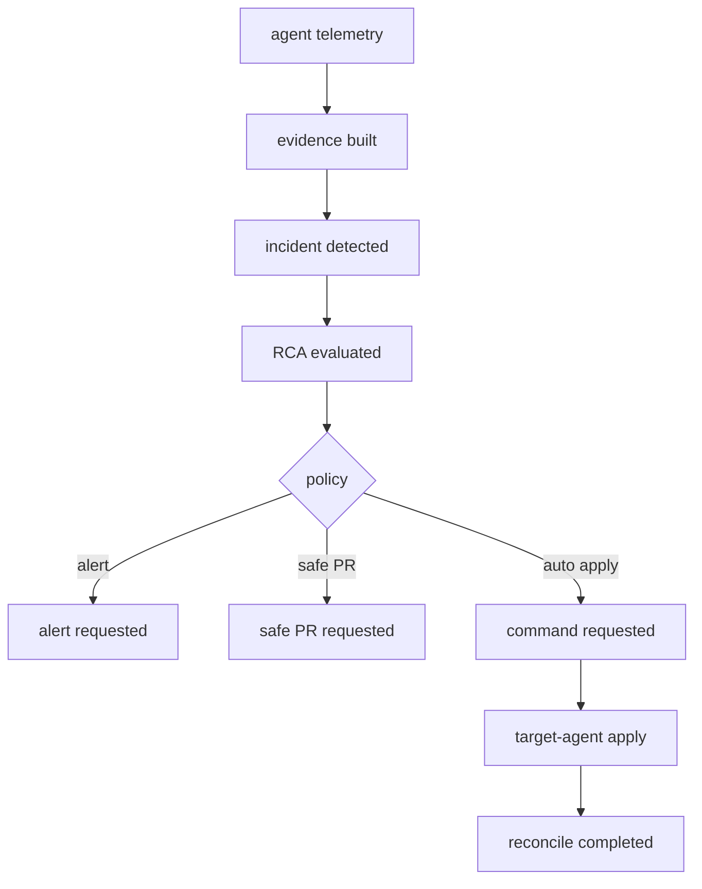

# Plural Console 기술 챌린지

이 문서는 Plural Console을 그대로 복제하자는 문서가 아니다. 우리 MVP가 이미 가진
event bus, target domain, command queue, agent loop 위에 무엇을 배워서 붙일지 정리한다.

## 결론

현재 구조로도 Plural식 핵심 흐름은 MVP 수준으로 구현할 수 있다.

- management plane이 target cluster의 desired state를 저장한다.
- cluster-agent가 target cluster에 설치되고 주기적으로 상태와 telemetry를 보낸다.
- reconcile worker가 desired state와 actual state를 비교해 drift 이벤트를 만든다.
- command worker가 승인된 명령을 target-agent로 전달한다.
- evidence/RCA/alert/safe-pr 흐름이 이벤트로 이어진다.

다만 Plural 수준의 운영급 fleet management는 단순 이벤트 연결만으로 끝나지 않는다.
Kubernetes-native controller, Git/Helm cache, CRD, rollout 관찰, 권한 모델, agent upgrade
전략이 필요하다.

## Plural Console에서 확인한 구조

참고 기준:

- GitHub: https://github.com/pluralsh/console
- GitOps architecture: https://docs.plural.sh/resources/architecture/gitops-architecture
- Deployment operator: https://docs.plural.sh/plural-features/continuous-deployment/deployment-operator
- Plural AI architecture: https://docs.plural.sh/plural-features/plural-ai/architecture

Plural은 hub-spoke 구조다. Console이 management hub이고, 각 cluster의 agent/operator가
spoke로 동작한다. agent는 hub를 자주 polling해서 새 tarball, manifest, 실행 작업을
가져오고, cluster 상태와 실행 결과를 다시 hub에 보낸다.

Plural repo의 큰 축은 다음처럼 나뉜다.

| 영역 | Plural 위치 | 의미 |
| --- | --- | --- |
| Console backend | `lib/console`, `lib/console_web` | Phoenix/GraphQL/API/UI backend |
| Frontend | `assets` | Console UI |
| Agent/controller | `go/*`, 별도 deployment-operator | cluster 내부 reconcile/apply 실행 |
| Helm/배포 | `charts`, `docker`, `dockerfiles` | 운영 설치 artifact |
| DB migration | `priv/repo/migrations` | Ecto migration |
| CRD/API | `static/crds`, `proto`, Kubernetes API docs | GitOps resource contract |

## 우리 구조와 다른 점

| 기준 | 우리 MVP | Plural Console |
| --- | --- | --- |
| 중심 모델 | domain event spine | GitOps desired state + Kubernetes operator |
| agent 통신 | API Gateway로 event/telemetry push | agent/operator가 hub를 polling하고 상태 보고 |
| 배포 실행 | command queue + target-agent apply 예정 | operator/controller가 CRD와 tarball을 reconcile |
| UI/API | FastAPI + Python domain | Phoenix/GraphQL + React |
| 상태 저장 | SQLAlchemy model + event/outbox | Ecto DB + sharded git/helm cache |
| 운영 artifact | management YAML 중심 | Helm charts, CRDs, controller images |
| AI/RCA | evidence/RCA event flow | 내부 event bus 기반 조사 + PR automation |

## 지금 구현된 MVP 흐름

이번 dev 기준 최소 흐름은 다음 파일에 있다.

- `src/packages/contracts/target.py`
- `src/domains/target/events.py`
- `src/domains/target/reconciler.py`
- `src/services/target/reconcile-worker/app.py`
- `src/domains/target/router.py`
- `deploy/management/services.yaml`

현재 동작:

1. admin이 `/targets`로 target cluster를 등록한다.
2. API Gateway가 cluster별 agent token을 만들고 install manifest를 생성한다.
3. `apply=true`인 경우 kubectl apply 성공 후 DB와 desired state를 기록한다.
4. `cluster.desired_state.changed` 이벤트가 발행된다.
5. target-reconcile-worker가 `cluster.reconcile.requested`를 만든다.
6. actual snapshot이 없으면 `requested` 상태로 기록한다.
7. actual snapshot이 들어오면 desired/actual을 비교해 drift 이벤트를 만든다.

이건 production 구현의 골격이다. 실제 Kubernetes apply, watch, rollout, remediation은
각 팀원이 도메인별로 붙여야 한다.

## 운영급으로 더 필요한 것

### Target / Agent

- TODO(target): cluster-agent가 target cluster의 실제 Deployment, DaemonSet, Service,
  ConfigMap, Secret metadata를 수집해 actual snapshot으로 API Gateway에 보고한다.
- TODO(target): node collector를 DaemonSet으로 설치하고 cluster-agent가 collector 상태를
  reconcile한다.
- TODO(target): kubectl 직접 실행을 agent-side server-side apply로 옮기고 field manager,
  dry-run, diff, rollout wait를 제공한다.
- TODO(target): agent upgrade 전략을 만든다. image tag, chart version, rollback 기준,
  canary namespace를 명시한다.

### GitOps / Command

- TODO(gitops): Git checkout, Helm/Kustomize render, manifest digest 생성, artifact 저장을
  command worker port 뒤로 분리한다.
- TODO(command): command queue는 idempotency key, retry backoff, lease timeout, dead-letter
  기준을 명확히 한다.
- TODO(command): apply 명령은 desired state version과 cluster actual version을 비교한 뒤
  같은 version이면 no-op 처리한다.

### Evidence / RCA / Alert

- TODO(evidence): Prometheus/Loki/OTel adapter를 실제 API 호출 기반으로 구현하고,
  대량 payload는 window 단위로 제한한다.
- TODO(rca): deterministic rule, policy threshold, AI 판단을 구분하고 판단 근거를
  evidence record에 남긴다.
- TODO(alert): drift, reconcile failed, rollout failed, incident detected 이벤트를 받아
  Slack/Email/PagerDuty worker로 라우팅한다.

### Identity / Workspace / RBAC

- TODO(identity): workspace, repo, cluster binding allowlist를 DB 권한 모델과 연결한다.
- TODO(identity): agent token은 cluster별 발급/회전/폐기 lifecycle을 가진다.
- TODO(identity): target 등록, apply, safe-pr, credential 접근은 role action으로 통제한다.

### Platform / Operations

- TODO(platform): management plane은 Helm chart로 설치하고 ingress/TLS, NetworkPolicy,
  PodDisruptionBudget, resource limit, non-root security context를 기본값으로 둔다.
- TODO(platform): reconcile metrics를 Prometheus에 노출한다.
  예: `reconcile_duration_seconds`, `reconcile_drift_total`, `agent_last_seen_timestamp`.
- TODO(platform): event relay, outbox, worker restart 시 중복 처리와 순서 보장을 검증한다.

## 기술 챌린지 제안

### 챌린지 1: DesiredState CRD 또는 SQL 모델 선택

우리 MVP는 SQL table의 `target_desired_states`를 기준으로 시작했다. 다음 단계는 둘 중 하나다.

- SQL-first: 빠르게 제품을 만든다. API, 권한, 이벤트 추적이 쉽다.
- CRD-first: Kubernetes-native 운영성이 좋아진다. controller 작성 난이도가 오른다.

MVP는 SQL-first가 맞다. 운영급 전환 시 CRD mirror를 추가해 SQL과 Kubernetes resource 사이의
source of truth를 명확히 해야 한다.

### 챌린지 2: Reconciler 실행 위치

현재 target-reconcile-worker는 management plane에서 비교만 한다. 실제 apply는 target-agent가
하는 구조가 맞다.

- management plane: desired state 저장, 정책 판단, 명령 생성
- target-agent: actual state 조회, diff, apply, rollout 관찰
- API Gateway: 인증, 수집, 이벤트 발행

이 분리가 있어야 고객 cluster credential을 management plane에 과도하게 저장하지 않는다.

### 챌린지 3: Plural식 Git/Helm cache

Plural은 agent가 매번 GitHub를 직접 치지 않도록 hub 쪽에 sharded git/helm cache와 tarball
전달 구조를 둔다. 우리도 cluster가 늘어나면 같은 문제가 생긴다.

MVP에서는 repo pull/render를 command worker에서 직접 처리해도 된다. 운영급에서는 manifest
artifact digest, cache, retention, provenance를 별도 module로 빼야 한다.

### 챌린지 4: 장애에서 PR까지의 폐루프

우리 이벤트 흐름은 다음 폐루프를 목표로 한다.

운영급에서는 `auto apply`가 항상 위험하다. 현재는 정책 함수를 통과하면 배포되도록 열어두되,
다음 release에서는 workspace/repo/cluster policy로 차단 조건을 추가해야 한다.

## 팀 작업 원칙

- 각 팀원은 자기 도메인 TODO만 구현한다.
- 도메인 간 직접 import를 늘리지 말고 `packages/contracts`의 event body, store protocol,
  gateway request/response를 먼저 확장한다.
- 실제 Kubernetes/SCM/Slack/GitHub API 호출은 port/interface 뒤에 둔다.
- test는 넓게 만들기보다 domain pure logic, router edge case, worker event mapping을
  작게 검증한다.

