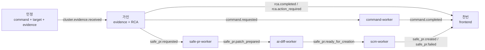

# 팀원별 역할 분리 실습 가이드

이 문서는 처음 들어온 팀원이 자기 역할을 보고 바로 연습할 수 있게 정리한 가이드다.

전체 코드를 한 번에 이해하려고 하면 너무 크다. 그래서 우리는 역할을 일부러 잘랐다.
내부 구현은 최대한 몰라도 되게 하고, 서로 넘겨주는 event/API 계약만 정확히 맞추는 방식으로 간다.

가장 중요한 기준은 이것이다.

```text
민정: 커맨드 + 타깃 + 에비던스
가인: 에비던스 + RCA
찬빈: 프론트
```

다른 사람 영역을 아예 몰라도 된다는 뜻은 아니다. 대신 "내가 어디까지 만들고, 무엇을 넘겨야 하는지"만 선명하면 된다.

같이 봐야 하는 큰 문서는 아래다.

- Command / Target / Evidence 상세 기준: [Target Agent Command / Evidence 구현 가이드](member-guides/target-agent-command-evidence-flow.md)
- RCA / Safe PR 상세 기준: [RCA / Safe PR 멤버 가이드](member-guides/rca-safe-pr.md)
- 역할 간 계약과 테스트 기준: [팀 간 구현 연결과 테스트 가이드](cross-role-implementation-test-guide.md)

## 위키 기준

위키 레포의 팀원별 문서를 같이 확인해서 아래처럼 정리했다.

| 팀원 | 위키에서 잡은 목표 | 이 문서에서 보는 역할 |
| --- | --- | --- |
| 민정 | 실제 target cluster에서 Kubernetes, Prometheus, Loki, Tempo/OpenTelemetry evidence를 만든다 | command 흐름, target agent, evidence job, provider 수집 |
| 가인 | evidence를 event/DB에 보존하고 RCA, recovery, command, Safe PR 분기로 이어준다 | evidence ingest, RCA rule/pipeline, action route, Safe PR 요청 |
| 찬빈 | RCA 부산물을 dashboard read model, API, frontend 화면으로 연결한다 | frontend가 읽을 계약, dashboard 목표, realtime/read model 소비 |

위키에는 최종 목표까지 적힌 문서가 섞여 있다. 이 레포 문서는 "현재 source repo 기준으로 실제 작동하는 것"과 "프로덕션 완성 작업"을 나눠 적는다.

## 전체 흐름

```text
민정
  command.requested
  -> command-worker
  -> agent command queue
  -> Target Agent poll/start/heartbeat/result
  -> command.completed

민정
  evidence job schedule
  -> provider별 job poll
  -> metrics/logs/traces result
  -> evidence aggregate
  -> cluster.evidence.received

가인
  cluster.evidence.received
  -> evidence.built
  -> incident.detected
  -> evidence.bundle.built
  -> rca.candidates.planned
  -> rca.candidates.evaluated
  -> rca.completed 또는 rca.action_required
  -> recovery.planned
  -> recovery.action_selected
  -> command.requested 또는 safe_pr.requested

찬빈
  Gateway API / realtime / read model 계약
  -> incident, evidence, RCA, command, Safe PR 상태 표시
```

같은 그림을 더 짧게 보면 이렇다.



## 지금 레포 기준 상태

여기는 중요하다. 위키의 최종 목표와 현재 코드가 완전히 같지는 않다.

현재 구현되어 있는 것:

| 구분 | 현재 상태 |
| --- | --- |
| command flow | `command.requested`부터 command-worker, agent queue, `/agent/commands/*`, `command.completed`까지 있다 |
| debug query flow | `POST /agent/debug/query`가 `telemetry.query.run` command를 agent queue에 넣는다 |
| evidence job flow | `/agent/evidence/jobs`, `/agent/evidence/jobs/poll`, `/agent/evidence/jobs/{job_id}/result`가 있다 |
| evidence aggregate | provider job이 terminal 상태가 되면 `cluster.evidence.received`로 묶는다 |
| provider registry | `@telemetry.source(...)`로 Kubernetes, Prometheus, Loki, Tempo provider를 등록한다 |
| Prometheus range query | `PrometheusRangeQuery`가 `/api/v1/query_range`를 호출한다 |
| Kubernetes snapshot provider | `KubernetesSnapshotProvider`가 `kubernetes` bucket을 채운다 |
| RCA split workers | evidence, incident, plan, analyze, rca, recovery, select, dispatch worker로 나뉘어 있다 |
| Safe PR write boundary | `safe_pr.requested`는 safe-pr-worker와 ai-diff-worker 게이트를 거쳐 `safe_pr.ready_for_creation`이 된 뒤 scm-worker가 GitHub PR 생성 또는 실패 이벤트로 끝낸다 |
| audit projection | `audit-worker`가 `@app.on_any`로 전체 이벤트를 audit log에 남긴다 |
| realtime gateway | 별도 realtime 서비스가 있고 target live summary를 받을 수 있다 |

찬빈이 새로 설계해야 하는 frontend/read model 목표:

| 구분 | 현재 기준 |
| --- | --- |
| dashboard-worker | `src/services/projection/dashboard-worker`가 있고 `RcaTimeline`을 upsert한다 |
| `/dashboard/rca/timeline`, `/dashboard/rca/incidents/{incident_id}` | `src/packages/contracts/gateway/routes.py`에 route 상수가 있다 |
| frontend app | `frontend/`에 React/Vite 운영 콘솔 앱이 있다. API는 Gateway 계약과 same-origin `/api` proxy 기준으로 붙인다 |
| `dashboard.updated` | 현재 `EventSubject`에 없다. 우선 query API 기준으로 화면을 붙인다 |

그래서 찬빈 파트는 "이미 있는 화면을 고친다"가 아니라, 먼저 backend 계약과 read model 목표를 고정하고, 그 다음 frontend가 실제 API를 소비하게 만드는 순서로 봐야 한다.

## 디커플링 원칙

우리가 나눈 기준은 단순하다.

1. 내부 구현은 각자 바꿀 수 있다.
2. event body, API path, DB 식별자는 말없이 바꾸지 않는다.
3. 다른 사람이 내부 함수를 직접 import해서 쓰지 않는다.
4. 외부 write는 한 곳으로 모은다.
5. 화면은 DB나 NATS를 직접 보지 않고 Gateway/API/read model만 본다.

예를 들면:

- 민정은 Prometheus provider 내부를 바꿀 수 있다. 하지만 `cluster.evidence.received` payload 모양을 말없이 바꾸면 가인의 RCA가 깨진다.
- 가인은 RCA rule을 바꿀 수 있다. 하지만 `rca.completed`와 `rca.action_required` 의미를 바꾸면 찬빈 화면이 깨진다.
- 찬빈은 화면 구성을 바꿀 수 있다. 하지만 worker DB를 직접 읽으면 backend 계약이 없어져서 유지보수가 어려워진다.

## 데코레이터 감 잡기

처음 헷갈리는 부분이 여기다.

이 프로젝트에서 데코레이터는 크게 두 종류다.

| 데코레이터 | 쓰는 곳 | 의미 |
| --- | --- | --- |
| `@event(EventSubject.X)` | event body dataclass | 이 body가 어떤 event subject로 흘러가는지 등록한다 |
| `@app.on(BodyType)` | worker `app.py` | 이 worker가 어떤 event body를 구독할지 정한다 |
| `@app.on_any` | cross-cutting worker | 모든 이벤트 봉투를 그대로 받는다 |
| `@telemetry.source(...)` | target telemetry provider | provider source, evidence key, query type을 등록한다 |

### event body 만들기

새 event를 만들 때는 subject와 body가 같이 있어야 한다.

```python
from dataclasses import dataclass

from packages.contracts.event_bus.bodies.base import EventBody
from packages.contracts.event_bus.registry import event
from packages.contracts.event_bus.subjects import EventSubject


@event(EventSubject.RCA_COMPLETED)
@dataclass(frozen=True)
class RcaCompletedBody(EventBody):
    root_cause: str
    action: str
    evidence_ref: str
```

이렇게 하면 `RcaCompletedBody.__subject__`가 생긴다. worker는 문자열 `"rca.completed"`를 직접 외우지 않아도 된다.

### worker에서 event 받기

worker는 `App`을 하나 만들고, `@app.on(...)`으로 하나의 body 타입을 받는다.

```python
from packages.runtime.app import App
from domains.rca.events import EvidenceBuiltBody, IncidentDetectedBody

app = App("incident-worker")


@app.on(EvidenceBuiltBody)
async def on_evidence(evt, ctx):
    yield IncidentDetectedBody(...)


if __name__ == "__main__":
    app.run()
```

여기서 중요한 건 `yield`다.

worker가 `yield SomeBody(...)`를 하면 런타임이 알아서 다음 일을 해준다.

- 같은 `correlation_id`를 유지한다.
- 부모 event id를 `causation_id`로 연결한다.
- DB transaction 안에서 업무 처리, outbox 적재, ledger 완료를 같이 처리한다.
- NATS 발행은 outbox relay가 맡는다.
- 실패하면 retry하고, 계속 실패하면 DLQ로 보낸다.

그래서 worker 안에서 직접 NATS publish를 하지 않는다.

### 언제 `ctx`를 받나

handler는 두 가지 형태가 가능하다.

```python
async def handler(evt):
    ...

async def handler(evt, ctx):
    ...
```

`ctx`가 필요할 때:

- 현재 `correlation_id`를 보고 싶을 때
- 현재 event id, causation id를 보고 싶을 때
- DB repository를 써야 할 때

단순 변환이면 `evt`만 받아도 된다.

### 언제 `@app.on_any`를 쓰나

모든 이벤트를 봐야 하는 projection, audit, monitor에만 쓴다.

```python
app = App("audit-worker")


@app.on_any
async def on_event(evt, ctx):
    await ctx.db.append_audit_log(evt)
```

일반 업무 worker는 `@app.on(BodyType)`을 쓴다. 모든 이벤트를 받는 worker를 남발하면 역할 경계가 흐려진다.

### 언제 `@telemetry.source`를 쓰나

민정 쪽 provider를 추가할 때 쓴다.

```python
@telemetry.source(
    source="prometheus",
    evidence_key="metrics",
    query_type=PrometheusInstantQuery,
)
class PrometheusMetricsProvider:
    ...
```

이렇게 등록하면 collector와 scheduler는 provider 목록을 직접 나열하지 않는다.
새 provider를 붙일 때 scheduler에 `if source == ...`를 늘리는 방식으로 가지 않는다.

## 민정: 커맨드 + 타깃 + 에비던스

민정 파트의 목표는 "대상 클러스터에서 실제로 무슨 일이 있었는지 management로 안전하게 가져오는 것"이다.

민정의 끝은 보통 여기다.

```text
command.completed
cluster.evidence.received
```

RCA 결론을 내리거나 PR 본문을 쓰는 일은 민정 책임이 아니다. 대신 가인이 판단할 수 있을 만큼 evidence를 정확히 만들어야 한다.

### 민정이 맡는 것

| 구분 | 맡는 일 |
| --- | --- |
| command | 요청된 command를 target agent가 가져가고, 실행하고, 결과를 돌려주는 흐름 |
| target agent | management로 outbound 연결만 맺는 agent 실행 루프 |
| evidence job | provider별 수집 job을 schedule, poll, complete하는 흐름 |
| telemetry provider | Kubernetes, Prometheus, Loki, Tempo 결과를 evidence payload로 정규화 |
| policy | 어떤 provider를 켜고, 몇 초마다 수집하고, worker를 몇 개 둘지 반영 |
| target safety | secret, kubeconfig, token, 너무 큰 raw payload를 evidence에 넣지 않기 |

### 민정이 바로 열어볼 파일

처음에는 이 순서로 보는 게 좋다.

| 순서 | 파일 | 보는 이유 |
| --- | --- | --- |
| 1 | `src/services/target/cluster-agent/agent.py` | agent가 command, policy, evidence loop를 어떻게 동시에 돌리는지 본다 |
| 2 | `src/services/target/cluster-agent/evidence/jobs.py` | evidence scheduler와 provider worker pool을 본다 |
| 3 | `src/domains/target/router.py` | `/agent/evidence/jobs/*`, `/agent/commands/*` Gateway route를 본다 |
| 4 | `src/domains/target/evidence_jobs.py` | `evidence_key`, aggregate, failure policy를 본다 |
| 5 | `src/services/target/cluster-agent/telemetry_registry.py` | provider 등록 방식이 registry 기준인지 본다 |
| 6 | `src/services/target/cluster-agent/providers/*.py` | Kubernetes, Prometheus, Loki, Tempo provider 구현을 본다 |
| 7 | `src/domains/target/evidence_policy.py` | default provider query와 policy를 본다 |
| 8 | `src/services/command/command-worker/app.py` | command event가 agent queue로 가는 입구를 본다 |

### command 흐름

```text
command.requested
  -> command-worker
  -> command.dispatched
  -> command.queued_for_agent
  -> Target Agent GET /agent/commands/poll
  -> Target Agent POST /agent/commands/{command_id}/start
  -> Target Agent heartbeat
  -> Target Agent POST /agent/commands/{command_id}/result
  -> command.completed
```

민정이 기억할 점:

- agent는 target cluster 안에서 management Gateway로 outbound 요청만 한다.
- command 결과는 바로 날려버리지 않고 local outbox에 넣은 뒤 전송한다.
- heartbeat는 "계속 실행 중"이라는 lease 유지 신호다.
- command action은 agent command registry에 등록되어 있어야 한다.
- sandbox namespace 밖 write는 정책으로 막아야 한다.

### evidence 흐름

```text
Target Agent policy sync
  -> EvidenceJobScheduler
  -> POST /agent/evidence/jobs
  -> GET /agent/evidence/jobs/poll?provider_key=metrics
  -> provider query 실행
  -> POST /agent/evidence/jobs/{job_id}/result
  -> 모든 provider terminal 상태 확인
  -> aggregate_evidence_payload
  -> cluster.evidence.received
```

현재 provider key는 보통 이렇게 보면 된다.

| provider key | source | evidence payload key | 현재 provider |
| --- | --- | --- | --- |
| `kubernetes` | `kubernetes` | `kubernetes` | `KubernetesSnapshotProvider` |
| `metrics` | `prometheus` | `metrics` | `PrometheusMetricsProvider` |
| `logs` | `loki` | `logs` | `LokiLogsProvider` |
| `traces` | `tempo` | `traces` | `TempoTracesProvider` |

`kubernetes` bucket은 `KubernetesSnapshotProvider`가 채운다. 같은 evidence window 안에서 `kubernetes`, `metrics`, `logs`, `traces` provider job이 각각 terminal 상태가 되면 Management가 `cluster.evidence.received`를 한 번 만든다.

### 민정이 가인에게 넘기는 것

가인이 RCA를 하려면 최소한 아래를 알아야 한다.

- `workspace_id`
- `cluster_id`
- `agent_id`
- `source_id`
- `window_start`
- `evidence_key`
- 어떤 provider가 성공했는지
- 어떤 provider가 실패했는지
- `failure_policy`가 `allow_partial`인지 `strict`인지
- logs에 redaction이 적용됐는지
- kubernetes/metrics/logs/traces가 실제 provider 결과인지

특히 `correlation_id`는 `ClusterEvidenceReceivedBody` 필드가 아니라 event envelope 쪽이다.
body에 새 필드로 억지로 넣지 않는다.

### 민정이 하면 안 되는 것

- RCA 결론을 target agent에서 미리 만들어 넣지 않는다.
- PR 제목, PR 본문을 target agent가 만들지 않는다.
- raw kubeconfig, bearer token, secret 값을 evidence에 넣지 않는다.
- Prometheus/Loki/Tempo raw response 전체를 무제한으로 넣지 않는다.
- provider 실패를 성공 데이터처럼 꾸미지 않는다.
- provider 목록을 scheduler 곳곳에 직접 나열하지 않는다.

### 민정 연습 순서

1. `tests/test_target_evidence_jobs.py`를 먼저 읽는다.
2. `EvidenceJobScheduler.schedule_once()`가 provider job을 어떻게 만드는지 본다.
3. `EvidenceJobScheduler.work_once()`가 provider 하나를 어떻게 수집하는지 본다.
4. `src/domains/target/evidence_jobs.py`의 `aggregate_evidence_payload()`를 본다.
5. `src/domains/target/evidence_policy.py`에 metric query 하나를 추가해본다.
6. 테스트 레거시 데이터에서 새 query가 policy에 들어가는지 확인한다.

민정 파트에서 바로 돌릴 테스트:

```bash
PYTHONPATH=src .venv/bin/python -m pytest \
  tests/test_command_worker.py \
  tests/test_command_router.py \
  tests/test_target_agent_commands.py \
  tests/test_target_evidence_jobs.py \
  tests/test_target_metric_evidence.py \
  tests/test_target_telemetry_evidence.py \
  tests/test_target_kubernetes_evidence.py \
  tests/test_target_pod_evidence.py \
  tests/test_telemetry_registry.py \
  -q
```

## 가인: 에비던스 + RCA

가인 파트의 목표는 "민정이 보낸 evidence를 근거 있는 판단과 조치 후보로 바꾸는 것"이다.

가인의 시작은 보통 여기다.

```text
cluster.evidence.received
```

가인의 끝은 보통 여기다.

```text
rca.completed
rca.action_required
command.requested
safe_pr.requested
```

실제 GitHub API로 PR을 쓰는 책임은 `scm-worker`에 둔다.
가인은 RCA 결과와 Safe PR 요청에 필요한 근거, route, patch 의도를 정확히 만드는 데 집중한다.

### 가인이 맡는 것

| 구분 | 맡는 일 |
| --- | --- |
| evidence ingest | `cluster.evidence.received`를 `Evidence` 값 객체로 정리 |
| incident 판단 | 어떤 resource에 어떤 증상이 있는지 결정 |
| evidence bundle | RCA 판단에 필요한 근거와 부족한 근거를 묶기 |
| RCA planning | 가능한 원인 후보를 만들기 |
| RCA analysis | 후보를 evidence 기반으로 점수화 |
| RCA result | `rca.completed` 또는 `rca.action_required`로 끝내기 |
| recovery route | `auto`, `safe_pr`, `approval_required`, `forbidden` 중 하나로 분기 |
| dispatch | command 또는 Safe PR 요청 event를 만들기 |

### 가인이 바로 열어볼 파일

| 순서 | 파일 | 보는 이유 |
| --- | --- | --- |
| 1 | `src/domains/rca/events.py` | RCA event body 계약을 본다 |
| 2 | `src/services/ai/evidence-worker/app.py` | `cluster.evidence.received` 시작점을 본다 |
| 3 | `src/services/ai/incident-worker/app.py` | evidence에서 incident로 넘어가는 부분을 본다 |
| 4 | `src/services/ai/plan-worker/app.py` | candidate 생성 흐름을 본다 |
| 5 | `src/services/ai/analyze-worker/app.py` | candidate 평가 흐름을 본다 |
| 6 | `src/services/ai/rca-worker/app.py` | 최종 RCA 결론을 본다 |
| 7 | `src/services/ai/recovery-worker/app.py` | RCA 결과를 복구 후보로 바꾸는 부분을 본다 |
| 8 | `src/services/ai/select-worker/app.py` | route 선택을 본다 |
| 9 | `src/services/ai/dispatch-worker/app.py` | command 또는 Safe PR로 나누는 부분을 본다 |
| 10 | `src/services/ai/agent/causes/catalog/*.yaml` | 증상별 rule을 본다 |

### 현재 RCA worker 구조

위키에는 "RCA worker가 evidence를 받아 RCA까지 한다"처럼 한 덩어리로 보일 수 있다.
현재 source repo는 더 잘게 나뉘어 있다.

```text
cluster.evidence.received
  -> evidence-worker
  -> evidence.built
  -> incident-worker
  -> incident.detected
  -> evidence.bundle.built
  -> plan-worker
  -> rca.candidates.planned
  -> analyze-worker
  -> rca.candidates.evaluated
  -> rca-worker
  -> rca.completed 또는 rca.action_required
  -> recovery-worker
  -> recovery.planned
  -> select-worker
  -> recovery.action_selected 또는 recovery.selection_requested
  -> dispatch-worker
  -> command.requested 또는 safe_pr.requested
```

이렇게 나눈 이유는 각 단계가 독립적으로 테스트되고, 실패해도 retry/DLQ로 끊긴 지점을 찾기 쉽게 하기 위해서다.

### 가인이 민정에게 받아야 하는 것

- `cluster.evidence.received` payload 예시
- provider별 성공/실패 상태
- `evidence_key`
- `source_id`, `window_start`
- logs redaction 여부
- metrics query 이름과 의미
- Kubernetes bucket이 비어 있는지, 어떤 경로로 채워지는지

민정 evidence가 부족하면 RCA가 성공한 척하면 안 된다.
부족한 근거는 `missing_evidence`, `rca.rule_missing`, `rca.action_required`, backlog/fallback 쪽으로 보내야 한다.

### 가인이 찬빈에게 넘겨야 하는 것

찬빈은 화면을 만들 때 아래 값을 알아야 한다.

- `correlation_id`
- `incident_id`
- `evidence_ref`
- `root_cause`
- `confidence`
- `supporting_evidence`
- `missing_evidence`
- `rca.completed`인지 `rca.action_required`인지
- action route가 `auto`, `safe_pr`, `approval_required`, `forbidden` 중 무엇인지
- `command_id` 또는 PR 결과가 나중에 어디서 연결되는지

화면이 필요하다고 해서 RCA body에 임의 필드를 넣기보다, 먼저 DTO/event 계약을 같이 고정한다.

### Safe PR 경계

Safe PR은 두 단계로 나눠 생각한다.

```text
가인 쪽
  RCA/recovery 판단
  -> safe_pr.requested
  -> safe_pr.patch_prepared

SCM 쪽
  safe_pr.requested
  -> GitHub branch/commit/PR
  -> safe_pr.created 또는 safe_pr.failed
```

`safe_pr.requested`는 PR URL이 아니다.
PR URL은 `safe_pr.created`에 있다.

GitHub token, repo write, branch 생성은 `scm-worker`와 provider adapter 경계에서 처리한다.
RCA worker가 직접 GitHub API를 호출하면 역할이 섞인다.

### 가인이 하면 안 되는 것

- target agent poll loop를 수정해서 RCA를 억지로 끼워 넣지 않는다.
- evidence가 부족한데 root cause를 확정처럼 말하지 않는다.
- Safe PR이 필요하다고 RCA worker에서 직접 GitHub API를 호출하지 않는다.
- provider token이나 secret을 event body에 넣지 않는다.
- frontend 전용 표시 문자열을 RCA 내부 rule에 직접 나열하지 않는다.
- `correlation_id`를 잃어버리지 않는다.

### 가인 연습 순서

1. `tests/test_rca_evidence.py`에서 golden path를 먼저 본다.
2. `ClusterEvidenceReceivedBody` 레거시 데이터가 어떻게 RCA 결과로 바뀌는지 따라간다.
3. `src/services/ai/agent/causes`에서 증상별 rule을 하나 고른다.
4. 해당 rule이 어떤 evidence item을 기대하는지 적는다.
5. 근거가 부족한 case를 추가해 `rca.action_required`로 끝나는지 확인한다.
6. Safe PR route로 가는 case는 `safe_pr.requested`까지만 검증하고, 준비 게이트는 `safe-pr-worker`/`ai-diff-worker`, 실제 PR write는 `scm-worker` 테스트로 본다.

가인 파트에서 바로 돌릴 테스트:

```bash
PYTHONPATH=src .venv/bin/python -m pytest \
  tests/test_agent_evidence_ingest.py \
  tests/test_rca_evidence.py \
  tests/test_event_golden_path.py \
  tests/test_ai_agent.py \
  tests/test_command_worker.py \
  tests/test_diff_analyze_worker.py \
  tests/test_repo_gateway_worker.py \
  tests/test_operational_event_followups.py \
  -q
```

## 찬빈: 프론트

찬빈 파트의 목표는 "운영자가 지금 무슨 문제가 있고, 왜 그렇게 판단했고, 다음 조치가 어디까지 갔는지 볼 수 있게 만드는 것"이다.

현재 source repo 기준으로 dashboard projection과 `/dashboard/rca/*` API는 backend에 구현되어 있다.
찬빈은 이 계약을 먼저 소비하고, frontend 앱과 화면 상태를 그 API 기준으로 붙이는 순서로 간다.

찬빈이 직접 worker 내부 로직을 만지는 구조로 가면 안 된다.

```text
Frontend
  -> Gateway API
  -> realtime-gateway
  -> dashboard read model API
```

### 찬빈이 맡는 것

| 구분 | 맡는 일 |
| --- | --- |
| 화면 계약 | incident, evidence, RCA, action 상태를 어떤 DTO로 받을지 정리 |
| read model 목표 | event log를 매번 직접 계산하지 않도록 dashboard table/API 목표를 고정 |
| frontend 상태 | loading, empty, partial evidence, action required, stream disconnected 처리 |
| realtime | live 상태와 event update를 화면에 연결 |
| 표시 기준 | `rca.completed`, `rca.action_required`, `safe_pr.created`, `safe_pr.failed`를 구분 |

### 현재 찬빈이 알아야 하는 실제 상태

| 항목 | 현재 상태 |
| --- | --- |
| `src/services/projection/audit-worker` | 있다. 모든 event를 audit log로 남긴다 |
| `src/services/projection/dashboard-worker` | 있다. `@app.on_any`로 RCA/command/Safe PR event를 읽는다 |
| `src/domains/dashboard/*.py` | 있다. model/repository/router가 read model과 query API를 맡는다 |
| `/dashboard/rca/timeline` | 있다. RCA timeline list API다 |
| `/dashboard/rca/incidents/{incident_id}` | 있다. incident detail API다 |
| `/dashboard/stream` | 없다. dashboard용 SSE는 후속 목표다 |
| frontend app | `frontend/`에 React/Vite 운영 콘솔 앱이 있고 `/api`, `/api/live` proxy 기준으로 Gateway와 연결한다 |
| realtime-gateway | 있다. target live summary 같은 실시간 경계는 참고할 수 있다 |

그래서 문서나 화면은 현재 구현된 `/dashboard/rca/*` route와 `frontend/src` 구조를 같이 기준으로 잡는다.
찬빈 작업은 현재 구현된 `/dashboard/rca/*` API를 먼저 화면에 붙이고, 필요한 summary/stream만 작게 확장하는 작업이다.

### 찬빈이 바로 열어볼 파일

| 순서 | 파일 | 보는 이유 |
| --- | --- | --- |
| 1 | `src/packages/contracts/gateway/routes.py` | 현재 Gateway route 상수를 본다 |
| 2 | `src/packages/contracts/gateway/responses.py` | frontend가 받을 response DTO 패턴을 본다 |
| 3 | `src/packages/contracts/event_bus/subjects.py` | 화면에 필요한 event subject 목록을 본다 |
| 4 | `src/services/projection/dashboard-worker/app.py` | 실제 dashboard projection worker를 본다 |
| 5 | `src/domains/dashboard/repository.py` | event subject와 dashboard status mapping을 본다 |
| 6 | `src/domains/dashboard/router.py` | session/cluster read 권한 필터를 본다 |
| 7 | `tests/test_dashboard_projection.py` | projection 테스트 패턴을 본다 |
| 8 | `tests/test_dashboard_router.py` | API 권한 필터 테스트를 본다 |
| 9 | `src/services/realtime/realtime-gateway` | realtime 연결 방식을 본다 |
| 10 | `tests/test_realtime_contracts.py` | realtime payload 경계를 본다 |

### 찬빈이 민정에게 알아야 하는 것

- cluster id가 화면에서 어떤 filter가 되는지
- evidence window를 구분하는 `evidence_key`가 무엇인지
- provider가 partial failure일 때 어떻게 표시해야 하는지
- metrics/logs/traces payload가 어느 정도까지 bounded인지
- Kubernetes bucket이 비어 있을 수 있는지

### 찬빈이 가인에게 알아야 하는 것

- `correlation_id`로 어떤 event들을 묶을 수 있는지
- `incident_id`가 언제 생기는지
- `rca.completed`와 `rca.action_required` 차이
- confidence와 missing evidence를 어떻게 보여줘야 하는지
- action route가 `safe_pr`, `approval_required`, `forbidden`일 때 화면 상태가 어떻게 달라지는지
- PR URL은 `safe_pr.requested`가 아니라 `safe_pr.created`에서 온다는 점

### dashboard를 붙일 때 순서

찬빈이 dashboard를 실제로 붙일 때 순서는 이렇게 잡는다.

1. `RcaTimelineResponse`를 그대로 렌더링하는 timeline 화면을 만든다.
2. `GET /dashboard/rca/timeline`과 `GET /dashboard/rca/incidents/{incident_id}`를 먼저 붙인다.
3. cluster filter는 API query의 `cluster_id`를 쓰고, backend 403/404 상태를 화면 상태로 분리한다.
4. 필요한 summary가 생기면 `src/domains/dashboard/models.py`와 `repository.py`에 컬럼/쿼리를 작게 추가한다.
5. 새 event status가 필요하면 `RCA_TIMELINE_STATUS_BY_SUBJECT`와 테스트를 같이 바꾼다.
6. realtime stream이 필요하면 기존 realtime gateway 계약을 먼저 확장한다.
7. 그 다음 frontend가 새 route를 소비한다.

처음부터 임시 화면 데이터만 크게 만들면 backend와 붙을 때 다시 뜯게 된다.
반대로 read model과 DTO가 먼저 작게 있으면 화면은 훨씬 편하게 붙는다.

### 화면에서 구분해야 하는 상태

| 상태 | 화면에서 헷갈리면 안 되는 점 |
| --- | --- |
| no incident | 장애가 없는 것인지 filter가 너무 좁은 것인지 구분 |
| partial evidence | provider 실패가 있었는지 표시 |
| `rca.completed` | 근거가 충분해서 결론이 나온 상태 |
| `rca.action_required` | 자동 판단/조치가 멈춘 상태 |
| `safe_pr.requested` | PR 생성 요청일 뿐 URL이 있는 상태가 아님 |
| `safe_pr.created` | 실제 PR URL이 생긴 상태 |
| `command.queued_for_agent` | target agent가 가져갈 수 있는 상태 |
| `command.completed` | 실제 agent 결과가 management로 돌아온 상태 |
| stream disconnected | 데이터가 없는 것과 연결 끊김을 구분 |

### 찬빈이 하면 안 되는 것

- frontend에서 DB를 직접 조회하지 않는다.
- frontend에서 NATS subject를 직접 구독하지 않는다.
- 현재 구현된 `/dashboard/rca/*` API를 기준으로 한다.
- `safe_pr.requested`에 PR URL이 있다고 가정하지 않는다.
- RCA body에 화면 전용 임시 필드를 몰래 추가하지 않는다.
- 임시 데이터를 제품 경로의 성공처럼 보여주지 않는다.

### 찬빈 연습 순서

1. `tests/test_dashboard_projection.py`를 읽고 `@app.on_any` projection 패턴을 이해한다.
2. `tests/test_dashboard_router.py`에서 권한 필터와 response shape를 본다.
3. `EventSubject` 목록에서 화면 timeline에 필요한 subject를 체크한다.
4. frontend는 `RcaTimelineResponse`를 먼저 렌더링한다.
5. read model을 확장한다면 같은 event를 두 번 처리해도 row count가 늘지 않는 테스트를 먼저 둔다.

찬빈 파트에서 지금 바로 돌릴 테스트:

```bash
PYTHONPATH=src .venv/bin/python -m pytest \
  tests/test_projection.py \
  tests/test_realtime_contracts.py \
  tests/test_realtime_gateway.py \
  tests/test_service_entrypoints.py \
  -q
```

frontend app에서는 별도로:

```bash
cd frontend
npm run build
npm run lint
```

## 서로 넘길 때 체크리스트

### 민정 -> 가인

넘길 때 아래를 같이 적는다.

- `evidence_key`
- `workspace_id`, `cluster_id`, `agent_id`, `source_id`
- `window_start`
- 성공한 provider와 실패한 provider
- 실패한 provider의 error 요약
- logs redaction 적용 여부
- metrics query 이름과 의미
- 비어 있는 bucket이 있다면 이유

가인은 이 정보 없이 root cause를 확정하지 않는다.

### 가인 -> 찬빈

넘길 때 아래를 같이 적는다.

- `correlation_id`
- `incident_id`
- `evidence_ref`
- root cause와 confidence
- supporting evidence와 missing evidence
- 최종 상태가 `rca.completed`인지 `rca.action_required`인지
- action route
- command 또는 Safe PR로 이어졌다면 다음 event subject

찬빈은 이 값을 기준으로 화면 status와 timeline을 만든다.

### 찬빈 -> 민정/가인

화면에 필요한 값이 없으면 이렇게 요청한다.

```text
어느 화면에서 필요한가?
어느 event/API response에 들어가야 하는가?
필수 값인가, optional 값인가?
기존 field로 계산 가능한가?
없는 경우 화면은 어떻게 보여줄 것인가?
```

그냥 frontend에서 임시로 계산하거나 DB를 직접 보는 방식으로 해결하지 않는다.

## 끊긴 흐름을 발견했을 때

무엇이 끊겼는지 먼저 분류한다.

| 발견한 문제 | 처리 |
| --- | --- |
| 문서에 실제 없는 path가 있다 | 문서를 현재 source path로 고친다 |
| event subject가 문서에는 있는데 `EventSubject`에 없다 | 구현 목표인지 실제 구현인지 분리해서 적는다 |
| worker가 event를 yield하지 않는다 | 해당 worker 테스트에서 다음 subject를 확인한다 |
| route 상수는 있는데 Gateway에 include가 없다 | router include와 API test를 같이 본다 |
| payload field가 한쪽에는 있고 다른 쪽에는 없다 | body contract와 consumer test를 같이 고친다 |
| 테스트 대역이 제품 성공처럼 적혀 있다 | 테스트 전용인지 명시하거나 실제 구현 기준으로 고친다 |
| provider 목록이 여러 곳에 흩어져 있다 | registry나 policy 단일 출처로 옮긴다 |

현재 source repo 기준으로 특히 조심할 것:

- 위키의 오래된 `src/services/rca-worker` 경로 대신 `src/services/ai/rca-worker`를 쓴다.
- 위키의 오래된 `src/services/api-gateway/gateway.py` 경로 대신 `src/services/gateway/api-gateway/gateway.py`를 쓴다.
- dashboard worker와 dashboard route는 구현되어 있다. frontend는 이 계약을 먼저 소비한다.

## 전체 연습 시나리오

### 시나리오 1. command가 target agent까지 가는지 보기

```bash
PYTHONPATH=src .venv/bin/python -m pytest \
  tests/test_command_worker.py \
  tests/test_target_agent_commands.py \
  -q
```

확인할 것:

- `command.requested`
- `command.dispatched`
- `command.queued_for_agent`
- `command.completed`

### 시나리오 2. evidence job이 aggregate되는지 보기

```bash
PYTHONPATH=src .venv/bin/python -m pytest \
  tests/test_target_evidence_jobs.py \
  tests/test_target_metric_evidence.py \
  tests/test_target_kubernetes_evidence.py \
      -q
```

확인할 것:

- provider job이 provider별로 lease되는지
- `allow_partial`에서 실패한 query만 빠지고 성공한 query 결과는 남는지
- provider의 모든 query가 실패하면 빈 payload로 완료되는지
- 같은 `evidence_key`가 한 번만 event로 기록되는지

### 시나리오 3. evidence가 RCA와 Safe PR 요청으로 이어지는지 보기

```bash
PYTHONPATH=src .venv/bin/python -m pytest \
  tests/test_rca_evidence.py \
  tests/test_event_golden_path.py \
  tests/test_repo_gateway_worker.py \
  -q
```

확인할 것:

- `cluster.evidence.received`
- `evidence.built`
- `incident.detected`
- `rca.completed`
- `rca.action_required`
- `safe_pr.requested`
- `safe_pr.created` 또는 `safe_pr.failed`

### 시나리오 4. frontend 계약 준비 상태 보기

```bash
PYTHONPATH=src .venv/bin/python -m pytest \
  tests/test_projection.py \
  tests/test_realtime_contracts.py \
  tests/test_realtime_gateway.py \
  -q
```

확인할 것:

- audit projection이 전체 event를 받을 수 있는지
- realtime payload가 화면에 보낼 만큼 bounded인지
- dashboard route는 `/dashboard/rca/*` 기준으로 문서와 테스트에 맞는지

## PR을 작게 나누는 기준

한 PR에 여러 역할을 섞지 않는다.

좋은 단위:

- 민정: provider query 하나 추가, evidence job 테스트 추가
- 민정: command action 하나 추가, agent command 테스트 추가
- 가인: symptom rule 하나 추가, RCA 레거시 데이터/test 추가
- 가인: recovery route 하나 수정, dispatch test 추가
- 찬빈: Dashboard DTO 하나 추가, response test 추가
- 찬빈: projection table 하나 추가, idempotency test 추가

피해야 하는 단위:

- provider 수집, RCA rule, frontend 화면을 한 PR에 같이 넣기
- event body를 바꾸고 consumer 테스트를 안 바꾸기
- 임시 성공 화면만 만들고 실제 API 계약을 안 만들기
- PR 생성 책임을 RCA worker 안으로 가져오기

## 마지막 기준

각자 맡은 내부 구현은 몰라도 된다.
하지만 서로 넘기는 이름과 모양은 알아야 한다.

민정은 "실제 evidence가 왔다"고 말할 수 있어야 한다.
가인은 "이 evidence로 이렇게 판단했다"고 말할 수 있어야 한다.
찬빈은 "운영자가 그 판단과 조치 상태를 화면에서 볼 수 있다"고 말할 수 있어야 한다.

이 세 문장이 동시에 맞으면 역할 분리는 잘 된 것이다.
