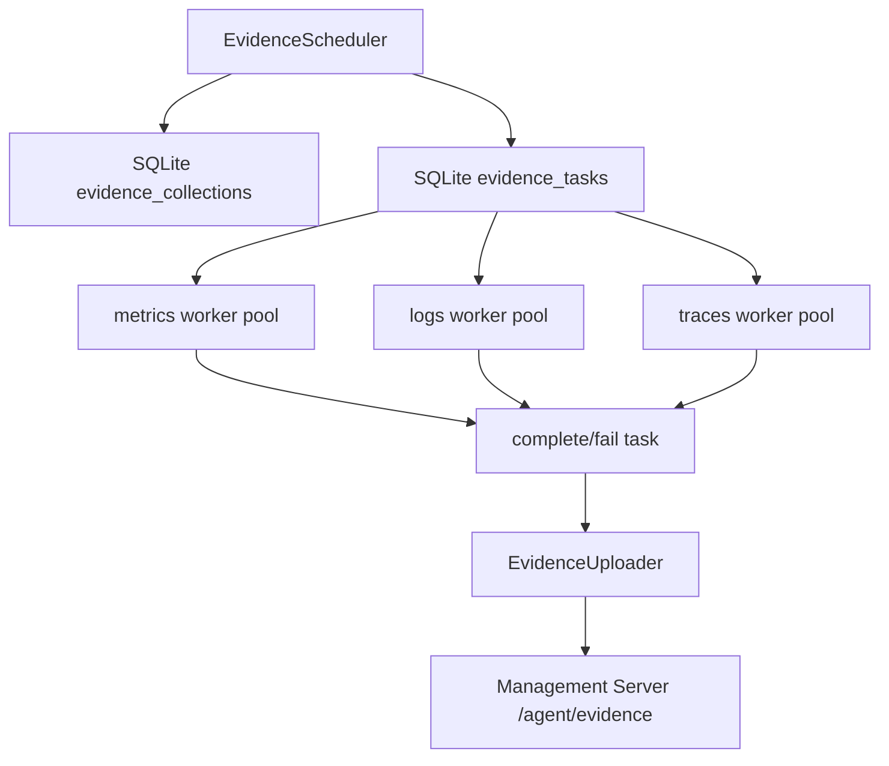
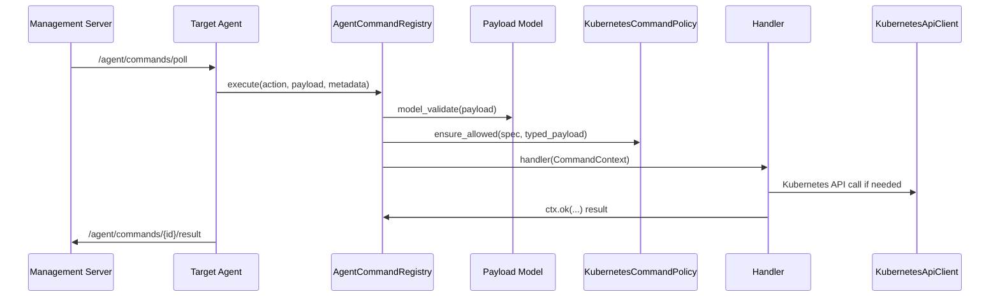
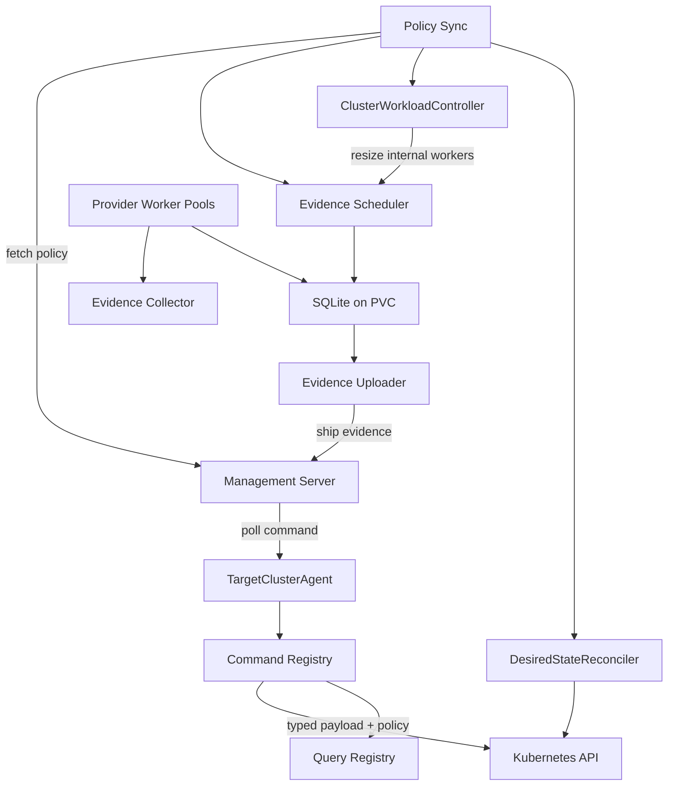

# Target Agent 설계 질문, 결정, 작업 기록

작성 기준: 2026-07-03  
대상 브랜치: `feat/minmings111/target-cluster-agent`  
마지막 원격 반영 커밋: `0430901 feat: 정책 동기화 / 명령 등록 / 쿼리 정리`  
현재 상태: 위 커밋은 push 완료. 이후 command framework 디커플링 작업은 working tree에 반영되어 있으나 아직 별도 커밋 전.

## 문서 목적

이 문서는 지금까지 논의한 target-cluster-agent 관련 질문, 설계 고민, 결정 이유, 구현된 내용, 아직 구현이 필요한 영역을 한곳에 복구 가능한 형태로 남기기 위한 기록이다.

특히 핵심 목표는 다음과 같다.

- target-agent가 무엇을 책임지는지 명확히 한다.
- evidence, provider, query, scheduler, worker, uploader, workload controller, policy sync, desired-state reconcile 흐름을 정리한다.
- "가볍지만 장애에 강한 구조"를 위해 선택한 SQLite/PVC, local scheduler, provider worker pool 구조의 이유를 남긴다.
- command decorator가 단순 라우팅이 아니라 표준 Context, typed payload, Kubernetes client, 권한 정책과 묶여야 하는 이유를 남긴다.
- 이후 팀원이 기능을 추가할 때 내부 프레임워크 변경에 덜 흔들리도록 어떤 계약을 써야 하는지 정리한다.

## 최상위 목표

target-agent의 본질적인 업무는 타깃 클러스터를 관리, 모니터링, 제어하는 것이다.

현재 범위에서 target-agent가 해야 하는 일은 다음이다.

- 외부, 즉 management server의 명령을 가져온다.
- 가져온 명령을 실행한다.
- 실행 결과를 management server로 반환한다.
- 내부 telemetry query를 실행한다.
- 수집 결과를 management server로 보낸다.
- 내부 병목을 감시한다.
- 우리 target-agent 관련 worker 수와 생애주기를 조절한다.
- management server가 내려준 policy와 desired state를 받아 local state에 저장하고 반영한다.
- Kubernetes API를 사용해 허용된 범위의 리소스를 제어한다.

아직 제외하거나 제한한 범위는 다음이다.

- 사용자 애플리케이션 제어는 아직 본격 구현하지 않는다.
- target-agent는 우선 우리 target-agent 자신과 관련된 리소스만 제어한다.
- user-workload scope는 정책상 막아둔다.
- system scope도 기본적으로 제한한다.

## 지금까지의 질문과 답변 흐름

### EvidenceCollector의 evidence는 무엇으로 만들어졌는가

초기 코드:

```python
async def collect_evidence(self) -> JsonObject:
    with TRACER.start_as_current_span("evidence.collect") as span:
        evidence = self.fake_evidence()
        evidence["metrics"] = await self.collect_prometheus_metrics()
        evidence["logs"] = await self.collect_loki_logs()
        evidence["traces"] = await self.collect_tempo_traces()
        ...
        return evidence
```

초기에는 `evidence`가 `self.fake_evidence()` 결과로 만들어지고, 그 위에 `metrics`, `logs`, `traces`가 덮어써지는 형태였다.

판단:

- fake evidence는 demo/mock 성격이 강하다.
- 실제 서비스에서는 source가 명확해야 한다.
- fake payload가 남아 있으면 실제 수집 결과와 demo 데이터가 섞일 위험이 있다.

적용:

- `fake_evidence` 의존성을 제거했다.
- fake evidence용 settings constants도 제거 대상으로 보고 삭제했다.
- evidence는 provider들이 수집한 결과로 만들어지도록 정리했다.

### span.set_attribute는 어떤 형식으로 쓰이는가

초기 코드:

```python
span.set_attribute("evidence.has_metrics", "metrics" in evidence)
span.set_attribute("evidence.has_logs", "logs" in evidence)
span.set_attribute("evidence.has_traces", "traces" in evidence)
```

의미:

- OpenTelemetry span에 key-value attribute를 기록한다.
- `"evidence.has_metrics"` 같은 문자열 key와 boolean value를 저장한다.
- trace backend에서 이 attribute로 필터링, 검색, 디버깅할 수 있다.

문제:

- attribute key가 여기저기 하드코딩된다.
- `set_attribute` 원 API를 직접 쓰면 코드가 길고 반복된다.
- "어떤 payload field가 있었는가" 같은 공통 관측 패턴은 helper로 감싸는 편이 낫다.

적용:

- span abstraction을 만들었다.
- `span.attr(...)`, `span.flag(...)`, `span.count(...)`, `span.http_status(...)`, `span.error(...)`, `span.fields_present(...)` 같은 helper를 제공하는 쪽으로 정리했다.
- 이후 `span.set_attribute(...)` 직접 호출을 줄이고 helper를 사용하도록 방향을 잡았다.

### Literal은 무엇인가

`Literal`은 Python typing에서 특정 값만 허용한다는 타입 힌트다.

예:

```python
Literal["allow_partial", "strict"]
```

이 경우 문자열이면 아무거나 되는 것이 아니라 `"allow_partial"` 또는 `"strict"`만 계약상 허용된다.

이 프로젝트에서 `Literal`이 중요한 이유:

- policy mode, provider source, command status처럼 허용 값이 제한된 도메인에 적합하다.
- Pydantic model과 함께 쓰면 잘못된 payload를 조기에 차단할 수 있다.
- command framework에서 typed payload를 만들 때 action, scope, verb 같은 계약을 더 명확히 할 수 있다.

### Prometheus, Loki, Tempo 수집 로직의 중복

처음 관찰한 공통 흐름:

```text
쿼리 가져온다
-> 쿼리를 처리한다
-> provider별 API를 호출한다
-> 결과를 반환 형식에 맞춰 변환한다
```

문제:

- Prometheus, Loki, Tempo가 개념적으로 같은 "telemetry source"인데 코드가 분리되어 반복되었다.
- URL 처리, timeout, query list, 결과 packaging이 비슷한데 각자 흩어져 있었다.

결정:

- Adapter 패턴으로 시작했다가 이름을 Provider로 바꿨다.
- 이유는 이 객체들이 외부 telemetry backend에서 evidence를 "공급"하는 역할에 더 가깝기 때문이다.

적용:

- `providers` 폴더로 분리했다.
- 파일명도 `prometheus_providers.py`, `loki_providers.py`, `tempo_providers.py`로 정리했다.
- 공통 인터페이스는 `TelemetryProvider`로 두었다.
- 각 provider가 자기 URL과 query, timeout, API 호출, normalize 방식을 책임진다.
- `EvidenceCollector`는 provider가 무엇인지 깊게 몰라도 `provider.evidence_key`를 기준으로 결과를 모을 수 있게 했다.

### URL은 EvidenceCollector가 들고 있어야 하는가

초기 개선안:

```python
self.telemetry_adapters = {
    "metrics": PrometheusMetricsAdapter(prometheus_base_url),
    "logs": LokiLogsAdapter(loki_base_url),
    "traces": TempoTracesAdapter(tempo_base_url),
}
```

질문:

- URL 자체를 EvidenceCollector가 받아서 provider에 넣는 것도 EvidenceCollector가 일부 provider 구성을 알고 있는 것 아닌가?

결정:

- 맞다. 더 디커플링하려면 EvidenceCollector는 provider 목록만 받아야 한다.
- URL을 어디서 읽고 provider를 어떻게 만드는지는 provider factory 또는 agent bootstrap 영역에서 처리해야 한다.

적용:

- `EvidenceCollector(providers: Iterable[TelemetryProvider])` 형태로 바꾸었다.
- provider 생성은 외부에서 주입한다.
- `build_default_telemetry_adapters(...)` 같은 하드코딩 factory 추가는 피했다.
- provider는 `from_config(env)` 같은 설정 기반 생성 메서드를 갖고, agent가 기본 provider를 조립한다.

### adapter 이름을 provider로 바꾼 이유

Adapter는 "어떤 인터페이스를 다른 인터페이스에 맞춰 변환"하는 의미가 강하다.

현재 객체의 역할:

- Prometheus에서 metrics evidence를 공급한다.
- Loki에서 logs evidence를 공급한다.
- Tempo에서 traces evidence를 공급한다.

따라서 Provider가 더 정확하다.

적용:

- `telemetry_adapters` -> `providers`
- `adapters` 폴더 대신 `providers` 폴더
- `LokiLogsAdapter` -> `LokiLogsProvider`
- `PrometheusMetricsAdapter` -> `PrometheusMetricsProvider`
- `TempoTracesAdapter` -> `TempoTracesProvider`

### provider 파일을 분리한 이유

한 파일에 모든 provider가 있으면 눈으로 따라가기 어렵다.

적용:

- `services/target-cluster-agent/providers/base.py`
- `services/target-cluster-agent/providers/prometheus_providers.py`
- `services/target-cluster-agent/providers/loki_providers.py`
- `services/target-cluster-agent/providers/tempo_providers.py`

결과:

- provider별 API 호출과 normalize 로직을 각 파일에서 독립적으로 볼 수 있다.
- 공통 interface는 `base.py`에서 확인할 수 있다.

### fake_evidence 제거

질문:

- fake_evidence를 전부 삭제해도 되는가?
- fake 안 쓰는 파일이 더 남아 있지 않은가?

판단:

- fake evidence는 더 이상 production path에 필요하지 않다.
- settings.py의 unused demo evidence constants도 제거 대상이다.

적용:

- fake evidence 의존성을 제거했다.
- demo evidence constants를 제거했다.
- 관련 import와 fallback path를 정리했다.

### span abstraction

초기 코드가 길었다:

- `TraceSpan`
- `TraceTracer`
- `OpenTelemetryTraceSpan`
- `OpenTelemetryTraceTracer`
- `configure_tracing`
- `get_tracer`
- `mark_span_error`

질문:

- 너무 길다.
- evidence 파일에 반영되어야 한다.
- `span.set_attribute("evidence.has_metrics", ...)` 같은 코드가 사라져야 하는 것 아닌가?
- 데코레이터로 더 쉽게 처리할 수 없나?

판단:

- 단순 decorator는 모든 span attribute를 자동화하기 어렵다.
- evidence처럼 runtime payload 구조를 보고 attribute를 찍는 경우 decorator보다 context/helper가 더 명시적이고 안전하다.
- 다만 공통 관측 행위는 helper로 줄일 수 있다.

적용:

- `span` 폴더로 묶었다.
- 파일명에서 telemetry를 빼고 간결하게 했다.
- `span/base.py`, `span/otel.py` 중심으로 정리했다.
- `span.attr`, `span.flag`, `span.count`, `span.http_status`, `span.fields_present`, `span.error` 같은 helper 형태를 사용한다.

### collect_prometheus_metrics, collect_loki_logs, collect_tempo_traces 중복

초기 형태:

```python
async def collect_prometheus_metrics(self) -> JsonObject:
    return cast(JsonObject, await self.collect_with_provider(self.providers["metrics"]))

async def collect_loki_logs(self) -> list[JsonObject]:
    return cast(list[JsonObject], await self.collect_with_provider(self.providers["logs"]))

async def collect_tempo_traces(self) -> JsonObject:
    return cast(JsonObject, await self.collect_with_provider(self.providers["traces"]))
```

질문:

- 같은 패턴인데 가변매개변수 사용해서 처리하면 되는 것 아닌가?

판단:

- 맞다. provider key를 기준으로 generic collect를 제공하는 편이 낫다.
- 개별 메서드는 호환용 또는 readability용으로만 남길 수 있다.

적용 방향:

- `collect(*evidence_keys)` 형태로 provider key를 받아 처리하는 구조로 이동했다.
- scheduler worker는 provider key별로 collect를 호출한다.

## Query 설계

### query는 DB에 등록해야 하는가, 파일이 나은가

질문:

- 쿼리를 DB로 등록해두고 처리하는 것이 맞는가?
- 파일이 더 좋은가?

판단:

- 기본 내장 query는 파일이 좋다.
- 이유:
  - Git으로 버전 관리가 된다.
  - 배포 이미지와 함께 재현 가능하다.
  - 클러스터별 기본 query set을 쉽게 구성할 수 있다.
  - 장애 후에도 파일은 그대로 남는다.
- DB는 runtime에서 사용자가 동적으로 등록하는 query나 UI 기반 저장 query에 적합하다.

현재 선택:

- 기본 query는 파일 기반이다.
- agent command를 통해 1회성 query 실행, query 등록, query directory import가 가능하다.
- provider별로 query folder를 나눌 수 있다.

적용:

- `services/target-cluster-agent/queries/prometheus/default.json`
- `services/target-cluster-agent/queries/loki/default.json`
- `services/target-cluster-agent/queries/tempo/default.json`
- `load_query_definitions(path)`는 폴더 안의 모든 `.json` query file을 읽는다.
- 파일에 `source`를 둘 수 있고, 각 row마다 `source`를 둘 수도 있다.

### query 파일을 provider마다 다르게 달아두는 구조

질문:

- 각 공급자마다 query 파일을 다르게 달 수 있게 하고, 폴더에 생성된 모든 파일을 가져와 query를 만들면 편하지 않은가?

판단:

- 맞다. 기준별로 파일을 나눌 수 있어야 한다.
- 예:
  - `prometheus/default.json`
  - `prometheus/api-server.json`
  - `loki/errors.json`
  - `tempo/latency.json`

적용:

- query path가 directory면 recursive하게 `.json`을 읽는다.
- 하드코딩된 query list를 제거하고 파일 기반 registry를 사용한다.

### query command

현재 command action:

- `telemetry.query.run`
- `telemetry.query.register`
- `telemetry.query.import`

의미:

- `telemetry.query.run`: 1회성 query 실행
- `telemetry.query.register`: scheduler/provider collection에서 계속 사용할 query 등록
- `telemetry.query.import`: 파일 또는 폴더를 읽어 query 등록

현재 추가 작업:

- `TelemetryQueryCommandPayload`
- `TelemetryQueryImportPayload`
- query command도 typed payload를 타도록 정리했다.

주의:

- 이 command action 문자열은 management server와 target-agent 사이의 내부 계약이다.
- Kubernetes API 이름이 아니다.

## Observability stack

### alloy.yaml 제거와 opentelemetry.yaml 대체

질문:

- `alloy.yaml`을 제거하고 기능을 `opentelemetry.yaml`로 대체하자.

현재 상태:

- deploy target에는 `deploy/target/opentelemetry.yaml`이 존재한다.
- target stack은 Prometheus, Loki, Tempo, OpenTelemetry Collector 기반으로 구성된다.
- Alloy는 현재 주요 흐름에서 사용하지 않는 방향으로 정리했다.

주의:

- OpenTelemetry Collector가 trace export, span ingest, telemetry pipeline의 중심이 된다.
- target-agent 자체 span도 OTLP endpoint로 전송한다.

## Scheduler, worker, queue 설계

### management server queue를 command queue로 보는 개념

질문:

- main server의 queue를 target agent가 polling하는 방식으로 쓰겠다는 것인가?

답:

- 맞다.
- command는 management server DB가 queue 역할을 한다.
- 여러 command worker 또는 target-agent instance가 `/agent/commands/poll`을 호출하고, 각자 command를 가져가 처리하고 결과를 반납하는 개념이다.

흐름:

```text
management server DB queue
-> target-agent poll
-> command 실행
-> command result report
```

주의:

- command polling에는 별도 broker를 target cluster 안에 둘 필요가 적다.
- management server가 이미 command ownership, status, result를 관리할 수 있어야 한다.

### evidence 수집은 command와 다르게 봐야 하는 이유

command:

- 외부에서 발생한다.
- management server가 queue 역할을 할 수 있다.
- target은 poll해서 처리한다.

evidence collection:

- 주기적으로 target cluster 내부에서 생성된다.
- 모든 수집 task를 management server에 만들면 클러스터 수가 늘 때 management server 트래픽이 불필요하게 증가한다.
- cluster local 상황에 맞춰 scheduling과 retry가 필요하다.

결정:

- evidence scheduling은 target cluster 내부에서 처리하는 방향이 적합하다.
- management server는 policy를 내려준다.
- target-agent는 policy를 받아 local scheduler에 반영한다.

### A, B, C 구조 비교

#### A. management server가 수집 task 생성

```text
management scheduler
-> evidence_tasks DB
-> target evidence workers poll
-> 처리
-> upload
```

장점:

- 중앙에서 중복 방지가 쉽다.
- 전역 정책 관리가 단순하다.

단점:

- 클러스터가 늘면 management server queue와 polling 트래픽이 커진다.
- target cluster 내부 상태를 반영한 빠른 scheduling이 어렵다.
- 20개 cluster, 4000개 pod 규모에서는 불필요한 central traffic이 부담될 수 있다.

#### B. target 안에 scheduler 1개

```text
target evidence scheduler
-> local SQLite queue
-> provider worker pool
-> aggregator/uploader
-> management server
```

장점:

- management server 트래픽이 줄어든다.
- cluster local state 기반으로 수집/재시도/복구를 처리할 수 있다.
- SQLite/PVC로 가볍게 복구 가능하다.
- 현재 목표인 "가볍고 장애에 강한 agent"에 잘 맞는다.

단점:

- target-agent 자체를 여러 replica로 늘리면 scheduler 중복 문제가 생긴다.
- queue 저장소 공유 방식이 중요해진다.

현재 선택:

- B를 선택했다.

#### C. worker 중 leader가 scheduler 역할

```text
worker N개
-> leader 1개만 scheduler
-> 나머지는 worker
```

장점:

- scheduler pod를 별도 개념으로 두지 않아도 된다.

단점:

- leader election이 필요하다.
- 구현 복잡도가 올라간다.
- leader failover, split brain, lease 관리가 필요하다.

현재 판단:

- 지금 단계에서는 B가 가장 단순하고 운영 친화적이다.
- 다만 target-agent replica 수를 늘리는 시점에는 leader election, RWX PVC, 외부 DB/queue 중 하나를 다시 검토해야 한다.

### 왜 worker만 여러 개면 안 되는가

질문:

- worker가 여러 명이면 각자 다른 작업을 가져와서 하면 되는 것 아닌가?

답:

- queue에서 서로 다른 task를 가져간다면 맞다.
- 문제는 task를 누가 만들 것인가다.
- 모든 worker가 독립적으로 10초마다 `metrics/logs/traces` 수집 task를 만들면 같은 시간대의 동일 작업이 중복 생성된다.

따라서 역할이 나뉜다.

- scheduler: "언제 어떤 collection task를 만들지" 결정
- worker: queue에서 task를 하나 가져와 처리
- uploader: collection 결과가 준비되면 management server로 업로드

### task 단위 논의: provider별 vs evidence 전체

처음 방식:

```text
collection_id=A
  metrics task
  logs task
  traces task
```

장점:

- metrics, logs, traces를 독립적으로 retry할 수 있다.
- logs가 느리면 logs worker만 늘릴 수 있다.
- provider별 병목을 queue stats로 볼 수 있다.
- provider별 worker pool을 따로 autoscale할 수 있다.
- partial upload와 strict failure policy를 명확히 구현할 수 있다.

단점:

- collection_id 아래 결과를 모아야 한다.
- aggregator/uploader가 필요하다.
- 구조가 한 worker가 전체 evidence를 만드는 것보다 복잡하다.

대안:

```text
worker 하나가 metrics/logs/traces를 모두 수집
-> 한 evidence payload로 바로 upload
```

장점:

- 단순하다.
- collection aggregation이 필요 없다.
- 처음 구현과 눈으로 따라가기 쉽다.

단점:

- logs만 느려도 metrics/traces까지 묶여 지연된다.
- provider별 worker 수 제어가 어렵다.
- provider별 retry, partial failure 처리 범위가 흐려진다.

최종 현재 선택:

- provider별 task + 종류별 worker pool + uploader 구조.
- metrics/logs/traces는 같은 `collection_id` 아래 task로 쪼갠다.
- uploader가 collection 단위로 모아서 management server에 보낸다.

### span으로 provider별 관측이 되는데 왜 task를 쪼개는가

질문:

- 어차피 span으로 provider별 실패/재시도/상태 추적이 가능하지 않은가?

답:

- 관측과 운영 제어는 다르다.
- span은 "무슨 일이 있었는지 보는 것"에 강하다.
- queue task는 "무엇을 재시도하고, 어떤 worker pool을 늘릴지 결정하는 것"에 필요하다.

정리:

- provider별 span은 관측에 충분하다.
- provider별 task는 운영 제어에 필요하다.
- 현재 구조는 둘 다 사용한다.

### strict mode와 allow_partial mode

요구:

- 엄격 모드:
  - metrics/logs/traces 중 하나라도 failed면 upload하지 않고 collection failed 처리
- 허용 모드:
  - max retry 후 실패한 provider는 빈 값 또는 실패 상태로 채우고 partial evidence upload
- default는 allow_partial

적용:

- `EvidenceUploader`에 `failure_policy`를 둔다.
- `allow_partial`은 가능한 결과를 payload로 만들어 upload한다.
- `strict`은 failed task가 있으면 collection failed로 표시하고 upload를 건너뛴다.

### SQLite + PVC 선택

질문:

- 내부 메모리 queue로 장애 없고 누락 없는 서비스를 만들 수 있는가?

답:

- 어렵다.
- memory queue는 process restart, pod restart 시 task 상태가 사라진다.
- 수집 task의 leased/completed/failed 상태를 복구하려면 durable store가 필요하다.

선택:

- SQLite + PVC

이유:

- target-agent 내부 queue 용도에는 가볍다.
- 별도 Redis, NATS JetStream 같은 broker 운영이 필요 없다.
- WAL, busy_timeout, lease recovery로 단일 agent pod 기준 충분히 단단하다.
- PVC에 DB 파일을 두면 pod가 재시작되어도 파일이 남는다.

PVC 원리:

- Kubernetes Pod filesystem은 보통 ephemeral이다.
- Pod가 재시작되면 container local filesystem은 사라질 수 있다.
- PVC는 Pod 생명주기 밖에 있는 persistent volume에 연결된다.
- SQLite DB 파일을 PVC mount path에 두면 scheduler pod가 재시작되어도 DB 파일은 남는다.

복구 방식:

- leased task는 `lease_until` 시간이 지나면 queued로 되돌린다.
- completed task는 그대로 남는다.
- failed task는 retry limit 기준으로 처리된다.
- collection 상태는 DB에서 복구된다.

주의:

- SQLite + PVC는 "단일 writer 또는 제한된 동시성"에 적합하다.
- target-agent replica를 여러 개로 늘리고 모두 같은 SQLite를 쓰려면 PVC access mode와 lock 문제가 중요하다.
- RWO PVC는 여러 node에서 동시에 mount되지 않는다.
- RWX PVC가 가능해도 SQLite multi-writer는 조심해야 한다.

### JetStream과 Redis 비교

Redis:

- 빠른 in-memory queue/cache로 적합하다.
- persistence 설정이 가능하지만 queue semantics를 정확히 만들려면 stream/consumer group을 써야 한다.
- 운영 구성, HA, persistence 설정을 신중히 해야 한다.

NATS JetStream:

- durable stream, ack, redelivery, consumer group에 강하다.
- 이벤트/메시지 중심 구조에 좋다.
- 하지만 target cluster마다 운영하기에는 상대적으로 무겁다.

현재 판단:

- 20개 cluster, 4000개 pod 규모라고 해도 evidence task는 pod마다 하나씩 만드는 구조가 아니다.
- Prometheus/Loki/Tempo가 pod-level raw data를 이미 aggregate/query backend로 제공한다.
- target-agent는 provider query task를 주기적으로 만들 뿐이다.
- 따라서 cluster마다 JetStream을 꼭 둘 필요는 없다.
- 현재 단계에서는 SQLite/PVC가 더 단순하고 적합하다.

JetStream/Redis를 다시 볼 조건:

- target-agent replica를 적극적으로 늘리고 queue를 여러 pod가 공유해야 할 때
- user workload 제어까지 포함해서 command/event 수가 폭증할 때
- 여러 component가 같은 queue를 동시에 consume해야 할 때
- exactly-once에 가까운 message durability와 redelivery 추적이 필요할 때

## Evidence 현재 구현 구조

현재 흐름:



구성 파일:

- `services/target-cluster-agent/evidence/scheduler.py`
- `services/target-cluster-agent/evidence/store.py`
- `services/target-cluster-agent/evidence/uploader.py`

주요 포인트:

- scheduler는 provider별 due time을 보고 collection을 만든다.
- collection은 같은 scheduled time의 provider tasks 묶음이다.
- worker는 provider key별로 queue를 lease해서 처리한다.
- lease가 만료되면 queued로 복구된다.
- uploader는 collection이 upload 가능해지면 management server로 전송한다.
- strict/allow_partial 정책을 uploader가 적용한다.

## ClusterWorkloadController

요구:

- target-agent 내부 worker들의 병목을 보고 worker 수를 늘리고 줄이는 친구가 필요하다.
- 이 친구는 매우 중요하다.
- 우리 기술 목표 중 하나가 Kubernetes 생애주기 알고리즘과 운영 효율 개선이다.
- 우선 사용자 앱이 아니라 우리 target-agent 내부 worker만 관리한다.
- 다른 리소스는 함부로 제어하지 못하게 권한 제한이 필요하다.

선택한 이름:

- `ClusterWorkloadController`

현재 역할:

- evidence provider worker pool 상태를 본다.
- provider별 queued task, leased task, oldest queued age를 확인한다.
- management server policy에서 내려온 min/max worker와 queue age target을 적용한다.
- 필요하면 provider worker 수를 늘리거나 줄인다.

현재 적용된 제어 기준:

- queued task 수가 현재 worker 수보다 많으면 worker를 1 증가
- 가장 오래된 queued task age가 target을 넘으면 worker를 1 증가
- queued/leased task가 없고 현재 worker가 min보다 크면 worker를 1 감소
- 아니면 유지

중요한 제한:

- `EvidenceScheduler.resize_provider_workers(...)`는 authority token이 있어야 호출할 수 있다.
- `ClusterWorkloadController`만 이 authority를 가진다.
- 즉, 다른 코드가 worker pool을 마음대로 바꾸지 못하게 막았다.

구현 파일:

- `services/target-cluster-agent/workload/controller.py`

## Policy sync

질문:

- scheduler 작동 기준이 지금은 local env 아닌가?
- management server가 interval, provider enable, min/max worker, partial/strict 등을 내려줘야 하지 않는가?

답:

- 맞다.
- target-agent는 management server가 내려주는 desired policy를 받아 local state에 저장하고 scheduler/controller에 반영해야 한다.

적용:

- `AgentPolicySync` 추가
- local SQLite control DB 사용
- `AgentPolicy` model 사용
- policy generation 기반 sync
- partial provider policy는 기존 provider 설정과 merge

중요한 버그와 수정:

- partial provider policy가 provider를 의도치 않게 끄는 문제
  - policy에 metrics만 포함하면 logs/traces가 꺼지는 문제가 있었다.
  - base policy와 merge하도록 수정했다.
- policy apply 실패 보고 generation 문제
  - 실패한 payload generation이 아니라 기존 active generation을 보고할 수 있었다.
  - attempted generation을 보고하도록 수정했다.
- management gateway policy generation 문제
  - 오래된 generation이 최신 policy를 덮으면 agent가 영원히 못 받을 수 있다.
  - DB 저장에서 generation 단조 증가 조건을 고려해야 한다.

구현 파일:

- `services/target-cluster-agent/control/policy.py`
- `services/target-cluster-agent/control/store.py`
- `packages/contracts/gateway/requests.py`

## Desired-state reconcile

요구:

- management server가 desired state를 들고 있고 target-agent가 현재 cluster 상태를 읽어 반영해야 한다.
- 최초 bootstrap, 이후 diff/reconcile 구조가 필요하다.

현재 구현:

- `DesiredStateReconciler`
- policy의 `bootstrap.resources`, `desired_state.resources`를 순회
- `observe` 또는 `apply` 수행
- 결과를 local SQLite에 저장
- management server에 reconcile status report

중요한 버그와 수정:

- 실패 후 같은 desired hash가 저장되면 재시도하지 않는 문제
  - 실패 결과도 hash가 저장되어 already applied로 스킵될 수 있었다.
  - last successful hash만 스킵 기준으로 쓰도록 수정했다.
- observe action이 실제 관찰 없이 applied 처리되는 문제
  - `observe`는 Kubernetes API GET을 호출하도록 수정했다.
  - 결과 status는 observed/unchanged 의미로 처리한다.
- 권한 제한
  - user-workload reconciliation은 비활성화
  - target role은 target namespace만
  - management role은 management namespace만
  - target-agent Deployment는 `target-cluster-agent` 이름만
  - ConfigMap은 `target-agent-policy` 이름만

구현 파일:

- `services/target-cluster-agent/control/reconciler.py`
- `services/target-cluster-agent/control/store.py`

주의:

- reconciler용 Kubernetes client와 command framework용 Kubernetes client가 현재 별도로 존재한다.
- 다음 리팩토링에서 하나의 Kubernetes API abstraction으로 통합하는 것이 좋다.

## Management cluster와 target cluster bootstrap

질문:

- management server가 있는 cluster도 모니터링/제어가 필요하니 target-agent가 깔릴 것 아닌가?
- 그러면 management bootstrap과 target bootstrap 두 개가 필요하지 않은가?

답:

- 맞다.
- target-agent는 cluster role을 가져야 한다.
- role에 따라 bootstrap mode, namespace, 권한 범위, 기본 policy가 달라져야 한다.

현재 구분:

- `CLUSTER_ROLE=management`
- `CLUSTER_ROLE=target`
- `BOOTSTRAP_MODE=management`
- `BOOTSTRAP_MODE=target`

남은 일:

- 최초 cluster registration 후 자동 설치/provision 흐름은 아직 완성되지 않았다.
- management server에서 cluster 등록, manifest 생성, 권한 검증, PVC/collector/query file 배포를 밀어넣는 bootstrap controller가 필요하다.
- diff 기준으로 cluster 상태를 지속 반영하는 reconciler는 시작했지만 production-grade bootstrap pipeline은 추가 작업이 필요하다.

## Command decorator와 디커플링

### 단순 데코레이터가 약한 이유

단순한 decorator:

```python
@command_handler("telemetry.query.run")
async def run_query_command(payload):
    ...
```

이 정도는 사실상 `if action == ...`을 dict로 바꾼 것에 가깝다.

문제:

- payload 검증이 handler마다 흩어진다.
- 결과 형식이 handler마다 반복된다.
- Kubernetes client 준비가 handler마다 반복된다.
- 권한 정책이 빠질 수 있다.
- tracing/error/reporting이 handler마다 달라질 수 있다.
- framework가 바뀌면 handler 코드도 같이 흔들릴 수 있다.

따라서 진짜 의미 있는 구조는 다음이다.

```text
decorator
+ CommandSpec
+ CommandContext
+ typed payload
+ Kubernetes client
+ permission policy
+ standard result helper
+ registry execution pipeline
```

### 현재 구현한 command framework

추가 파일:

- `services/target-cluster-agent/commands/context.py`
- `services/target-cluster-agent/commands/kubernetes.py`
- `services/target-cluster-agent/queries/payloads.py`

수정 파일:

- `services/target-cluster-agent/commands/registry.py`
- `services/target-cluster-agent/commands/__init__.py`
- `services/target-cluster-agent/agent.py`
- `services/target-cluster-agent/queries/__init__.py`
- `services/target-cluster-agent/settings.py`
- `tests/test_target_agent_commands.py`

새 핵심 객체:

- `CommandSpec`
- `CommandContext`
- `CommandResult`
- `KubernetesCommandSpec`
- `KubernetesApiClient`
- `KubernetesCommandPolicy`
- `KubernetesPatchPayload`
- `KubernetesScalePayload`
- `TelemetryQueryCommandPayload`
- `TelemetryQueryImportPayload`

현재 command 실행 흐름:



### action string은 Kubernetes API 이름인가

질문:

- `kubernetes.diff.apply` 같은 action이 Kubernetes API 이름인가?

답:

- 아니다.
- action string은 management server와 target-agent 사이의 내부 command contract다.
- Kubernetes API URL이나 method는 decorator metadata가 표현한다.

예:

```python
@kubernetes_command(
    "k8s.apps.v1.deployments.scale",
    api_group="apps",
    version="v1",
    resource="deployments",
    verb="patch",
    payload_model=KubernetesScalePayload,
)
async def scale_deployment_command(
    self,
    ctx: CommandContext[KubernetesScalePayload],
) -> JsonObject:
    ...
```

여기서:

- `"k8s.apps.v1.deployments.scale"`은 내부 command action 이름이다.
- `api_group="apps"`, `version="v1"`, `resource="deployments"`, `verb="patch"`가 Kubernetes API 호출 정보를 담는다.
- 실제 path는 framework client가 만든다.

### if action 분기와 decorator registry 차이

기존 방식:

```python
if action == "telemetry.query.run":
    return await self.run_query_command(payload)
if action == "telemetry.query.register":
    return await self.register_query_command(payload)
if action == "kubernetes.diff.apply":
    return await self.apply_kubernetes_diff_command(payload)
```

이 방식의 문제:

- command가 늘 때마다 중앙 if문을 수정해야 한다.
- payload 검증, 권한, result 형식이 흩어진다.
- 팀원이 기능 추가 시 내부 router 구조를 알아야 한다.

새 방식:

```python
@command_handler("telemetry.query.run", payload_model=TelemetryQueryCommandPayload)
async def run_query_command(
    self,
    ctx: CommandContext[TelemetryQueryCommandPayload],
) -> JsonObject:
    ...
```

또는:

```python
@kubernetes_command(
    "k8s.apps.v1.deployments.scale",
    api_group="apps",
    version="v1",
    resource="deployments",
    verb="patch",
    payload_model=KubernetesScalePayload,
)
async def scale_deployment_command(
    self,
    ctx: CommandContext[KubernetesScalePayload],
) -> JsonObject:
    ...
```

handler는 다음만 알면 된다.

- `ctx.payload`
- `ctx.kubernetes`
- `ctx.kubernetes_spec`
- `ctx.ok(...)`
- `ctx.fail(...)`

framework가 담당하는 것:

- action lookup
- typed payload validation
- Kubernetes permission policy
- Kubernetes client injection
- cluster_id/cluster_role injection
- standard result shape
- unknown command fallback

### 현재 등록된 command action

Query:

- `telemetry.query.run`
- `telemetry.query.register`
- `telemetry.query.import`

Kubernetes:

- `k8s.apps.v1.deployments.patch`
- `k8s.apps.v1.deployments.scale`
- `k8s.core.v1.configmaps.patch`

Kubernetes command 권한 제한:

- scope는 현재 `target-agent`만 허용
- 허용 resource는 `deployments`, `configmaps`
- 허용 verb는 `get`, `patch`, `apply`
- target role은 `target` namespace만 제어 가능
- management role은 `management` namespace만 제어 가능
- Deployment name은 `target-cluster-agent`만 가능
- ConfigMap name은 `target-agent-policy`만 가능

## 지금까지 내가 추가로 작업한 것

### push 완료

push 완료 대상:

- branch: `feat/minmings111/target-cluster-agent`
- commit: `0430901 feat: 정책 동기화 / 명령 등록 / 쿼리 정리`

최근 관련 커밋:

- `0430901 feat: 정책 동기화 / 명령 등록 / 쿼리 정리`
- `5ab6495 feat: 쿼리 폴더 / 명령 등록 / 스케줄 반영`
- `9e7d09f feat: evidence 큐 / provider 워커 / PVC 복구`
- `953a7f3 refactor: OTel 로그 수집 / query 실행 / fake 제거`
- `eadb283 refactor: evidence 수집 / span 파사드 / 공급자 선택`
- `ceefb2a refactor: span 인터페이스 / tracing 래퍼`
- `d14dd86 refactor: evidence provider / 책임 분리 / fake 제거`
- `22ea57c feat: emit target agent OpenTelemetry spans`

### 현재 working tree에 추가한 최신 작업

아직 커밋하지 않은 최신 작업:

- command framework를 `CommandContext` 기반으로 변경
- decorator에 `payload_model` 지원 추가
- Kubernetes command decorator 추가
- Kubernetes API client 추가
- Kubernetes command permission policy 추가
- query command typed payload 추가
- query handler를 context 기반으로 변경
- Kubernetes deployment patch/scale, configmap patch command 추가
- command tests를 framework 경유 방식으로 변경
- Kubernetes command permission test 추가

검증:

- `uv run ruff check services packages tests` 통과
- `uv run pytest -q` 통과, 48 passed
- `kubectl apply --dry-run=client --validate=false -k deploy/management` 통과
- `kubectl apply --dry-run=client --validate=false -f deploy/target/target.yaml` 통과

## 내가 보기에 추가로 반드시 알아야 하는 점

### 1. decorator는 목적이 아니라 계약을 숨기기 위한 입구다

decorator 자체가 중요한 것이 아니다.

중요한 것은 다음이다.

- handler가 framework 내부 router를 몰라도 된다.
- handler가 payload parsing을 직접 반복하지 않아도 된다.
- handler가 result shape를 직접 만들지 않아도 된다.
- handler가 Kubernetes auth/path/client 준비를 몰라도 된다.
- handler가 권한 정책을 빠뜨릴 수 없게 한다.

따라서 decorator는 `CommandSpec`을 등록하는 입구일 뿐이고, 진짜 핵심은 registry execution pipeline이다.

### 2. 내부 framework 변경에도 handler를 재사용하려면 Context를 얇게 유지해야 한다

`CommandContext`가 너무 많은 내부 객체를 노출하면 다시 결합된다.

현재 handler가 의존해야 하는 최소 표면:

- `ctx.payload`
- `ctx.ok(...)`
- `ctx.fail(...)`
- `ctx.kubernetes`
- `ctx.kubernetes_spec`
- `ctx.cluster_id`
- `ctx.cluster_role`

피해야 할 것:

- handler에서 registry internals 접근
- handler에서 management client 직접 접근
- handler에서 raw command record 직접 접근
- handler에서 DB store 직접 접근
- handler에서 settings/env 직접 읽기

### 3. Kubernetes API 이름과 command action 이름은 분리해야 한다

command action은 제품 내부 이벤트 이름이다.

Kubernetes API metadata는 decorator parameter다.

이 분리가 있어야 나중에 다음이 가능하다.

- 같은 Kubernetes API라도 비즈니스 command 이름을 다르게 둘 수 있다.
- command name을 안정적으로 유지하면서 내부 Kubernetes 호출 방식을 바꿀 수 있다.
- management server UI/API가 Kubernetes path 구조를 몰라도 된다.

### 4. RBAC만으로는 부족하고 app-level policy도 필요하다

Kubernetes RBAC는 service account가 할 수 있는 최댓값을 제한한다.

하지만 target-agent 코드 안에서도 더 좁게 제한해야 한다.

이유:

- RBAC가 실수로 넓어져도 app-level policy가 마지막 방어선이 된다.
- command payload가 악의적이거나 잘못되어도 특정 namespace/name만 허용한다.
- 우리 target-agent만 제어한다는 제품 정책을 코드에서 강제할 수 있다.

현재 적용:

- KubernetesCommandPolicy
- DesiredStateReconciler.ensure_allowed

### 5. target-agent replica를 늘리는 순간 queue/scheduler 문제가 다시 열린다

현재 SQLite/PVC와 local scheduler는 "가볍고 단일 scheduler" 기준에서 좋다.

하지만 target-agent pod 자체를 여러 개로 늘리면 다음 중 하나가 필요하다.

- leader election
- RWX PVC와 SQLite lock 전략
- 외부 DB/queue
- scheduler와 worker 분리

현재 구조에서는 provider worker 수를 내부 asyncio task로 늘리는 것이 우선이다.

target-agent Pod replica 수까지 늘리는 것은 다음 단계 문제다.

### 6. ClusterWorkloadController는 현재 internal worker pool만 조절한다

이 이름 때문에 Kubernetes Deployment replica까지 조절하는 controller로 오해할 수 있다.

현재는:

- evidence provider worker pool 조절
- asyncio worker task 증감
- target-agent 내부 병목 관리

아직 아님:

- target-agent Pod replica autoscaling
- 사용자 app Deployment 제어
- cluster-wide scheduler replacement

향후:

- Kubernetes Deployment scale command와 연결하면 target-agent Pod 수 조절까지 확장 가능
- 이 경우 scheduler 중복 방지 설계가 반드시 선행되어야 한다.

### 7. management cluster도 target-agent 대상이다

management server가 있는 cluster도 monitoring/control 대상이다.

따라서:

- management cluster에도 target-agent가 깔린다.
- 단, cluster_role이 `management`다.
- namespace와 권한 범위가 target cluster와 다르다.

남은 설계:

- management bootstrap policy
- target bootstrap policy
- role별 default desired state
- role별 allowed scope

### 8. query file과 query DB는 서로 대체가 아니라 역할이 다르다

파일:

- 기본 내장 query
- GitOps
- 배포 재현성
- source-controlled default

DB:

- UI에서 만든 사용자 query
- runtime 등록 query
- cluster-specific override

현재는 파일 기반을 우선 구현했다.

추후 DB query registry를 추가한다면 파일 query와 DB query merge 우선순위를 정해야 한다.

### 9. desired-state reconcile은 command와 다르다

command:

- 1회성 명령
- 결과를 바로 반환
- 실패하면 해당 command result가 failed

reconcile:

- 지속적인 desired state 수렴
- 실패해도 다음 loop에서 재시도해야 함
- "이미 적용됨" 판단은 성공한 hash 기준이어야 함

그래서 reconciler에서 failed hash를 skip 기준으로 쓰면 안 된다.

## 아직 미구현 또는 다음 정리 대상

### command handler 파일 분리

현재 command handler는 여전히 `agent.py` 안에 있다.

다음 단계에서 더 디커플링하려면:

- `commands/handlers/query.py`
- `commands/handlers/kubernetes.py`
- 또는 feature package별 command module

형태로 분리하는 것이 좋다.

단, registry가 instance method scan만 하는 현재 방식도 바꿔야 한다.

필요한 방향:

- handler module auto-discovery
- dependency injection container 또는 handler class registration
- registry가 agent instance에 강하게 묶이지 않게 정리

### Kubernetes client 통합

현재 비슷한 client가 두 곳에 있다.

- command framework: `commands/kubernetes.py`의 `KubernetesApiClient`
- reconciler: `control/reconciler.py`의 `KubernetesResourceClient`

다음 단계:

- 공통 `kubernetes` package 또는 `control/kubernetes.py`로 통합
- resource path builder 재사용
- observe/apply/patch/scale 같은 method를 하나의 client contract로 정리

### command result schema 확장

현재 result는 다음 표준 shape다.

```json
{
  "status": "completed",
  "cluster_id": "...",
  "applied": true,
  "message": "..."
}
```

추후 추가하면 좋은 필드:

- `action`
- `command_id`
- `started_at`
- `finished_at`
- `duration_ms`
- `error_code`
- `details`

단, management API schema와 같이 맞춰야 한다.

### policy-driven command permission

현재 KubernetesCommandPolicy는 코드 상수 기반이다.

향후:

- management server policy가 allowed command scope를 내려줄 수 있다.
- 예: 특정 cluster는 configmap patch만 허용, scale 금지
- 예: user-workload beta cluster만 제한적으로 허용

### target-agent Pod autoscaling

현재 ClusterWorkloadController는 내부 worker pool만 제어한다.

target-agent Pod replica까지 조절하려면:

- scheduler 중복 방지
- local queue 공유 방식
- leader election 또는 external queue
- rolling update와 lease recovery
- RBAC for scaling own Deployment

이 순서로 설계해야 한다.

### bootstrap/provision pipeline

아직 필요한 큰 흐름:

```text
cluster registration
-> management server desired bootstrap policy 생성
-> target cluster에 target-agent 설치
-> service account/RBAC/PVC/collector/query file 검증
-> target-agent connect
-> policy sync
-> desired-state reconcile
```

현재 manifest는 있으나 "management server가 자동으로 최초 세팅을 밀어 넣는 흐름"은 아직 미완성이다.

## 현재 코드 기준 주요 파일 지도

### agent entry

- `services/target-cluster-agent/agent.py`
- `services/target-cluster-agent/runner.py`

### command framework

- `services/target-cluster-agent/commands/context.py`
- `services/target-cluster-agent/commands/registry.py`
- `services/target-cluster-agent/commands/kubernetes.py`
- `services/target-cluster-agent/commands/__init__.py`

### providers

- `services/target-cluster-agent/providers/base.py`
- `services/target-cluster-agent/providers/prometheus_providers.py`
- `services/target-cluster-agent/providers/loki_providers.py`
- `services/target-cluster-agent/providers/tempo_providers.py`

### query

- `services/target-cluster-agent/queries/registry.py`
- `services/target-cluster-agent/queries/payloads.py`
- `services/target-cluster-agent/queries/prometheus/default.json`
- `services/target-cluster-agent/queries/loki/default.json`
- `services/target-cluster-agent/queries/tempo/default.json`

### evidence

- `services/target-cluster-agent/evidence/collector.py`
- `services/target-cluster-agent/evidence/scheduler.py`
- `services/target-cluster-agent/evidence/store.py`
- `services/target-cluster-agent/evidence/uploader.py`

### policy and reconcile

- `services/target-cluster-agent/control/policy.py`
- `services/target-cluster-agent/control/store.py`
- `services/target-cluster-agent/control/reconciler.py`

### workload

- `services/target-cluster-agent/workload/controller.py`

### tracing

- `services/target-cluster-agent/span/base.py`
- `services/target-cluster-agent/span/otel.py`

### deployment

- `deploy/target/target.yaml`
- `deploy/target/opentelemetry.yaml`
- `deploy/target/prometheus.yaml`
- `deploy/target/loki.yaml`
- `deploy/target/tempo.yaml`
- `deploy/management/target-agent.yaml`

## 현재 command framework 사용 예시

### 일반 command

```python
@command_handler("telemetry.query.run", payload_model=TelemetryQueryCommandPayload)
async def run_query_command(
    self,
    ctx: CommandContext[TelemetryQueryCommandPayload],
) -> JsonObject:
    definition = self.query_definition_from_payload(ctx.payload.definition_payload())
    result = await self.evidence_collector.run_query(definition)
    return ctx.ok(
        "telemetry query executed",
        query=definition.__dict__,
        result=result,
    )
```

### Kubernetes command

```python
@kubernetes_command(
    "k8s.apps.v1.deployments.scale",
    api_group="apps",
    version="v1",
    resource="deployments",
    verb="patch",
    payload_model=KubernetesScalePayload,
)
async def scale_deployment_command(
    self,
    ctx: CommandContext[KubernetesScalePayload],
) -> JsonObject:
    spec = ctx.kubernetes_spec
    result = await ctx.kubernetes.patch_namespaced_resource(
        api_group=spec.api_group,
        version=spec.version,
        namespace=ctx.payload.namespace,
        resource=spec.resource,
        name=ctx.payload.name,
        body=ctx.payload.patch_body(),
        subresource="scale",
    )
    return ctx.ok(
        "kubernetes deployment scaled",
        applied=True,
        replicas=ctx.payload.replicas,
        result=result,
    )
```

## 전체 현재 구조 요약



## 결론

현재까지의 방향은 다음으로 정리된다.

- target-agent는 command polling, evidence collection, policy sync, desired-state reconcile, internal workload control을 맡는다.
- command queue는 management server DB를 사용한다.
- evidence queue는 target cluster 내부 SQLite/PVC를 사용한다.
- evidence task는 provider 단위로 쪼개고 collection_id로 묶는다.
- uploader가 strict/allow_partial policy에 따라 management server로 전송한다.
- ClusterWorkloadController는 현재 내부 provider worker pool만 조절한다.
- Kubernetes 제어는 target-agent 자기 리소스만 허용한다.
- decorator는 단순 라우팅이 아니라 context, typed payload, Kubernetes client, permission policy를 묶는 framework entrypoint다.
- 앞으로 handler 파일 분리, Kubernetes client 통합, policy-driven permission, bootstrap/provision pipeline, target-agent Pod autoscaling 설계가 남아 있다.

